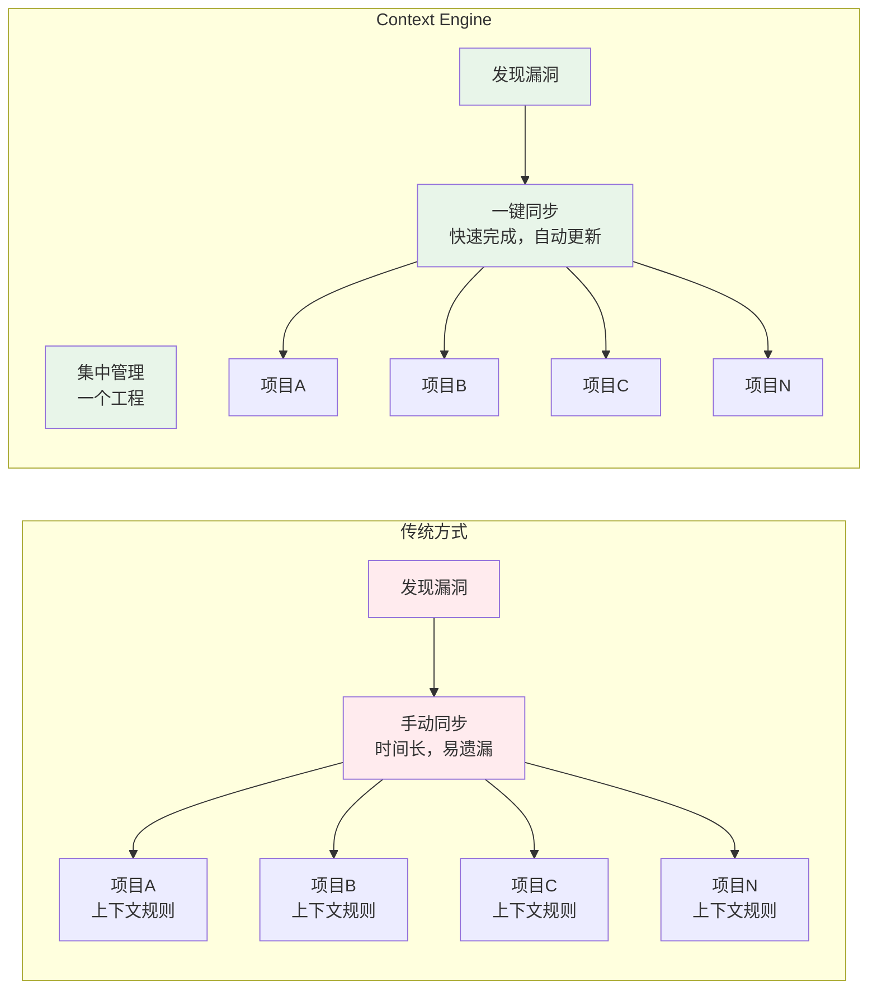
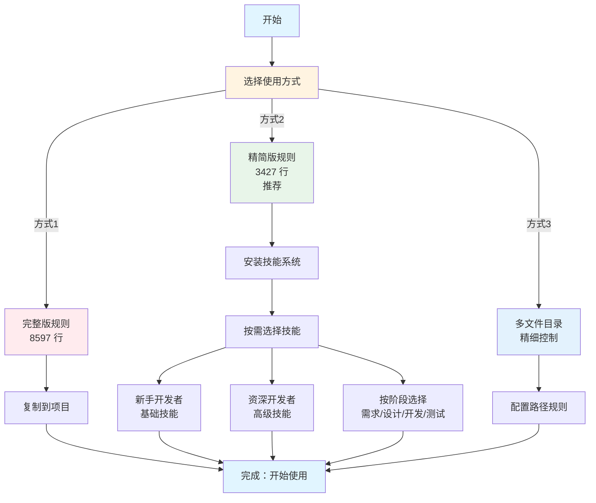
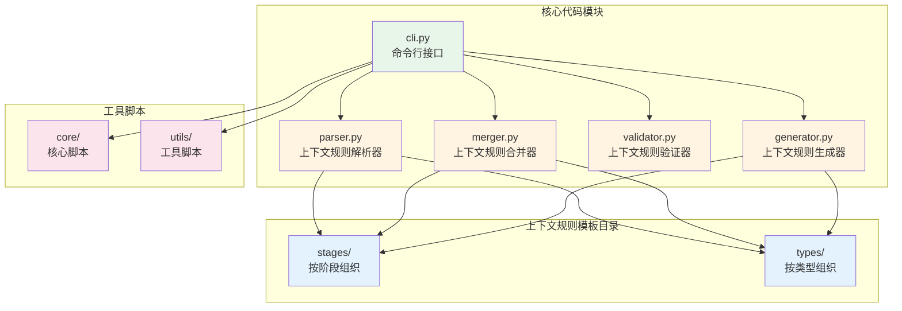

# Context Engine - 系统化上下文工程实践

## 简介

**Context Engine 是什么？**

> 以工程化思想为核心的系统化上下文管理工程，将 AI 辅助开发从手工维护提升到工程化实践。

**三大核心价值**：

- **一次修复，全项目同步**：维护成本从 O(n) 降低到 O(1)
- **Token 优化 60%**：从 8597 行减少到 3427 行
- **工程化实践**：版本控制 + 标准化 + 批量同步

**适用场景**：

- 多项目团队协作
- AI 辅助开发标准化
- 上下文规则集中管理

---

## 一、问题与痛点

### 1.1 你是否遇到过这样的困扰？

**场景1：多项目维护的噩梦**

想象一下这个场景：
- 你在项目 A 中发现了一个上下文规则漏洞，修复后需要同步到项目 B、C、D...
- 同事在项目 B 中也发现了问题，修复后又要同步到项目 A、C、D...
- **结果**：版本不一致，维护成本极高，团队协作困难

**核心问题**：维护成本随项目数量线性增长（O(n)）

**场景2：Token 浪费的困扰**

- 大文件占用大量上下文 Token
- 不同角色、不同阶段需要不同的规则，但只能一刀切
- **结果**：Token 浪费，个性化缺失

**场景3：重复造轮子**

- 每个项目都要重新编写规则
- 多个项目内规则质量参差不齐
- **结果**：重复工作，风格不统一

### 1.2 核心痛点总结

| 痛点 | 影响 | 成本 |
|------|------|------|
| **上下文规则分散和同步困难** | 版本不一致，维护成本高 | O(n) 线性增长 |
| **Token 浪费和个性化缺失** | 资源浪费，一刀切 | 60%+ Token 浪费 |
| **缺乏标准化和复用机制** | 重复编写，风格不统一 | O(n) 线性增长 |

## 二、解决方案：Context Engine

### 2.1 从提示词工程到上下文工程

**提示词工程**：单次对话的提示词优化
- 关注点：单次交互的效果
- 局限性：缺乏系统化管理，难以复用和持续改进

**上下文工程**：系统化的上下文管理工程
- 关注点：上下文规则的系统化组织、版本管理、批量同步
- 核心思想：引入软件工程的方法论和实践（模块化、版本控制、批量同步、标准化）

**升级路径**：

```text
提示词工程（手工维护）
    ↓
上下文工程（工程化实践）
    ↓
系统化组织 + 版本管理 + 批量同步 + 标准化
```

### 2.2 Context Engine：上下文工程的实践

**一句话定义**：以工程化思想为核心的系统化上下文管理工程

**三大核心价值**：

| 价值 | 说明 | 效果 |
|------|------|------|
| **一次修复，全项目同步** | 集中管理 + 批量同步 | 维护成本从 O(n) → O(1) |
| **Token 优化 60%** | 精简版 + 技能系统 | 从 8597 行 → 3427 行 |
| **工程化实践** | 版本控制 + 标准化 | 团队协作效率显著提升 |

**五大核心能力**：

- **系统化组织**：按阶段、类型、功能模块组织上下文规则
- **版本管理**：使用 Git 进行版本控制，支持版本回退
- **批量同步**：一键同步到多个项目，维护成本从 O(n) 降低到 O(1)
- **标准化**：建立统一的规范体系，提升团队协作效率
- **个性化适配**：按角色、阶段选择不同技能，减少 Token 占用

### 2.3 核心功能

#### 功能1：集中管理和系统化组织（解决核心痛点）

**实现方式**：

- **集中管理**：所有上下文规则集中在一个工程中
- **系统化组织**：
  - 按阶段组织（需求、设计、开发、测试、文档）
  - 按类型组织（前端、后端、全栈、移动端）
  - 按功能模块组织（模式规则、代码规范、文档规范等）
- **批量同步**：一键同步到多个项目
- **版本控制**：使用 Git 进行版本管理

**实施效果**：

- **一次修复，全项目同步**：修复上下文规则漏洞后，自动同步到所有项目
- **维护成本大幅降低**：从 O(n) 降低到 O(1)
- **版本一致性**：所有项目使用相同版本的上下文规则

#### 功能2：Token 优化和个性化适配

**Token 优化方案**：

| 方式 | 规则文件 | 适用场景 | 特点 |
|------|---------|---------|------|
| **方式1** | 完整版规则文件（8597 行） | 小项目 | 一次性加载，简单直接 |
| **方式2** | 精简版规则文件 + 技能系统（3427 行 + 按需加载） | **推荐** | Token 优化，灵活配置 |
| **方式3** | 多文件目录（按需加载，精细控制） | 大型项目 | 精细控制，最大优化 |

**技能系统（个性化适配）**：

- 将可选规则转换为技能（Skills）
- 按需加载，不使用时不影响 Token 上下文
- 支持个性化配置：不同角色、不同阶段选择不同技能

**实施效果**：

- **Token 占用减少约 60.1%**（方式2）
- **个性化适配**：不同人群、不同阶段使用不同技能
- **提升 AI 响应速度**：减少 Token 占用，提升处理效率

#### 功能3：多平台支持

**支持的 IDE 平台**：

| IDE 平台 | 规则文件格式 |
|---------|------------|
| **Cursor IDE** | `.cursorrules` 或 `.cursor/rules/` |
| **TRAE IDE** | `.traerules` 或 `.trae/ai-rules.yml` |
| **Antigravity IDE** | `.antigravityrules` |

**核心特性**：

- **自动格式转换**：支持 Markdown、YAML 格式自动转换
- **统一规则源**：同一套规则适配多个平台
- **格式兼容**：自动处理不同平台的格式差异

### 2.4 工程化思想的体现

**核心方法论**：

| 方法论 | 实现方式 | 核心价值 |
|--------|---------|---------|
| **模块化** | 上下文规则按功能模块拆分，支持独立维护和复用 | 提高可维护性和复用性 |
| **版本控制** | 使用 Git 进行版本管理，支持版本回退和协作 | 确保版本一致性和可追溯性 |
| **批量同步** | 提供工具脚本，实现一键同步到多个项目 | 维护成本从 O(n) 降低到 O(1) |
| **标准化** | 建立统一的规范体系，提升团队协作效率 | 提升团队协作效率 |
| **持续改进** | 集中修复漏洞，自动同步到所有项目 | 实现持续优化和迭代 |

## 三、实际效果

### 3.1 数据对比：传统方式 vs Context Engine

| 指标 | 传统方式 | Context Engine（方式2） | 提升效果 |
|------|---------|----------------------|---------|
| **初始 Token** | 8597 行 | 3427 行 | 减少 60.1% |
| **维护成本** | 高（多项目同步，O(n)） | 低（集中管理，O(1)） | 从 O(n) 到 O(1) |
| **同步效率** | 手动同步，容易遗漏 | 一键同步，自动更新 | 秒级完成 |
| **版本一致性** | 不同项目版本不一致 | 所有项目版本统一 | 100% 一致 |
| **个性化适配** | 一刀切 | 按角色、阶段选择 | 灵活配置 |

**关键数据亮点**：

- **Token 优化**：从 8597 行减少到 3427 行，节省 60.1%
- **维护效率**：从 O(n) 线性增长到 O(1) 常数时间
- **同步速度**：从手动同步（分钟级）到一键同步（秒级）

### 3.2 典型使用场景：团队协作标准化

#### 真实案例：从混乱到有序

**背景**：一个团队维护 5 个项目，每个项目都有独立的上下文规则

**问题**：
- 上下文规则分散在 5 个项目中
- 发现漏洞后需要手动同步到 5 个项目
- 维护成本极高，经常遗漏，版本不一致

**解决方案**：
- 统一使用方式2（精简版 + 技能系统）
- 集中管理：所有上下文规则集中在一个工程中
- 批量同步：使用工具脚本一键同步到所有项目

**实施效果对比**：

| 维度 | 实施前 | 实施后 | 改善 |
|------|--------|--------|------|
| **版本一致性** | 经常不一致 | 100% 一致 | 完全统一 |
| **协作效率** | 低（经常冲突） | 高（顺畅协作） | 显著提升 |
| **错误率** | 高（容易遗漏） | 低（自动同步） | 几乎为零 |

#### 多项目协作场景对比图



## 四、快速开始

### 4.1 使用步骤（3 步完成）

1. **生成规则文件**：选择你的 IDE（Cursor、TRAE、Antigravity）
2. **复制到项目**：将生成的规则文件复制到项目根目录
3. **安装技能**（可选）：根据角色和阶段选择所需技能

### 4.2 推荐方式：方式2（精简版 + 技能系统）

**为什么推荐方式2？**

| 优势 | 说明 | 价值 |
|------|------|------|
| **Token 优化** | 占用减少约 60% | 节省成本，提升速度 |
| **按需加载** | 灵活配置，个性化适配 | 不同角色、阶段使用不同技能 |
| **团队共享** | 支持团队共享技能 | 提升协作效率 |
| **易于维护** | 集中管理，一键同步 | 维护成本从 O(n) 到 O(1) |

### 4.3 使用流程图



### 4.4 技术特点

- **轻量级**：Python 开发，依赖少，易于部署
- **模块化**：核心功能模块化设计，易于扩展
- **多格式**：支持 Markdown、YAML、JSON 等多种格式
- **多平台**：支持 Cursor、TRAE、Antigravity 等主流 IDE

### 4.5 技术架构图



## 五、核心价值总结

### 5.1 从提示词工程到上下文工程的升级

**升级路径对比**：

| 维度 | 提示词工程（传统方式） | 上下文工程（Context Engine） | 升级效果 |
|------|---------------------|---------------------------|---------|
| **组织方式** | 上下文规则管理混乱 | 系统化组织和管理 | 有序管理 |
| **复用机制** | 重复编写 | 一次编写，多项目复用 | 效率提升 |
| **成本控制** | Token 浪费 | Token 优化，减少 60% | 成本降低 |
| **标准化** | 风格不统一 | 团队标准化规范 | 统一规范 |
| **个性化** | 一刀切 | 按角色、阶段个性化适配 | 灵活配置 |

**核心升级价值**：

> **从手工维护到工程化实践，从单次优化到系统化管理，从重复编写到一次编写多项目复用**

### 5.2 工程化实践的核心方法论

| 方法论 | 实现方式 | 核心价值 |
|--------|---------|---------|
| **系统化组织** | 按阶段、类型、功能模块组织 | 有序管理，易于维护 |
| **模块化复用** | 小模块独立使用和验证 | 一次编写，多项目复用 |
| **版本控制** | Git 版本管理，支持回退和协作 | 版本一致，可追溯 |
| **批量同步** | 工具脚本，一键同步 | 维护成本从 O(n) 到 O(1) |
| **持续改进** | 集中修复，自动同步 | 持续优化，迭代升级 |

**核心思想**：

> **从提示词工程升级到上下文工程，实现系统化的上下文管理，将 AI 辅助开发从手工维护提升到工程化实践。**

## 六、未来展望：希望实现的能力

### 6.1 基于用户角色的个性化生成（核心方向）

- 根据不同的用户角色（前端开发者、后端开发者、架构师等），自动生成和推荐最适合的上下文规则和技能
- 支持角色识别和自动适配，降低使用门槛

### 6.2 AI 辅助上下文规则生成

- 基于项目代码自动生成上下文规则
- 智能推荐适合的规则和配置

### 6.3 上下文规则效果分析和优化

- 分析上下文规则使用效果，提供优化建议
- 建立上下文规则质量评估体系，持续提升上下文工程质量
