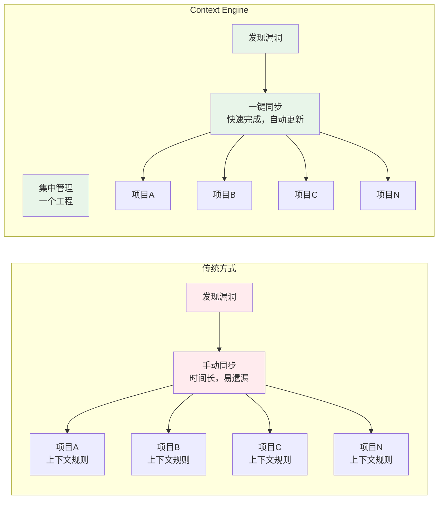
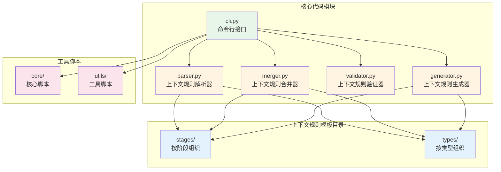
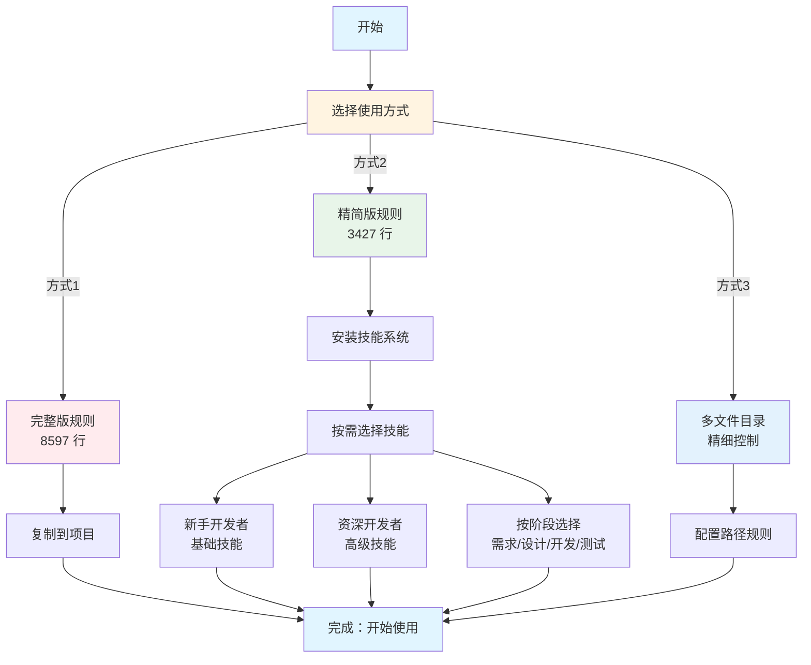

# Context Engine - 系统化上下文工程实践

## 一、开场：问题与痛点

### 1.1 AI 辅助开发的现状

开场问题：
- 有多少人在使用 AI 辅助开发工具？
- 使用过程中遇到了哪些问题？

现状：
- AI 辅助开发工具（Cursor、TRAE、Antigravity）越来越普及
- 上下文规则管理混乱，缺乏结构化组织

问题：
- 上下文规则散落在各个项目中
- 重复编写相似的上下文规则
- 缺乏版本管理和复用机制
- 团队协作时上下文规则不一致

### 1.2 技术团队的三大痛点

#### 痛点1：上下文规则分散和同步困难（最核心痛点）

问题：
- 不同项目分散到不同的上下文配置文件
- 上下文规则本身有漏洞，使用过程中需要不断完善
- 修复一个项目的上下文规则后，需要同步到其他项目
- 手动同步容易遗漏，自动化同步又需要额外工具

实际场景：
```
项目A：发现上下文规则漏洞 → 修复 → 需要同步到项目B、C、D...
项目B：发现上下文规则漏洞 → 修复 → 需要同步到项目A、C、D...
结果：上下文规则版本不一致，维护成本极高
```

影响：
- 时间成本：每次修复都要手动同步多个项目
- 容易遗漏：同步过程中容易遗漏某些项目
- 版本混乱：不同项目的上下文规则版本不一致
- 维护成本：随着项目增多，维护成本呈指数级增长（O(n)）

#### 痛点2：缺乏标准化和复用机制

问题：
- 重复编写：每个项目都要重新编写规则，相似功能重复实现
- 多个项目内上下文规则风格不统一，质量参差不齐
- 维护成本高：上下文规则更新需要同步到多个项目，维护成本呈指数级增长
- 缺乏最佳实践指导和可复用模板

影响：
- 时间成本：重复编写浪费大量时间
- 协作困难：风格不统一导致团队协作困难
- 成本增长：维护成本随项目数量指数级增长

#### 痛点3：Token 浪费和个性化缺失

问题：
- Token 浪费：大文件占用大量上下文 Token，不需要的规则也占用 Token
- 个性化缺失：不同角色、不同阶段需要不同的上下文规则，但只能一刀切
- 多平台支持困难：不同 IDE 需要不同的规则格式，需要维护多套规则

影响：
- 成本高：Token 占用导致 API 调用成本高
- 响应慢：大文件影响 AI 响应速度
- 精准度低：一刀切无法满足不同角色和阶段的需求

## 二、上下文工程：核心概念与价值

### 2.1 从提示词工程到上下文工程

**提示词工程**：单次对话的提示词优化
- 关注点：单次交互的效果
- 局限性：缺乏系统化管理，难以复用和持续改进

**上下文工程**：系统化的上下文管理工程
- 关注点：上下文规则的系统化组织、版本管理、批量同步
- 核心思想：引入软件工程的方法论和实践（模块化、版本控制、批量同步、标准化）

**升级路径**：
```
提示词工程（手工维护）
    ↓
上下文工程（工程化实践）
    ↓
系统化组织 + 版本管理 + 批量同步 + 标准化
```

### 2.2 Context Engine：上下文工程的实践

**定义**：以工程化思想为核心的系统化上下文管理工程。通过引入软件工程的方法论和实践（模块化、版本控制、批量同步、标准化），将分散的上下文规则管理从"手工维护"升级为"工程化实践"，帮助开发者实现从提示词到上下文工程的系统性升级。

**核心价值主张**：
- **系统化组织**：按阶段、类型、功能模块组织上下文规则
- **版本管理**：使用 Git 进行版本控制，支持版本回退
- **可复用模板**：提供经过验证的上下文规则模板
- **工具支持**：提供 CLI 工具，方便集成到开发流程
- **多平台支持**：支持 Cursor、TRAE、Antigravity 等多个 IDE

### 2.3 核心功能

#### 功能1：集中管理和系统化组织（解决核心痛点）

解决的问题：
- 不同项目分散到不同的上下文配置文件
- 上下文规则漏洞修复后需要同步到多个项目
- 上下文规则散落，难以查找和管理

实现方式：
- 集中管理：所有上下文规则集中在一个工程中
- 系统化组织：
  - 按阶段组织（需求、设计、开发、测试、文档）
  - 按类型组织（前端、后端、全栈、移动端）
  - 按功能模块组织（模式规则、代码规范、文档规范等）
- 批量同步：一键同步到多个项目
- 版本控制：使用 Git 进行版本管理

效果：
- 一次修复，全项目同步：修复上下文规则漏洞后，自动同步到所有项目
- 上下文规则结构清晰，易于查找
- 支持模块化复用
- 维护成本大幅降低：从 O(n) 降低到 O(1)
- 版本一致性：所有项目使用相同版本的上下文规则

#### 功能2：多平台支持

解决的问题：
- 不同 IDE 需要不同的规则格式

实现方式：
- 支持 Cursor IDE（`.cursorrules` 或 `.cursor/rules/`）
- 支持 TRAE IDE（`.traerules` 或 `.trae/ai-rules.yml`）
- 支持 Antigravity IDE（`.antigravityrules`）
- 自动格式转换（Markdown、YAML）

效果：
- 一套规则，多平台使用
- 自动格式转换
- 统一的管理体验

#### 功能3：Token 优化和个性化适配

解决的问题：
- Token 浪费：大文件占用大量上下文 Token，影响 AI 响应速度
- 个性化缺失：不同人群、不同阶段需要不同的上下文规则，但只能一刀切

核心价值：让上下文规则能适用于不同的人群和不同的开发阶段，同时减少 Token 占用

实现方式：
- Token 优化方案：
  - 方式1：完整版规则文件（8597 行，适合小项目）
  - 方式2：精简版规则文件 + 技能系统（3427 行 + 按需加载）（推荐）
  - 方式3：多文件目录（按需加载，精细控制）
- 技能系统（个性化适配）：
  - 将可选规则转换为技能（Skills）
  - 使用 OpenSkills 工具管理技能
  - 按需加载，不使用时不影响 Token 上下文
  - 支持个性化配置：不同角色、不同阶段选择不同技能

效果：
- Token 占用减少约 60.1%（方式2）
- 按需加载，灵活配置
- 个性化适配：不同人群、不同阶段使用不同技能
- 提升 AI 响应速度
- 支持团队共享技能

### 2.4 工程化思想的体现

**核心方法论**：
- **系统化组织**：按阶段、类型、功能模块组织上下文规则
- **模块化复用**：小模块独立使用和验证
- **渐进式完善**：从核心规则开始，逐步扩展功能
- **工程化实践**：从提示词升级到上下文工程，实现系统化的上下文管理

**工程化思想的体现**：
- **模块化**：上下文规则按功能模块拆分，支持独立维护和复用
- **版本控制**：使用 Git 进行版本管理，支持版本回退和协作
- **批量同步**：提供工具脚本，实现一键同步到多个项目
- **标准化**：建立统一的规范体系，提升团队协作效率
- **持续改进**：集中修复漏洞，自动同步到所有项目，维护成本从 O(n) 降低到 O(1)

## 三、实际效果与应用场景

### 3.1 数据对比

| 指标 | 传统方式 | Context Engine（方式2） | 提升 | 数据来源 |
|------|---------|----------------------|------|---------|
| **初始 Token** | 8597 行 | 3427 行 | ⬇️ 60.1% | 已统计 |
| **规则复用** | 每个项目重新编写 | 一次编写，多项目复用 | ⬆️ 显著 | 定性分析 |
| **维护成本** | 高（多项目同步，O(n)） | 低（集中管理，O(1)） | ⬇️ 显著 | 定性分析 |
| **同步效率** | 手动同步，容易遗漏 | 一键同步，自动更新 | ⬆️ 显著 | 定性分析 |
| **版本一致性** | 不同项目版本不一致 | 所有项目版本统一 | ⬆️ 显著 | 定性分析 |
| **团队协作** | 风格不统一 | 标准化规范 | ⬆️ 显著 | 定性分析 |
| **个性化适配** | 一刀切 | 按角色、阶段选择 | ⬆️ 显著 | 定性分析 |

### 3.2 实际收益

- 成本降低：Token 占用减少 60.1%，直接降低 API 调用成本
- 效率提升：AI 响应速度提升，开发效率提升
- 团队协作：标准化规范，知识共享，协作效率提升
- 精准适配：不同角色、不同阶段使用不同技能，更精准

#### Token 优化效果对比图


### 3.3 典型使用场景

#### 场景1：新项目初始化

需求：快速为新项目配置 AI 辅助开发规则

解决方案：
- 使用 `dist/` 目录中的预生成产物
- 一键复制到项目，无需安装环境
- 支持三种方式选择（完整版/精简版+技能/多文件）

效果：
- 从长时间配置 → 快速完成
- 标准化配置，团队统一

#### 场景2：大项目 Token 优化

需求：大项目需要减少 Token 占用，提升 AI 响应速度

解决方案：
- 使用方式2（精简版 + 技能系统）
- Token 占用减少约 60%
- 按需加载技能，灵活配置

效果：
- Token 占用减少 60%
- AI 响应速度提升
- 成本降低

#### 场景3：团队协作标准化（最典型场景）

场景：多人团队，多个项目，使用 Cursor IDE

问题：
- 上下文规则分散在多个项目中
- 发现漏洞后需要手动同步到多个项目
- 维护成本极高，容易遗漏

解决方案：
- 统一使用方式2（精简版 + 技能系统）
- 集中管理：所有上下文规则集中在一个工程中
- 批量同步：使用工具脚本一键同步到所有项目
- 团队共享技能库

效果：
- 维护时间：从长时间手动同步 → 快速自动同步（一次修复，全项目同步）
- 版本一致性：所有项目使用相同版本的上下文规则
- 团队风格统一
- 知识共享和传承
- 协作效率显著提升

#### 多项目协作场景对比图



### 3.4 实际案例

#### 案例1：前端项目（个性化适配）

场景：前端团队，包含新手和资深开发者

解决方案：
- 使用方式2（精简版 + 技能系统）
- 新手开发者：安装基础技能（代码格式、命名规范）
- 资深开发者：安装高级技能（架构设计、性能优化）

效果：
- Token 占用减少 60%
- AI 响应速度提升
- 不同角色获得最适合的上下文规则

#### 案例2：全栈项目（精细控制）

场景：全栈项目，前端和后端使用不同技术栈

解决方案：
- 使用方式3（多文件目录）
- 前端规则应用于 `**/*.tsx`、`**/*.jsx`
- 后端规则应用于 `**/*.py`、`**/*.go`

效果：
- 精细控制，按路径应用规则
- 不同文件类型使用不同规则
- 规则更精准，效果更好

#### 案例3：技能系统使用示例

**示例：生成微服务架构的技术方案文档**

场景：需要生成微服务架构的技术方案文档

使用方式：
- 安装文档生成技能
- 同步到项目
- 在 AI 对话中直接使用，AI 会自动识别并加载技能

效果：AI 自动加载并应用文档生成规范，生成结构完整、格式统一的技术方案文档，包含概述、架构设计、实施方案等标准章节。

## 四、技术实现与快速开始（

### 4.1 技术架构概览

技术选型：
- 使用 Python 开发，轻量级依赖
- 模块化设计，易于扩展和维护
- 支持多种数据格式（Markdown、YAML、JSON）

核心功能模块：
- 规则解析器：解析和提取规则内容
- 规则合并器：合并多个规则文件
- 规则验证器：验证规则完整性和正确性
- 规则生成器：生成不同格式的规则文件
- 命令行工具：提供便捷的使用接口

#### 技术架构图



### 4.2 关键技术点

1. **系统化设计**
   - 上下文规则按功能模块拆分，每个模块独立维护
   - 使用索引文件管理模块依赖关系
   - 支持按需合并和生成，避免全量加载

2. **多格式支持**
   - 支持多种输出格式自动转换
   - 保持规则内容一致，仅改变输出格式
   - 支持的格式：Markdown（Cursor）、YAML（TRAE）、自定义格式（Antigravity）

3. **Token 优化**
   - 核心规则与可选规则分离
   - 使用技能系统实现按需加载
   - 支持多文件目录结构，精细控制规则应用范围
   - 优化效果：方式2可减少约 60% Token 占用

4. **批量同步机制**
   - 使用配置文件管理项目列表
   - 支持 Git 仓库路径和本地路径
   - 自动检测项目类型（Cursor、TRAE、Antigravity）
   - 支持增量同步和全量同步

### 4.3 快速开始

使用步骤：
1. 生成规则文件（选择你的 IDE）
2. 复制到你的项目
3. 安装技能（可选，按需）

支持的功能：
- 生成核心规则（Token 优化）
- 支持多种 IDE 类型（Cursor、TRAE、Antigravity）
- 支持多种输出格式（Markdown、YAML）

#### 使用流程图



### 4.4 使用建议

针对技术研发部：

1. **新项目**：推荐使用方式2（精简版 + 技能系统）
   - Token 占用减少约 60%
   - 按需加载，灵活配置
   - 支持团队共享技能

2. **大项目**：推荐使用方式3（多文件目录）
   - 精细控制，按路径应用规则
   - 不同文件类型使用不同规则
   - 规则更精准，效果更好

3. **团队协作**：统一使用方式2，集中管理
   - 所有上下文规则集中在一个工程中
   - 一键同步到所有项目
   - 团队共享技能库

## 五、Q&A

### 5.1 常见问题

#### Q1：这个项目适合哪些团队？

A1：
- 使用 AI 辅助开发工具（Cursor、TRAE、Antigravity）的团队
- 需要标准化上下文规则管理的团队
- 希望提升 AI 辅助开发效率的团队
- 需要 Token 优化的大项目团队

#### Q2：如何开始使用？

A2：
- 最简单：从 `dist/` 目录复制预生成的规则文件
- 推荐：使用方式2（精简版 + 技能系统）
- 高级：使用方式3（多文件目录，精细控制）

#### Q3：是否需要安装环境？

A3：
- 不需要：可以直接使用 `dist/` 目录中的预生成产物
- 可选：如果需要自定义生成，需要 Python 环境

#### Q4：性能如何？支持大规模项目吗？

A4：
- 性能：使用批量处理，支持大规模项目
- 测试：已测试大量项目同步，性能稳定
- 优化：使用缓存机制，避免重复解析
- 扩展性：模块化设计，易于水平扩展

## 六、核心价值总结

### 6.1 核心价值回顾

核心价值总结：

1. 解决痛点：上下文规则管理混乱 → 系统化组织和管理
2. 提升效率：重复编写 → 一次编写，多项目复用
3. 降低成本：Token 浪费 → Token 优化，减少 60%
4. 标准化：风格不统一 → 团队标准化规范
5. 个性化：一刀切 → 按角色、阶段个性化适配

### 6.2 核心方法论

工程化实践的核心方法论：

- 系统化组织：按阶段、类型、功能模块组织上下文规则
- 模块化复用：小模块独立使用和验证
- 渐进式完善：从核心规则开始，逐步扩展功能
- 工程化实践：从提示词升级到上下文工程，实现系统化的上下文管理

工程化思想的体现：

- 模块化：上下文规则按功能模块拆分，支持独立维护和复用
- 版本控制：使用 Git 进行版本管理，支持版本回退和协作
- 批量同步：提供工具脚本，实现一键同步到多个项目
- 标准化：建立统一的规范体系，提升团队协作效率
- 持续改进：集中修复漏洞，自动同步到所有项目，维护成本从 O(n) 降低到 O(1)

**核心思想**：从提示词工程升级到上下文工程，实现系统化的上下文管理

## 相关资源

- 项目仓库：https://gitlab.rd.chanjet.com/cc_web/prompt-engin
- 文档：项目 `docs/` 目录下的完整文档
- 快速开始：`QUICK_START.md` 快速开始指南
- 技能系统：`docs/milestones/V1_SKILL/` 目录下的技能系统指南

