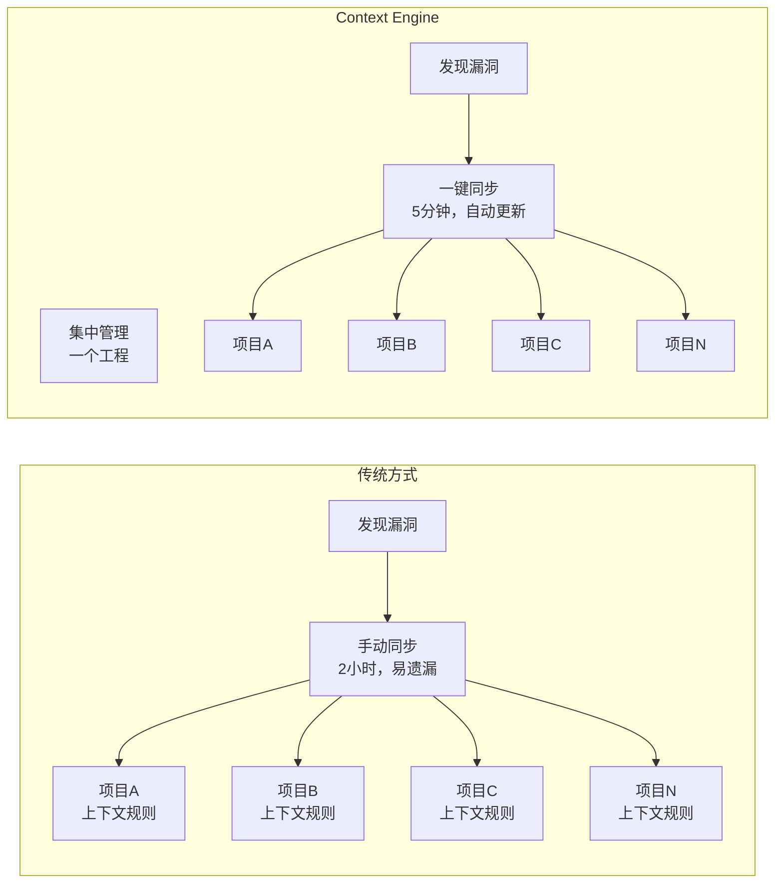
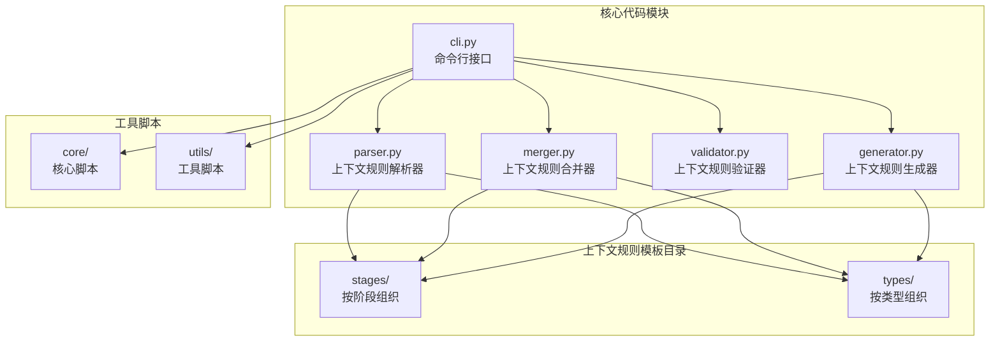
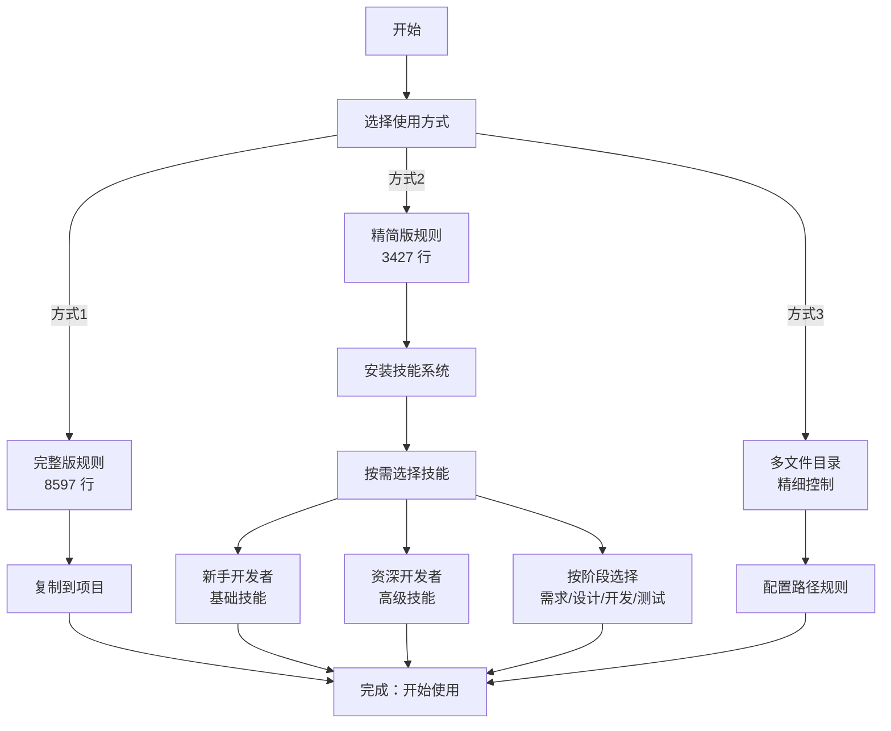

# Context Engine - 系统化上下文工程实践

## 一、核心痛点

### 三大痛点

1. 上下文规则分散和同步困难（最核心痛点）
   - 不同项目分散到不同的上下文配置文件
   - 上下文规则本身有漏洞，使用过程中需要不断完善
   - 修复一个项目后需要手动同步到其他项目
   - 维护成本随项目数量指数级增长（O(n)）

2. 缺乏标准化和复用机制
   - 每个项目都要重新编写规则，相似功能重复实现
   - 多个项目内上下文规则风格不统一，质量参差不齐
   - 缺乏最佳实践指导和可复用模板

3. Token 浪费和个性化缺失
   - 大文件占用大量 Token（成本高、响应慢）
   - 不同角色、不同阶段只能使用相同的上下文配置（一刀切）
   - 缺乏按需加载机制

---

## 二、解决方案

### Context Engine 是什么

**以工程化思想为核心**的系统化上下文管理工程。通过引入软件工程的方法论和实践（模块化、版本控制、批量同步、标准化），将分散的上下文规则管理从"手工维护"升级为"工程化实践"，帮助开发者实现从提示词到上下文工程的系统性升级。

### 核心功能

#### 1. 集中管理和系统化组织（解决核心痛点）

实现方式：
- 集中管理：所有上下文规则集中在一个工程中
- 系统化组织：
  - 按阶段组织（需求、设计、开发、测试、文档）
  - 按类型组织（前端、后端、全栈、移动端）
  - 按功能模块组织（模式规则、代码规范、文档规范等）
- 批量同步：一键同步到多个项目
- 版本控制：使用 Git 进行版本管理

效果：
- 一次修复，全项目同步：修复上下文规则漏洞后，自动同步到所有项目
- 维护成本从 O(n) 降低到 O(1)
- 版本一致性：所有项目使用相同版本的上下文规则

上下文规则覆盖范围：
- 通用阶段：模式规则（Plan/Act）、代码规范（命名、函数、格式、错误处理、注释等）、文档规范、交互规范、项目规范
- 文档阶段：文档生成规范、架构图文档模板、WIKI 输出规范
- 其他阶段：需求分析、设计、开发、测试（目录已创建，内容持续完善中）
- 项目类型：前端、后端、全栈、移动端（目录已创建，内容持续完善中）

#### 2. 多平台支持

- 支持 Cursor、TRAE、Antigravity 等多个 IDE
- 一套规则，多平台使用
- 自动格式转换（Markdown、YAML）

#### 3. Token 优化和个性化适配

核心价值：让上下文规则能适用于不同的人群和不同的开发阶段，同时减少 Token 占用

实现方式：
- 方式1：完整版（8597 行，适合小项目）
- 方式2：精简版 + 技能系统（3427 行 + 按需加载，推荐）
- 方式3：多文件目录（精细控制）

技能系统（个性化适配）：
- 将可选规则转换为技能（Skills）
- 使用 OpenSkills 工具管理技能
- 按需加载，不使用时不影响 Token 上下文
- 支持个性化配置：不同角色、不同阶段选择不同技能

技能分类示例：
- 按人群分类：
  - 新手开发者：基础技能（代码格式、命名规范）
  - 资深开发者：高级技能（架构设计、性能优化）
- 按阶段分类：
  - 需求分析阶段：需求分析技能
  - 设计阶段：架构设计技能
  - 开发阶段：代码规范技能
  - 测试阶段：测试规范技能

效果：
- Token 占用减少 60.1%（从 8597 行 → 3427 行）
- 按需加载，灵活配置
- 个性化适配：不同角色、不同阶段使用不同技能
- AI 响应速度提升
- 支持团队共享技能

---

## 三、实际效果

### 数据对比

| 指标 | 传统方式 | Context Engine（方式2） | 提升 | 数据来源 |
|------|---------|----------------------|------|---------|
| 初始 Token | 8597 行 | 3427 行 | 减少 60.1% | 已统计 |
| 维护成本 | 高（O(n)） | 低（O(1)） | 显著降低 | 定性分析 |
| 同步效率 | 手动同步，容易遗漏 | 一键同步，自动更新 | 显著提升 | 定性分析 |
| 版本一致性 | 不同项目版本不一致 | 所有项目版本统一 | 显著提升 | 定性分析 |
| 团队协作 | 风格不统一 | 标准化规范 | 显著提升 | 定性分析 |
| 个性化适配 | 一刀切 | 按角色、阶段选择 | 显著提升 | 定性分析 |

### 实际收益

- 成本降低：Token 占用减少 60.1%，直接降低 API 调用成本
- 效率提升：AI 响应速度提升，开发效率提升
- 团队协作：标准化规范，知识共享，协作效率提升
- 精准适配：不同角色、不同阶段使用不同技能，更精准

#### Token 优化效果对比图


---

## 四、使用场景

### 场景1：新项目初始化
- 需求：快速为新项目配置 AI 辅助开发规则
- 解决方案：使用 `dist/` 目录中的预生成产物，一键复制到项目
- 效果：从 30 分钟 → 1 分钟

### 场景2：大项目 Token 优化
- 需求：大项目需要减少 Token 占用，提升 AI 响应速度
- 解决方案：使用方式2（精简版 + 技能系统）
- 效果：Token 占用减少 60%，AI 响应速度提升

### 场景3：团队协作标准化（最典型场景）

场景：10 人团队，20 个项目，使用 Cursor IDE

问题：
- 上下文规则分散在 20 个项目中
- 发现漏洞后需要手动同步到 20 个项目
- 维护成本极高，容易遗漏

解决方案：
- 统一使用方式2（精简版 + 技能系统）
- 集中管理：所有上下文规则集中在一个工程中
- 批量同步：使用工具脚本一键同步到所有项目
- 团队共享技能库

效果：
- 维护时间：从 2 小时 → 5 分钟（一次修复，全项目同步）
- 版本一致性：所有项目使用相同版本的上下文规则
- 团队风格统一
- 知识共享和传承
- 协作效率提升 50%

#### 多项目协作场景对比图



---

## 五、技术实现：如何做到的

### 技术架构

核心模块：
- `parser.py` - 上下文规则解析器
- `merger.py` - 上下文规则合并器
- `validator.py` - 上下文规则验证器
- `generator.py` - 上下文规则生成器
- `cli.py` - 命令行接口

组织结构：
- `prompts/stages/` - 按阶段组织上下文规则
- `prompts/types/` - 按类型组织上下文规则
- `scripts/` - 工具脚本（核心脚本、工具脚本）

#### 技术架构图



### 关键技术点

1. 系统化设计：上下文规则按功能模块拆分，支持按需合并和生成
2. 多格式支持：Markdown（Cursor）、YAML（TRAE），自动格式转换
3. Token 优化：核心规则与可选规则分离，技能系统按需加载
4. 渐进式完善：从核心规则开始，逐步扩展功能

---

## 六、快速开始

### 3 步快速开始

```bash
# 1. 生成规则文件（选择你的 IDE）
python3 scripts/prompt-engine merge --core-only --ide cursor --output .cursorrules

# 2. 复制到你的项目
cp .cursorrules /path/to/your-project/

# 3. 安装技能（可选，按需）
bash scripts/utils/install_all_skills.sh /path/to/your-project
```

完成！现在你的项目已经可以使用规则了。

#### 使用流程图



### 使用建议

针对技术研发部：

1. 新项目：推荐使用方式2（精简版 + 技能系统）
   - Token 占用减少 60%
   - 按需加载，灵活配置
   - 支持团队共享技能

2. 大项目：推荐使用方式3（多文件目录）
   - 精细控制，按路径应用规则
   - 不同文件类型使用不同规则
   - 规则更精准，效果更好

3. 团队协作：统一使用方式2，集中管理
   - 所有上下文规则集中在一个工程中
   - 一键同步到所有项目
   - 团队共享技能库

### 技能系统使用案例

场景：需要生成微服务架构的技术方案文档

```bash
# 1. 安装文档生成技能
openskills install /path/to/prompt-engin/.claude/skills/document-generation

# 2. 同步到 AGENTS.md（技能列表会显示在 AGENTS.md 中）
cd /path/to/your-project
openskills sync -y

# 3. 在 AI 对话中直接使用
# 用户：调用 document-generation skills，生成一个用户服务微服务架构的技术方案文档
# AI 会自动加载 document-generation 技能，应用文档生成规范
```

效果：AI 自动加载并应用文档生成规范，生成结构完整、格式统一的技术方案文档，包含概述、架构设计、实施方案等 12 个标准章节。

案例2：调试接口返回数据异常问题

```bash
# 1. 安装问题定位技能
openskills install /path/to/prompt-engin/.claude/skills/problem-location

# 2. 同步到 AGENTS.md
cd /path/to/your-project
openskills sync -y

# 3. 在 AI 对话中直接使用
# 用户：调用 problem-location skills，接口返回的数据格式不对，帮我定位一下问题
# AI 会自动加载 problem-location 技能，应用问题定位规范
```

效果：AI 自动加载并应用问题定位规范，先系统性调试定位根因，再一次性修复，避免盲目添加防御性代码。

说明：使用方式2时，技能安装并同步到 AGENTS.md 后，AI 会根据用户需求和技能描述自动识别是否需要使用某个技能，无需手动调用。

---

## 七、未来展望：希望实现的能力

### 1. 基于用户角色的个性化生成（核心方向）

希望实现的能力：
- 根据不同的用户角色（前端开发者、后端开发者、架构师等），自动生成和推荐最适合的上下文规则和技能
- 支持角色识别和自动适配，降低使用门槛

### 2. AI 辅助上下文规则生成

希望实现的能力：
- 基于项目代码自动生成上下文规则
- 智能推荐适合的规则和配置

### 3. 上下文规则效果分析和优化

希望实现的能力：
- 分析上下文规则使用效果，提供优化建议
- 建立规则质量评估体系，持续提升上下文工程质量

---

## 八、核心价值总结

### 核心价值回顾

1. 解决痛点：上下文规则管理混乱 → 系统化组织和管理
2. 提升效率：重复编写 → 一次编写，多项目复用
3. 降低成本：Token 浪费 → Token 优化，减少 60%
4. 标准化：风格不统一 → 团队标准化规范
5. 个性化：一刀切 → 按角色、阶段个性化适配

### 核心方法论

- 系统化组织：按阶段、类型、功能模块组织上下文规则
- 模块化复用：小模块独立使用和验证
- 渐进式完善：从核心规则开始，逐步扩展功能
- 工程化实践：从提示词升级到上下文工程，实现系统化的上下文管理

### 行动建议

立即行动：
1. 访问项目仓库，了解详情
2. 尝试使用 `dist/` 目录中的预生成产物
3. 根据项目需求选择合适的使用方式

长期参与：
1. 反馈使用问题和建议
2. 贡献代码和技能
3. 分享使用经验和最佳实践

---

