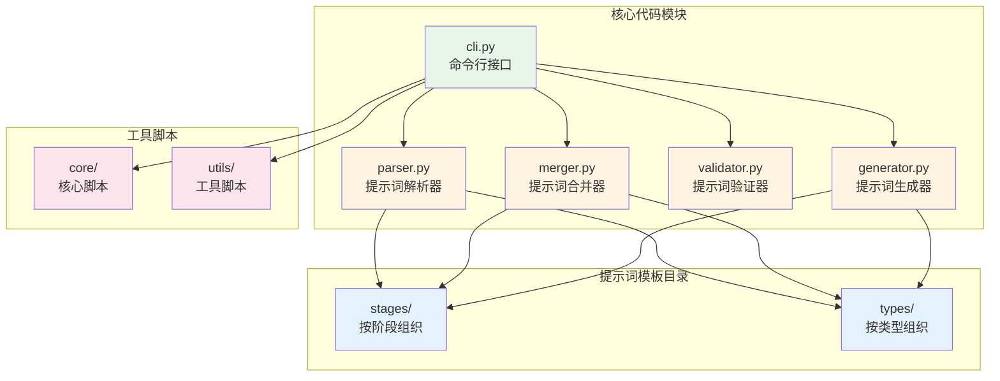
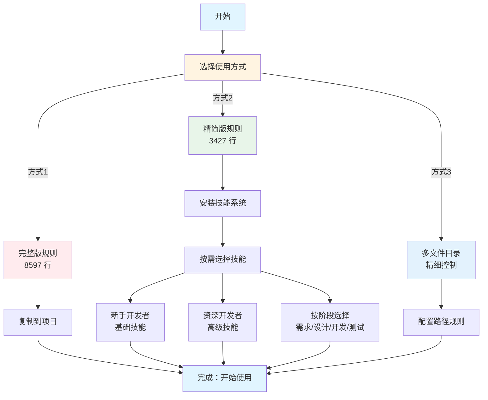
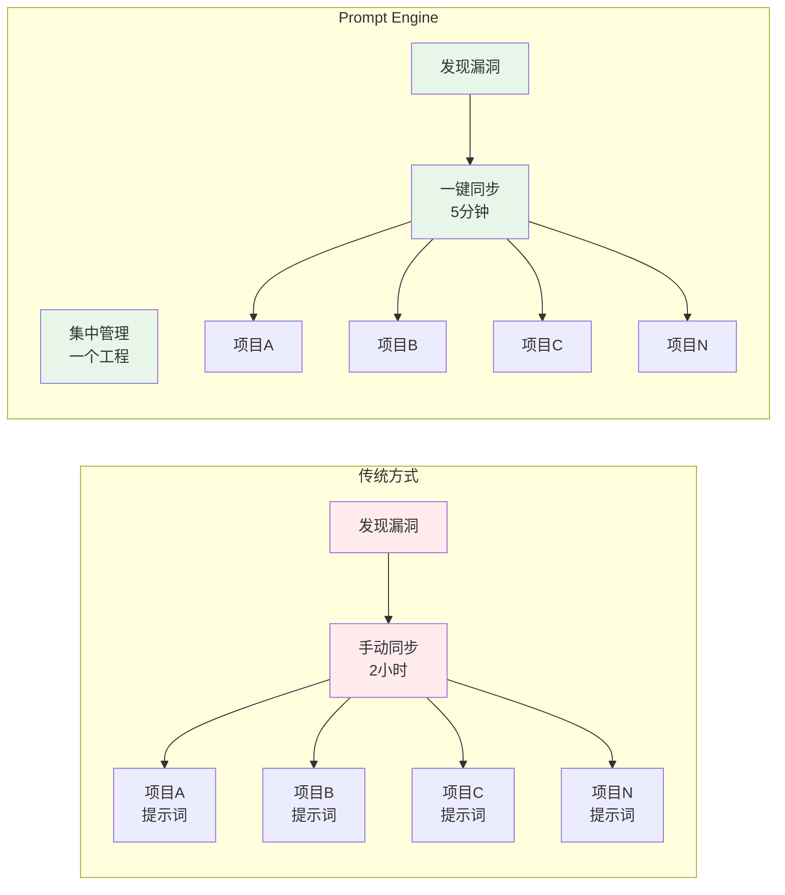

# Prompt Engine：AI 提效分享

> **分享主题**：Prompt Engine - 结构化提示词工程实践

---

## 一、开场：问题与痛点

### 1.1 AI 辅助开发的现状

**开场问题**：
- 有多少人在使用 AI 辅助开发工具？
- 使用过程中遇到了哪些问题？

**现状**：
- AI 辅助开发工具（Cursor、TRAE、Antigravity）越来越普及
- 提示词管理混乱，缺乏结构化组织

**问题**：
- 提示词散落在各个项目中
- 重复编写相似的提示词
- 缺乏版本管理和复用机制
- 团队协作时提示词不一致

### 1.2 技术团队的痛点

#### 痛点1：提示词分散和同步困难 ⭐ **最核心痛点**

**问题**：
- 不同项目分散到不同的提示词文件
- 提示词本身有漏洞，使用过程中需要不断完善
- 修复一个项目的提示词后，需要同步到其他项目
- 手动同步容易遗漏，自动化同步又需要额外工具

**实际场景**：
```
项目A：发现提示词漏洞 → 修复 → 需要同步到项目B、C、D...
项目B：发现提示词漏洞 → 修复 → 需要同步到项目A、C、D...
结果：提示词版本不一致，维护成本极高
```

**影响**：
- ⏱️ 时间成本：每次修复都要手动同步多个项目
- ❌ 容易遗漏：同步过程中容易遗漏某些项目
- 🔄 版本混乱：不同项目的提示词版本不一致
- 💰 维护成本：随着项目增多，维护成本呈指数级增长

#### 痛点2：缺乏标准化和复用机制

**问题**：
- 重复编写：每个项目都要重新编写规则，相似功能重复实现
- 缺乏标准化：团队内提示词风格不统一，质量参差不齐
- 维护成本高：提示词更新需要同步到多个项目，维护成本呈指数级增长

**影响**：
- ⏱️ 时间成本：重复编写浪费大量时间
- 👥 协作困难：风格不统一导致团队协作困难
- 💰 成本增长：维护成本随项目数量指数级增长

#### 痛点3：Token 浪费和个性化缺失

**问题**：
- Token 浪费：大文件占用大量上下文 Token，不需要的规则也占用 Token
- 个性化缺失：不同角色、不同阶段需要不同的提示词，但只能一刀切
- 多平台支持困难：不同 IDE 需要不同的规则格式，需要维护多套规则

**影响**：
- 💰 成本高：Token 占用导致 API 调用成本高
- ⚡ 响应慢：大文件影响 AI 响应速度
- 🎯 精准度低：一刀切无法满足不同角色和阶段的需求

---

## 二、工程初衷：为什么做这个项目

### 2.1 核心动机

#### 动机1：解决提示词分散和同步的痛点 ⭐ **核心动机**

**问题**：
- 不同项目分散到不同的提示词文件
- 提示词本身有漏洞，使用过程中需要不断完善
- 修复后需要同步到多个项目，同步困难

**解决方案**：
- ✅ 集中管理：所有提示词集中在一个工程中管理
- ✅ 结构化组织：按阶段和类型分类，便于查找和维护
- ✅ 版本控制：使用 Git 进行版本管理，支持版本回退
- ✅ 批量同步：提供工具脚本，一键同步到多个项目
- ✅ 持续完善：集中修复漏洞，自动同步到所有项目

#### 动机2：提升 AI 辅助开发效率

**问题**：
- AI 辅助开发工具使用效率低
- 提示词质量参差不齐
- 缺乏最佳实践指导

**解决方案**：
- ✅ 提供经过验证的提示词模板
- ✅ 支持多平台（Cursor、TRAE、Antigravity）
- ✅ 提供 Token 优化方案（精简版 + 技能系统）

#### 动机3：推动提示词工程标准化

**问题**：
- 提示词工程缺乏标准规范
- 团队协作时风格不统一
- 缺乏可复用的最佳实践

**解决方案**：
- ✅ 建立提示词工程规范体系
- ✅ 提供标准化的模板和工具
- ✅ 支持团队协作和知识共享

### 2.2 项目定位

**Prompt Engine** 是一个用于结构化管理和组织提示词的开源工程，帮助开发者更好地组织、管理和复用提示词。

**核心价值主张**：
- 📝 结构化组织：按阶段和类型分类，便于管理和查找
- 🔄 版本管理：支持版本控制和批量处理
- 🎨 可复用模板：提供经过验证的提示词模板
- 🔧 工具支持：提供 CLI 工具，方便集成到开发流程
- 📚 多平台支持：支持 Cursor、TRAE、Antigravity 等多个 IDE

---

## 三、核心价值：解决了什么问题

### 3.1 核心功能

#### 功能1：集中管理和结构化组织 ⭐ **解决核心痛点**

**解决的问题**：
- 不同项目分散到不同的提示词文件
- 提示词漏洞修复后需要同步到多个项目
- 提示词散落，难以查找和管理

**实现方式**：
- 集中管理：所有提示词集中在一个工程中管理
- 结构化组织：
  - 按阶段组织（需求、设计、开发、测试、文档）
  - 按类型组织（前端、后端、全栈、移动端）
  - 按功能模块组织（模式规则、代码规范、文档规范等）
- 版本控制：使用 Git 进行版本管理
- 批量同步：提供工具脚本，一键同步到多个项目

**效果**：
- ✅ 一次修复，全项目同步：修复提示词漏洞后，自动同步到所有项目
- ✅ 提示词结构清晰，易于查找
- ✅ 支持模块化复用
- ✅ 维护成本大幅降低：从 O(n) 降低到 O(1)
- ✅ 版本一致性：所有项目使用相同版本的提示词

#### 功能2：多平台支持

**解决的问题**：
- 不同 IDE 需要不同的规则格式

**实现方式**：
- 支持 Cursor IDE（`.cursorrules` 或 `.cursor/rules/`）
- 支持 TRAE IDE（`.traerules` 或 `.trae/ai-rules.yml`）
- 支持 Antigravity IDE（`.antigravityrules`）

**效果**：
- ✅ 一套规则，多平台使用
- ✅ 自动格式转换
- ✅ 统一的管理体验

#### 功能3：Token 优化和个性化适配 ⭐

**解决的问题**：
- Token 浪费：大文件占用大量上下文 Token，影响 AI 响应速度
- 个性化缺失：不同人群、不同阶段需要不同的提示词，但只能一刀切

**核心价值**：让提示词能适用于不同的人群和不同的开发阶段，同时减少 Token 占用

**实现方式**：
- Token 优化方案：
  - 方式1：完整版规则文件（8597 行，适合小项目）
  - 方式2：精简版规则文件 + 技能系统（3427 行 + 按需加载）⭐ **推荐**
  - 方式3：多文件目录（按需加载，精细控制）
- 技能系统（个性化适配）：
  - 将可选规则转换为技能（Skills）
  - 使用 OpenSkills 工具管理技能
  - 按需加载，不使用时不影响 Token
  - 支持个性化配置：不同角色、不同阶段选择不同技能

**技能分类示例**：
- 按人群分类：
  - 新手开发者：基础技能（代码格式、命名规范）
  - 资深开发者：高级技能（架构设计、性能优化）
- 按阶段分类：
  - 需求分析阶段：需求分析技能
  - 设计阶段：架构设计技能
  - 开发阶段：代码规范技能
  - 测试阶段：测试规范技能

**效果**：
- ✅ Token 占用减少约 60%（方式2）
- ✅ 按需加载，灵活配置
- ✅ 个性化适配：不同人群、不同阶段使用不同技能
- ✅ 提升 AI 响应速度
- ✅ 支持团队共享技能

### 3.2 实际效果

**数据对比**：

| 指标 | 传统方式 | Prompt Engine（方式2） | 提升 |
|------|---------|----------------------|------|
| **初始 Token** | 8597 行 | 3427 行 | ⬇️ 60.1% |
| **规则复用** | 每个项目重新编写 | 一次编写，多项目复用 | ⬆️ 显著 |
| **维护成本** | 高（多项目同步，O(n)） | 低（集中管理，O(1)） | ⬇️ 显著 |
| **同步效率** | 手动同步，容易遗漏 | 一键同步，自动更新 | ⬆️ 显著 |
| **版本一致性** | 不同项目版本不一致 | 所有项目版本统一 | ⬆️ 显著 |
| **团队协作** | 风格不统一 | 标准化规范 | ⬆️ 显著 |
| **个性化适配** | 一刀切 | 按角色、阶段选择 | ⬆️ 显著 |

**实际收益**：
- 💰 **成本降低**：Token 占用减少 60.1%，直接降低 API 调用成本
- ⚡ **效率提升**：AI 响应速度提升，开发效率提升
- 👥 **团队协作**：标准化规范，知识共享，协作效率提升
- 🎯 **精准适配**：不同角色、不同阶段使用不同技能，更精准

#### Token 优化效果对比图


---

## 四、技术实现：如何做到的

### 4.1 技术架构

#### 核心模块

```
prompt-engin/
├── src/prompt_engine/      # 核心代码模块
│   ├── parser.py           # 提示词解析器
│   ├── merger.py           # 提示词合并器
│   ├── validator.py        # 提示词验证器
│   ├── generator.py         # 提示词生成器
│   └── cli.py              # 命令行接口
├── prompts/                # 提示词模板目录
│   ├── stages/             # 按阶段组织
│   └── types/              # 按类型组织
└── scripts/                # 工具脚本
    ├── core/               # 核心脚本
    └── utils/              # 工具脚本
```

#### 技术架构图



#### 关键技术点

1. **模块化设计**
   - 提示词按功能模块拆分
   - 支持按需合并和生成
   - 便于维护和扩展

2. **多格式支持**
   - Markdown 格式（Cursor）
   - YAML 格式（TRAE）
   - 自动格式转换

3. **Token 优化**
   - 核心规则与可选规则分离
   - 技能系统按需加载
   - 多文件目录精细控制

4. **渐进式完善**
   - 从核心规则开始
   - 逐步扩展功能
   - 每个模块独立验证

### 4.2 使用流程

**快速开始**（3 步）：

```bash
# 1. 生成规则文件（选择你的 IDE）
python3 scripts/prompt-engine merge --core-only --ide cursor --output .cursorrules

# 2. 复制到你的项目
cp .cursorrules /path/to/your-project/

# 3. 安装技能（可选，按需）
bash scripts/utils/install_all_skills.sh /path/to/your-project
```

#### 使用流程图



---

## 五、使用场景：实际应用

### 5.1 典型使用场景

#### 场景1：新项目初始化

**需求**：快速为新项目配置 AI 辅助开发规则

**解决方案**：
- 使用 `dist/` 目录中的预生成产物
- 一键复制到项目，无需安装环境
- 支持三种方式选择（完整版/精简版+技能/多文件）

**效果**：
- ⏱️ 从 30 分钟 → 1 分钟
- ✅ 标准化配置，团队统一

#### 场景2：大项目 Token 优化

**需求**：大项目需要减少 Token 占用，提升 AI 响应速度

**解决方案**：
- 使用方式2（精简版 + 技能系统）
- Token 占用减少约 60%
- 按需加载技能，灵活配置

**效果**：
- ⬇️ Token 占用减少 60%
- ⚡ AI 响应速度提升
- 💰 成本降低

#### 场景3：团队协作标准化

**需求**：团队内提示词风格统一，便于协作

**解决方案**：
- 集中管理提示词规则
- 版本控制和更新机制
- 团队共享技能库

**效果**：
- ✅ 团队风格统一
- ✅ 知识共享和传承
- ✅ 协作效率提升

### 5.2 实际案例

#### 案例1：前端项目（个性化适配）

**场景**：前端团队，包含新手和资深开发者

**解决方案**：
- 使用方式2（精简版 + 技能系统）
- 新手开发者：安装基础技能（代码格式、命名规范）
- 资深开发者：安装高级技能（架构设计、性能优化）

**效果**：
- Token 占用减少 60%
- AI 响应速度提升
- 不同角色获得最适合的提示词

#### 案例2：全栈项目（精细控制）

**场景**：全栈项目，前端和后端使用不同技术栈

**解决方案**：
- 使用方式3（多文件目录）
- 前端规则应用于 `**/*.tsx`、`**/*.jsx`
- 后端规则应用于 `**/*.py`、`**/*.go`

**效果**：
- 精细控制，按路径应用规则
- 不同文件类型使用不同规则
- 规则更精准，效果更好

#### 案例3：团队协作（标准化 + 同步）⭐

**场景**：10 人团队，20 个项目，使用 Cursor IDE

**问题**：
- 提示词分散在 20 个项目中
- 发现漏洞后需要手动同步到 20 个项目
- 维护成本极高，容易遗漏

**解决方案**：
- 统一使用方式2（精简版 + 技能系统）
- 集中管理：所有提示词集中在一个工程中
- 批量同步：使用工具脚本一键同步到所有项目
- 团队共享技能库

**效果**：
- ⏱️ 维护时间：从 2 小时 → 5 分钟（一次修复，全项目同步）
- ✅ 版本一致性：所有项目使用相同版本的提示词
- ✅ 团队风格统一
- ✅ 知识共享和传承
- ✅ 协作效率提升 50%

#### 团队协作场景对比图



---

## 六、未来展望：希望实现的能力

### 6.1 基于用户角色的个性化生成 ⭐ **核心方向**

**希望实现的能力**：
- 根据不同的用户角色（前端开发者、后端开发者、架构师等），自动生成和推荐最适合的提示词和技能
- 支持角色识别和自动适配，降低使用门槛

### 6.2 AI 辅助规则生成

**希望实现的能力**：
- 基于项目代码自动生成规则
- 智能推荐适合的规则和配置

### 6.3 规则效果分析和优化

**希望实现的能力**：
- 分析规则使用效果，提供优化建议
- 建立规则质量评估体系，持续提升规则质量

---

## 七、Q&A

### 7.1 常见问题

#### Q1：这个项目适合哪些团队？

**A1**：
- ✅ 使用 AI 辅助开发工具（Cursor、TRAE、Antigravity）的团队
- ✅ 需要标准化提示词管理的团队
- ✅ 希望提升 AI 辅助开发效率的团队
- ✅ 需要 Token 优化的大项目团队

#### Q2：如何开始使用？

**A2**：
- 最简单：从 `dist/` 目录复制预生成的规则文件
- 推荐：使用方式2（精简版 + 技能系统）
- 高级：使用方式3（多文件目录，精细控制）

#### Q3：是否需要安装环境？

**A3**：
- **不需要**：可以直接使用 `dist/` 目录中的预生成产物
- **可选**：如果需要自定义生成，需要 Python 环境

#### Q4：如何贡献？

**A4**：
- 提交 Issue 反馈问题
- 提交 PR 贡献代码
- 分享使用经验和最佳实践
- 创建和分享技能

---

## 八、总结

### 8.1 核心价值回顾

**核心价值总结**：

1. **解决痛点**：提示词管理混乱 → 结构化组织和管理
2. **提升效率**：重复编写 → 一次编写，多项目复用
3. **降低成本**：Token 浪费 → Token 优化，减少 60%
4. **标准化**：风格不统一 → 团队标准化规范
5. **个性化**：一刀切 → 按角色、阶段个性化适配 ⭐

**核心方法论**：
- 结构化组织 + 模块化复用 + 渐进式完善

**未来方向**：
- 继续完善提示词质量
- 基于用户角色的个性化生成
- 实现真正的个性化 AI 辅助开发体验

### 8.2 行动建议

**立即行动**：
- 访问项目仓库，了解详情
- 尝试使用 `dist/` 目录中的预生成产物
- 根据项目需求选择合适的使用方式

**长期参与**：
- 反馈使用问题和建议
- 贡献代码和技能
- 分享使用经验和最佳实践

---

## 📚 相关资源

- **项目仓库**：GitHub 开源项目
- **文档**：项目 `docs/` 目录下的完整文档
- **快速开始**：`QUICK_START.md` 快速开始指南
- **技能系统**：`docs/milestones/V1_SKILL/` 目录下的技能系统指南

