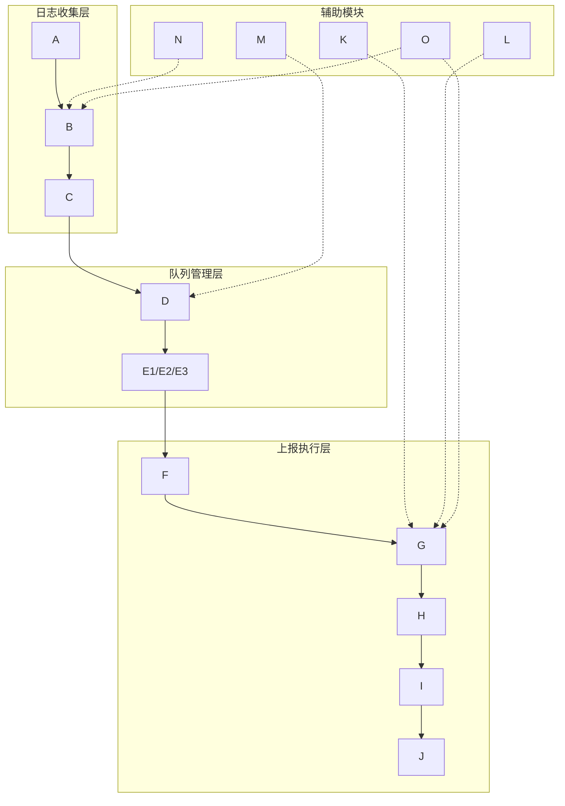

# 合并的提示词文件
# 本文件由 prompts/ 目录下的提示词文件合并生成
# 提示词按研发阶段和项目类型组织
# 如需修改提示词，请编辑 prompts/ 目录下对应的文件，然后运行此脚本合并


# ============================================================================
# 提示词来源：prompts/stages/common/code/comments/comments.md
# ============================================================================

# 注释规范

> **文件说明**：本文件包含 注释规范 相关规则
> **规则来源**：rules/stages/common/code/comments/comments.md

---

### 注释规范

#### 基本原则

- **完整句子**：使用完整的句子进行注释，首字母大写，句末加句号
- **清晰表达**：注释应清晰表达代码的意图和逻辑
- **及时更新**：代码修改时，应同步更新相关注释
- **避免冗余**：避免注释与代码重复，注释应解释"为什么"而不是"是什么"

#### 单行注释

- **格式**：使用 `//` 进行单行注释
- **位置**：注释应放在代码行的上方或右侧
- **内容**：解释代码的意图或重要逻辑

**示例**：

```javascript
// ✅ 好的做法：清晰的单行注释
// 计算用户的总订单金额
const totalAmount = orders.reduce((sum, order) => sum + order.amount, 0);

// 验证用户是否有权限访问资源
if (!user.hasPermission(resource)) {
    return null;
}

const maxRetries = 3; // 最大重试次数
```

#### 多行注释

- **格式**：使用 `/* */` 进行多行注释
- **使用场景**：用于解释复杂的逻辑或算法
- **格式要求**：每行注释前加 `*`，保持格式统一

**示例**：

```javascript
// ✅ 好的做法：格式统一的多行注释
/*
 * 计算用户的总订单金额
 * 包括已支付和待支付的订单
 * 排除已取消的订单
 */
const totalAmount = orders
    .filter(order => order.status !== 'cancelled')
    .reduce((sum, order) => sum + order.amount, 0);
```

#### 文档注释

- **函数注释**：函数和类的定义应包含文档字符串，描述其功能和参数
- **参数说明**：说明每个参数的类型和用途
- **返回值说明**：说明返回值的类型和含义
- **格式要求**：使用 JSDoc 或其他文档注释格式

**示例**：

```javascript
// ✅ 好的做法：完整的文档注释
/**
 * 根据用户ID获取用户信息
 * @param {string} userId - 用户ID
 * @param {boolean} includeProfile - 是否包含用户详细信息
 * @returns {Promise<User>} 用户对象
 * @throws {Error} 当用户不存在时抛出错误
 */
async function getUserById(userId, includeProfile = false) {
    // 函数实现
}

/**
 * 用户服务类
 * 提供用户相关的业务逻辑处理
 */
class UserService {
    /**
     * 创建新用户
     * @param {Object} userData - 用户数据
     * @param {string} userData.name - 用户名称
     * @param {string} userData.email - 用户邮箱
     * @returns {Promise<User>} 创建的用户对象
     */
    async createUser(userData) {
        // 方法实现
    }
}
```

#### TODO 注释

- **格式**：使用 `// TODO:` 标记待完成的任务
- **内容要求**：说明需要完成的任务和原因
- **责任人**：可以添加责任人信息（可选）

**示例**：

```javascript
// ✅ 好的做法：清晰的 TODO 注释
// TODO: 优化数据库查询性能，当前查询较慢
function getUserOrders(userId) {
    // 当前实现
}

// TODO(张三): 添加缓存机制，减少数据库查询
function getProductList() {
    // 当前实现
}
```

#### 禁止的注释

- ❌ **注释与代码重复**：注释只是重复代码内容，没有提供额外信息
- ❌ **过时的注释**：代码已修改但注释未更新
- ❌ **无意义的注释**：注释没有提供有用信息

**示例**：

```javascript
// ❌ 不好的做法：注释与代码重复
// 设置用户名为 'John'
const userName = 'John';

// ❌ 不好的做法：过时的注释
// 获取用户ID（已废弃，应使用 getUserById）
function getUserId() {
    // 新实现
}

// ❌ 不好的做法：无意义的注释
// 这是一个函数
function processData(data) {
    // 处理数据
    return data;
}
```

# ============================================================================
# 提示词来源：prompts/stages/common/code/comments/index.md
# ============================================================================

# 注释规范索引

> **文件说明**：本文件提供注释规范的索引和导航
> **创建时间**：2025-12-12（本地时间）

---

## 📑 模块列表

| 模块 | 文件路径 | 说明 | 行数 |
|------|---------|------|------|
| 注释规范 | `comments.md` | 单行、多行、文档、TODO 注释规范 | ~150 |

---

## 📝 扩展指南

### 如何添加新的注释规范

1. **创建规则文件**：
   - 文件命名：使用 kebab-case（如 `new-rule.md`）
   - 文件头：包含文件说明和规则来源注释
   - 文件位置：`rules/stages/common/code/comments/`

2. **更新索引**：
   - 在本文件中添加新模块的说明

---

## 📖 使用说明

- 所有注释规范都通过合并脚本自动合并到 `.cursorrules` 文件中
- 索引文件（`index.md`）不会被合并，仅用于导航和说明


# ============================================================================
# 提示词来源：prompts/stages/common/code/design-principles/design-principles.md
# ============================================================================

# 设计原则规范

> **文件说明**：本文件包含设计原则相关规则，强调简单设计优先，避免过度设计
> **规则来源**：rules/stages/common/code/design-principles/design-principles.md

---

## 设计原则规范

### 核心原则

- **简单设计优先**：优先考虑最简单的设计方案，只有在明确需要时才采用复杂方案
- **避免过度设计**：不要为了"未来可能的需求"而增加不必要的复杂度
- **场景驱动**：复杂方案必须基于明确的场景和需求，不能假设未来需求
- **渐进式演进**：从简单方案开始，根据实际需求逐步演进，而不是一开始就设计复杂方案

### 简单设计优先原则

#### 基本原则

1. **从最简单方案开始**：
   - 优先考虑最直接、最简单的实现方式
   - 使用语言和框架提供的原生功能，避免引入不必要的抽象层
   - 优先使用标准库和常见模式，避免自定义复杂机制

2. **避免过早抽象**：
   - 不要在没有明确需求时创建抽象层
   - 不要为了"复用"而创建不必要的抽象
   - 只有在实际出现重复代码（3次以上）时才考虑抽象

3. **最小化依赖**：
   - 优先使用项目已有的依赖和工具
   - 避免引入新的依赖，除非有明确且必要的理由
   - 评估新依赖的必要性和维护成本

#### 设计决策流程

**第一步：评估需求**

1. **明确当前需求**：
   - 当前需要解决什么问题？
   - 问题的核心是什么？
   - 是否有明确的边界和约束？

2. **识别简单方案**：
   - 最简单的实现方式是什么？
   - 能否用现有功能直接解决？
   - 是否需要引入新的概念或机制？

**第二步：选择方案**

1. **优先选择简单方案**：
   - 如果简单方案能满足当前需求，直接采用
   - 不要因为"未来可能需要"而选择复杂方案
   - 简单方案更容易理解、维护和测试

2. **复杂方案的条件**：
   - 只有在简单方案无法满足需求时，才考虑复杂方案
   - 复杂方案必须基于明确的场景和需求
   - 必须说明为什么简单方案不可行

**第三步：文档化决策**

1. **记录设计决策**：
   - 为什么选择这个方案？
   - 简单方案为什么不可行？
   - 复杂方案解决了什么问题？

2. **说明场景和约束**：
   - 在什么场景下需要复杂方案？
   - 有哪些约束条件？
   - 未来如何演进？

### 复杂方案的要求

#### 必须明确说明的内容

如果采用复杂方案，必须明确说明以下内容：

1. **场景说明**：
   - 在什么具体场景下需要复杂方案？
   - 简单方案为什么无法满足需求？
   - 有哪些明确的约束条件？

2. **需求分析**：
   - 当前需求是什么？
   - 未来可能的需求是什么（如果有）？
   - 这些需求是否已经明确，还是只是假设？

3. **方案对比**：
   - 简单方案是什么？
   - 简单方案的局限性是什么？
   - 复杂方案如何解决这些局限性？

4. **成本评估**：
   - 复杂方案的实现成本是多少？
   - 维护成本是多少？
   - 学习成本是多少？

#### 禁止的行为

- ❌ **禁止假设未来需求**：不能因为"未来可能需要"而采用复杂方案
- ❌ **禁止过度抽象**：不能在没有明确需求时创建抽象层
- ❌ **禁止过早优化**：不能为了"性能"或"扩展性"而增加不必要的复杂度
- ❌ **禁止复杂方案无场景说明**：复杂方案必须明确说明使用场景

### 设计示例

#### ✅ 好的做法：简单设计优先

**场景**：需要实现一个用户登录功能

**简单方案**：
```javascript
// 简单方案：直接实现登录功能
async function login(username, password) {
  const user = await db.findUser(username);
  if (!user || user.password !== hashPassword(password)) {
    throw new Error('用户名或密码错误');
  }
  return generateToken(user);
}
```

**说明**：
- 直接实现核心功能，没有不必要的抽象
- 使用标准库和常见模式
- 代码清晰易懂，易于维护

#### ⚠️ 复杂方案：需要明确场景

**场景**：需要支持多种登录方式（用户名、手机号、邮箱、第三方登录），且需要支持多种认证策略

**复杂方案**：
```javascript
// 复杂方案：使用策略模式和工厂模式
class LoginStrategy {
  async authenticate(credentials) { throw new Error('Not implemented'); }
}

class UsernameLoginStrategy extends LoginStrategy { /* ... */ }
class PhoneLoginStrategy extends LoginStrategy { /* ... */ }
class EmailLoginStrategy extends LoginStrategy { /* ... */ }
class ThirdPartyLoginStrategy extends LoginStrategy { /* ... */ }

class LoginFactory {
  createStrategy(type) { /* ... */ }
}

async function login(type, credentials) {
  const strategy = loginFactory.createStrategy(type);
  return strategy.authenticate(credentials);
}
```

**必须说明**：
- **场景**：需要支持多种登录方式，且未来可能继续扩展
- **简单方案局限性**：简单方案需要大量 if-else，难以扩展
- **复杂方案优势**：策略模式便于扩展新的登录方式
- **成本评估**：增加了代码复杂度，但提高了可扩展性

#### ❌ 不好的做法：过度设计

**场景**：只需要实现用户名密码登录

**过度设计**：
```javascript
// ❌ 不好的做法：为了"未来可能的需求"而过度设计
class AuthenticationStrategyFactory {
  // 创建了复杂的抽象层，但当前只需要一种登录方式
}
```

**问题**：
- 没有明确的场景需求
- 为了"未来可能的需求"而增加复杂度
- 增加了理解和维护成本

### 方案输出要求

#### 在输出技术方案时

1. **必须优先考虑简单方案**：
   - 首先提出最简单的实现方案
   - 说明简单方案如何满足当前需求
   - 评估简单方案的局限性

2. **复杂方案必须说明场景**：
   - 如果采用复杂方案，必须明确说明：
     - 在什么场景下需要复杂方案？
     - 简单方案为什么不可行？
     - 复杂方案解决了什么问题？

3. **方案对比**：
   - 对比简单方案和复杂方案
   - 说明各自的优缺点
   - 说明选择理由

#### 方案输出格式

```markdown
## 设计方案

### 方案1：简单方案（推荐）

**实现方式**：[简单方案的描述]

**优点**：
- 实现简单，易于理解
- 维护成本低
- 满足当前需求

**局限性**：
- [如果有局限性，说明]

### 方案2：复杂方案（可选）

**适用场景**：[明确说明在什么场景下需要复杂方案]

**实现方式**：[复杂方案的描述]

**优点**：
- [复杂方案的优势]

**缺点**：
- 实现复杂度高
- 维护成本高
- 学习成本高

**为什么需要复杂方案**：
- 简单方案无法满足 [具体需求]
- 需要支持 [具体场景]
- 有明确的 [约束条件]

### 推荐方案

基于当前需求，推荐使用 [方案1/方案2]，因为 [理由]。
```

### 适用场景

**以下场景必须遵循此规范：**

- ✅ **技术方案设计**：设计技术方案时，优先考虑简单方案
- ✅ **架构设计**：设计系统架构时，避免过度设计
- ✅ **代码实现**：实现功能时，优先使用简单直接的方式
- ✅ **重构决策**：决定是否重构时，评估简单方案是否可行
- ✅ **依赖引入**：引入新依赖时，评估是否必要

### 重要原则

1. **简单优先**：优先考虑最简单的设计方案
2. **场景驱动**：复杂方案必须基于明确的场景和需求
3. **渐进演进**：从简单方案开始，根据实际需求逐步演进
4. **避免假设**：不要为了"未来可能的需求"而增加复杂度
5. **明确说明**：复杂方案必须明确说明使用场景和理由

### 注意事项

1. **强制要求**：所有设计方案必须优先考虑简单方案
2. **场景说明**：复杂方案必须明确说明使用场景
3. **方案对比**：必须对比简单方案和复杂方案
4. **决策记录**：重要设计决策应记录在文档中
5. **定期审查**：定期审查设计，评估是否过度设计


# ============================================================================
# 提示词来源：prompts/stages/common/code/design-principles/index.md
# ============================================================================

# 设计原则规范索引

> **文件说明**：本文件提供设计原则规范的索引和导航
> **创建时间**：2025-12-12（本地时间）

---

## 📑 模块列表

| 模块 | 文件路径 | 说明 | 行数 |
|------|---------|------|------|
| 设计原则规范 | `design-principles.md` | 简单设计优先、避免过度设计 | ~300 |

---

## 📝 扩展指南

### 如何添加新的设计原则规范

1. **创建规则文件**：
   - 文件命名：使用 kebab-case（如 `new-rule.md`）
   - 文件头：包含文件说明和规则来源注释
   - 文件位置：`rules/stages/common/code/design-principles/`

2. **更新索引**：
   - 在本文件中添加新模块的说明

---

## 📖 使用说明

- 所有设计原则规范都通过合并脚本自动合并到 `.cursorrules` 文件中
- 索引文件（`index.md`）不会被合并，仅用于导航和说明


# ============================================================================
# 提示词来源：prompts/stages/common/code/error-handling/index.md
# ============================================================================

# 错误处理规范索引

> **文件说明**：本文件提供错误处理规范的索引和导航
> **创建时间**：2025-12-12（本地时间）

---

## 📑 模块列表

| 模块 | 文件路径 | 说明 | 行数 |
|------|---------|------|------|
| 错误处理策略 | `strategy.md` | 错误处理策略、异常捕获、错误边界 | ~200 |
| 错误日志记录 | `logging.md` | 错误日志记录规范 | ~150 |
| 错误信息格式 | `message-format.md` | 错误信息格式规范 | ~150 |
| 返回值规范 | `return-values.md` | 返回值规范 | ~100 |

---

## 🔗 依赖关系

- **错误日志记录** → **错误处理策略**：日志记录需要错误处理策略的支持
- **错误信息格式** → **错误处理策略**：错误信息格式需要错误处理策略的支持
- **返回值规范** → **错误处理策略**：返回值规范需要错误处理策略的支持

---

## 📝 扩展指南

### 如何添加新的错误处理规范

1. **创建规则文件**：
   - 文件命名：使用 kebab-case（如 `new-rule.md`）
   - 文件头：包含文件说明和规则来源注释
   - 文件位置：`rules/stages/common/code/error-handling/`

2. **更新索引**：
   - 在本文件中添加新模块的说明
   - 更新依赖关系（如果有）

---

## 📖 使用说明

- 所有错误处理规范都通过合并脚本自动合并到 `.cursorrules` 文件中
- 索引文件（`index.md`）不会被合并，仅用于导航和说明


# ============================================================================
# 提示词来源：prompts/stages/common/code/error-handling/logging.md
# ============================================================================

# 错误日志记录

> **文件说明**：本文件包含 错误日志记录 相关规则
> **规则来源**：rules/stages/common/code/error-handling/logging.md

---

### 错误日志记录

#### 基本原则

- **统一日志库**：使用统一的日志记录库（如 `logging`、`winston`、`pino` 等）
- **日志级别**：根据事件的重要性设置日志级别
- **详细信息**：记录详细的错误信息，包括时间戳、模块名称、错误类型、堆栈信息等
- **结构化日志**：使用结构化日志格式，便于日志分析和查询

#### 日志级别

根据事件的重要性，使用以下日志级别：

- **DEBUG**：详细的调试信息，通常只在开发环境使用
- **INFO**：一般信息，记录程序正常运行的关键步骤
- **WARNING**：警告信息，表示可能的问题，但不影响程序运行
- **ERROR**：错误信息，表示发生了错误，但程序可以继续运行
- **CRITICAL**：严重错误，表示发生了严重问题，可能导致程序无法继续运行

**使用示例**：

```javascript
// ✅ 好的做法：根据重要性选择合适的日志级别
logger.debug('开始处理用户请求', { userId, requestId });
logger.info('用户登录成功', { userId, loginTime });
logger.warn('API 响应时间较长', { endpoint, duration: 2000 });
logger.error('数据库查询失败', { query, error });
logger.critical('数据库连接丢失', { error });
```

#### 日志内容要求

错误日志应包含以下信息：

1. **时间戳**：错误发生的时间
2. **模块名称**：发生错误的模块或文件
3. **错误类型**：错误的类型（如 `SyntaxError`、`TypeError` 等）
4. **错误消息**：错误的详细消息
5. **堆栈信息**：错误的堆栈跟踪信息
6. **上下文信息**：相关的上下文信息（如用户ID、请求ID、参数值等）

**示例**：

```javascript
// ✅ 好的做法：记录详细的错误信息
try {
    const user = await getUserById(userId);
    return user;
} catch (error) {
    logger.error('获取用户失败', {
        timestamp: new Date().toISOString(),
        module: 'UserService',
        errorType: error.constructor.name,
        errorMessage: error.message,
        stack: error.stack,
        context: {
            userId,
            requestId,
            userAgent
        }
    });
    throw error;
}
```

```python
# ✅ 好的做法：记录详细的错误信息
try:
    user = await get_user_by_id(user_id)
    return user
except Exception as e:
    logger.error('获取用户失败', extra={
        'timestamp': datetime.now().isoformat(),
        'module': 'UserService',
        'error_type': type(e).__name__,
        'error_message': str(e),
        'stack': traceback.format_exc(),
        'context': {
            'user_id': user_id,
            'request_id': request_id,
            'user_agent': user_agent
        }
    })
    raise
```

#### 结构化日志

使用结构化日志格式，便于日志分析和查询：

```javascript
// ✅ 好的做法：使用结构化日志
logger.error({
    level: 'error',
    timestamp: new Date().toISOString(),
    message: '数据库查询失败',
    error: {
        type: error.constructor.name,
        message: error.message,
        stack: error.stack
    },
    context: {
        userId,
        query,
        requestId
    }
});
```

#### 敏感信息处理

- **禁止记录**：不要在日志中记录敏感信息（如密码、Token、密钥等）
- **脱敏处理**：如果必须记录敏感信息，应进行脱敏处理

**示例**：

```javascript
// ❌ 不好的做法：记录敏感信息
logger.info('用户登录', { username, password });  // 密码不应记录

// ✅ 好的做法：脱敏处理
logger.info('用户登录', { 
    username, 
    passwordHash: hashPassword(password)  // 记录哈希值而非明文
});
```

# ============================================================================
# 提示词来源：prompts/stages/common/code/error-handling/message-format.md
# ============================================================================

# 错误信息格式

> **文件说明**：本文件包含 错误信息格式 相关规则
> **规则来源**：rules/stages/common/code/error-handling/message-format.md

---

### 错误信息格式

#### 基本原则

- **用户友好**：对于用户可见的错误，提供清晰、简洁的错误提示，避免技术术语
- **技术细节分离**：技术细节应记录在日志中，与用户提示分离
- **可操作性**：错误提示应提供可操作的建议，帮助用户解决问题
- **一致性**：错误信息格式应保持一致，便于用户理解

#### 用户可见错误

用户可见的错误信息应遵循以下原则：

- **清晰简洁**：使用简单明了的语言，避免技术术语
- **具体明确**：明确指出问题所在，而不是泛泛而谈
- **可操作**：提供解决建议或下一步操作指引
- **友好语气**：使用友好的语气，避免指责用户

**示例**：

```javascript
// ✅ 好的做法：用户友好的错误提示
try {
    const user = await getUserById(userId);
    if (!user) {
        throw new UserNotFoundError('抱歉，未找到该用户信息。请检查用户ID是否正确。');
    }
    return user;
} catch (error) {
    if (error instanceof UserNotFoundError) {
        // 用户可见的错误提示
        return {
            success: false,
            message: '未找到用户信息',
            suggestion: '请检查用户ID是否正确，或联系管理员'
        };
    }
    // 其他错误记录到日志，返回通用错误提示
    logger.error('获取用户失败', { userId, error });
    return {
        success: false,
        message: '获取用户信息失败',
        suggestion: '请稍后重试，如问题持续存在，请联系技术支持'
    };
}
```

**❌ 不好的做法：技术术语和模糊提示**

```javascript
// ❌ 不好的做法：使用技术术语
return {
    success: false,
    message: 'SQLException: No rows found in users table for userId=123'
};

// ❌ 不好的做法：模糊的提示
return {
    success: false,
    message: '出错了'
};
```

#### 错误码规范

对于需要程序化处理的错误，应使用错误码：

- **错误码格式**：使用统一的错误码格式（如 `ERR_USER_NOT_FOUND`、`ERR_INVALID_INPUT`）
- **错误码分类**：按模块或功能分类错误码
- **错误码文档**：维护错误码文档，说明每个错误码的含义和处理方式

**示例**：

```javascript
// ✅ 好的做法：使用错误码
const ErrorCodes = {
    USER_NOT_FOUND: 'ERR_USER_NOT_FOUND',
    INVALID_INPUT: 'ERR_INVALID_INPUT',
    DATABASE_ERROR: 'ERR_DATABASE_ERROR',
    NETWORK_ERROR: 'ERR_NETWORK_ERROR'
};

function getUserById(userId) {
    try {
        const user = fetchUser(userId);
        if (!user) {
            throw new AppError(ErrorCodes.USER_NOT_FOUND, '用户不存在');
        }
        return user;
    } catch (error) {
        if (error.code === ErrorCodes.USER_NOT_FOUND) {
            return {
                success: false,
                code: ErrorCodes.USER_NOT_FOUND,
                message: '未找到用户信息'
            };
        }
        throw error;
    }
}
```

#### 错误信息国际化

如果应用支持多语言，错误信息应支持国际化：

- **使用资源文件**：将错误信息存储在资源文件中，而非硬编码
- **语言切换**：根据用户语言偏好显示对应语言的错误信息
- **占位符支持**：支持在错误信息中使用占位符，动态填充变量

**示例**：

```javascript
// ✅ 好的做法：支持国际化
const errorMessages = {
    'zh-CN': {
        USER_NOT_FOUND: '未找到用户信息',
        INVALID_INPUT: '输入数据无效'
    },
    'en-US': {
        USER_NOT_FOUND: 'User not found',
        INVALID_INPUT: 'Invalid input data'
    }
};

function getErrorMessage(code, locale = 'zh-CN') {
    return errorMessages[locale]?.[code] || errorMessages['zh-CN'][code];
}
```

# ============================================================================
# 提示词来源：prompts/stages/common/code/error-handling/return-values.md
# ============================================================================

# 返回值规范

> **文件说明**：本文件包含 返回值规范 相关规则
> **规则来源**：rules/stages/common/code/error-handling/return-values.md

---

### 返回值规范

#### 基本原则

- **明确返回值**：函数应明确返回值，避免返回 `None` 或不确定的值
- **错误处理**：在可能失败的情况下，函数应返回错误码或抛出异常，以便调用者进行处理
- **一致性**：返回值格式应保持一致，便于调用者处理
- **类型明确**：返回值类型应明确，避免返回多种类型的值

#### 返回值模式

**模式1：返回结果对象**

```javascript
// ✅ 好的做法：返回结果对象
function getUserById(userId) {
    try {
        const user = fetchUser(userId);
        if (!user) {
            return {
                success: false,
                error: 'USER_NOT_FOUND',
                message: '用户不存在'
            };
        }
        return {
            success: true,
            data: user
        };
    } catch (error) {
        logger.error('获取用户失败', { userId, error });
        return {
            success: false,
            error: 'DATABASE_ERROR',
            message: '获取用户信息失败'
        };
    }
}
```

**模式2：抛出异常**

```javascript
// ✅ 好的做法：抛出异常
function getUserById(userId) {
    if (!userId) {
        throw new ValidationError('用户ID不能为空');
    }
    
    const user = fetchUser(userId);
    if (!user) {
        throw new UserNotFoundError(`用户不存在: ${userId}`);
    }
    
    return user;
}

// 调用者处理异常
try {
    const user = getUserById(userId);
    // 处理用户数据
} catch (error) {
    if (error instanceof UserNotFoundError) {
        // 处理用户不存在的情况
    } else if (error instanceof ValidationError) {
        // 处理验证错误
    } else {
        // 处理其他错误
    }
}
```

**模式3：使用 Result 类型**

```typescript
// ✅ 好的做法：使用 Result 类型（TypeScript）
type Result<T, E> = 
    | { success: true; data: T }
    | { success: false; error: E };

function getUserById(userId: string): Result<User, string> {
    try {
        const user = fetchUser(userId);
        if (!user) {
            return { success: false, error: 'USER_NOT_FOUND' };
        }
        return { success: true, data: user };
    } catch (error) {
        return { success: false, error: 'DATABASE_ERROR' };
    }
}
```

#### 禁止的返回值模式

**❌ 不好的做法：返回 null 或 undefined 表示错误**

```javascript
// ❌ 不好的做法：返回 null 表示错误
function getUserById(userId) {
    const user = fetchUser(userId);
    return user || null;  // 无法区分"用户不存在"和"查询失败"
}

// 调用者无法区分错误类型
const user = getUserById(userId);
if (user === null) {
    // 不知道是用户不存在还是查询失败
}
```

**❌ 不好的做法：返回多种类型的值**

```javascript
// ❌ 不好的做法：返回多种类型的值
function processData(data) {
    if (!data) {
        return null;  // 返回 null
    }
    if (data.invalid) {
        return false;  // 返回布尔值
    }
    return { result: 'success' };  // 返回对象
}

// 调用者需要检查多种类型
const result = processData(data);
if (result === null) {
    // 处理 null
} else if (result === false) {
    // 处理 false
} else {
    // 处理对象
}
```

#### 返回值文档

函数应明确文档化返回值：

```javascript
/**
 * 根据用户ID获取用户信息
 * @param {string} userId - 用户ID
 * @returns {Promise<{success: boolean, data?: User, error?: string}>}
 *   - success: true 时，返回 data（用户对象）
 *   - success: false 时，返回 error（错误码）
 * @throws {ValidationError} 当用户ID无效时抛出
 */
async function getUserById(userId) {
    // 函数实现
}
```

# ============================================================================
# 提示词来源：prompts/stages/common/code/error-handling/strategy.md
# ============================================================================

# 错误处理策略

> **文件说明**：本文件包含 错误处理策略 相关规则
> **规则来源**：rules/stages/common/code/error-handling/strategy.md

---

### 错误处理策略

#### 基本原则

- **统一错误处理机制**：在代码中实现统一的错误处理机制，确保所有可能的错误情况都被捕获和处理
- **具体异常类型**：捕获异常时，应指定具体的异常类型，避免使用通用的 `except`
- **及时处理**：所有可能引发异常的代码块应使用 `try-except` 进行处理
- **错误传播**：合理处理错误传播，避免错误被忽略或隐藏
- **设计时考虑**：错误处理应在代码设计时考虑，而非问题修复时盲目添加
  - ✅ **正常开发**：编写新代码时，应根据业务逻辑设计合理的错误处理机制
  - ❌ **问题修复**：修复已存在的问题时，应先遵循 `problem-location.md` 定位问题，再根据定位结果添加必要的错误处理

#### 异常捕获规范

**✅ 好的做法：捕获具体异常类型**

```javascript
// ✅ 好的做法：捕获具体异常类型
try {
    const data = JSON.parse(jsonString);
    return processData(data);
} catch (error) {
    if (error instanceof SyntaxError) {
        // 处理 JSON 解析错误
        logger.error('JSON 解析失败', { error, jsonString });
        throw new ValidationError('无效的 JSON 格式');
    } else if (error instanceof TypeError) {
        // 处理类型错误
        logger.error('类型错误', { error });
        throw new ValidationError('数据类型不正确');
    } else {
        // 处理其他未知错误
        logger.error('未知错误', { error });
        throw error;
    }
}
```

```python
# ✅ 好的做法：捕获具体异常类型
try:
    data = json.loads(json_string)
    return process_data(data)
except json.JSONDecodeError as e:
    # 处理 JSON 解析错误
    logger.error('JSON 解析失败', extra={'error': str(e), 'json_string': json_string})
    raise ValidationError('无效的 JSON 格式') from e
except TypeError as e:
    # 处理类型错误
    logger.error('类型错误', extra={'error': str(e)})
    raise ValidationError('数据类型不正确') from e
except Exception as e:
    # 处理其他未知错误
    logger.error('未知错误', extra={'error': str(e)})
    raise
```

**❌ 不好的做法：使用通用异常捕获**

```javascript
// ❌ 不好的做法：捕获所有异常但不处理
try {
    const data = JSON.parse(jsonString);
    return processData(data);
} catch (error) {
    // 捕获所有错误但不处理，隐藏了真正的问题
    return null;
}
```

```python
# ❌ 不好的做法：使用通用的 except
try:
    data = json.loads(json_string)
    return process_data(data)
except:  # 捕获所有异常，但不指定类型
    # 捕获所有错误但不处理，隐藏了真正的问题
    return None
```

#### 错误处理模式

**模式1：立即处理并返回**

```javascript
// ✅ 好的做法：立即处理错误并返回
function getUserById(userId) {
    try {
        const user = fetchUserFromDatabase(userId);
        return user;
    } catch (error) {
        logger.error('获取用户失败', { userId, error });
        return null;  // 返回默认值
    }
}
```

**模式2：处理并抛出新的错误**

```javascript
// ✅ 好的做法：处理错误并抛出新的错误
function validateUserData(userData) {
    try {
        validateEmail(userData.email);
        validatePhone(userData.phone);
        return true;
    } catch (error) {
        logger.error('用户数据验证失败', { userData, error });
        throw new ValidationError('用户数据无效', { cause: error });
    }
}
```

**模式3：错误恢复**

```javascript
// ✅ 好的做法：实现错误恢复机制
async function fetchUserData(userId) {
    try {
        return await fetchFromPrimaryDatabase(userId);
    } catch (error) {
        logger.warn('主数据库查询失败，尝试备用数据库', { userId, error });
        try {
            return await fetchFromBackupDatabase(userId);
        } catch (backupError) {
            logger.error('备用数据库查询也失败', { userId, error: backupError });
            throw new DatabaseError('无法获取用户数据', { cause: backupError });
        }
    }
}
```

#### 错误边界处理

- **边界检查**：在函数入口处进行参数验证，避免无效输入导致错误
- **资源清理**：使用 `finally` 块确保资源被正确清理
- **错误传播**：合理决定是否向上传播错误，还是就地处理

**示例**：

```javascript
// ✅ 好的做法：边界检查和资源清理
async function processFile(filePath) {
    // 边界检查
    if (!filePath || typeof filePath !== 'string') {
        throw new ValidationError('文件路径无效');
    }

    let fileHandle = null;
    try {
        fileHandle = await openFile(filePath);
        const content = await readFile(fileHandle);
        return processContent(content);
    } catch (error) {
        logger.error('文件处理失败', { filePath, error });
        throw new ProcessingError('无法处理文件', { cause: error });
    } finally {
        // 确保资源被清理
        if (fileHandle) {
            await closeFile(fileHandle);
        }
    }
}
```

# ============================================================================
# 提示词来源：prompts/stages/common/code/format/code-format.md
# ============================================================================

# 代码格式规范

> **文件说明**：本文件包含 代码格式规范 相关规则
> **规则来源**：rules/stages/common/code/code-format/code-format.md

---

### 代码格式规范

#### 缩进规范

- **缩进方式**：使用 4 个空格进行缩进，不使用制表符（Tab）
- **一致性要求**：整个项目应使用统一的缩进方式
- **编辑器配置**：建议在编辑器中配置自动将 Tab 转换为空格

**示例**：

```javascript
// ✅ 好的做法：使用 4 个空格
function processData(data) {
    if (data) {
        return data.map(item => {
            return processItem(item);
        });
    }
    return null;
}

// ❌ 不好的做法：使用 Tab 或混合使用
function processData(data) {
	if (data) {  // Tab 缩进
        return data.map(item => {  // 空格缩进（不一致）
			return processItem(item);  // Tab 缩进
		});
	}
	return null;
}
```

#### 行长度规范

- **最大行长度**：每行代码不超过 80 个字符
- **超长处理**：如果代码行超过 80 个字符，应进行换行处理
- **换行原则**：在逻辑断点处换行，保持代码可读性

**示例**：

```javascript
// ✅ 好的做法：合理换行
const result = users
    .filter(user => user.isActive)
    .map(user => ({
        id: user.id,
        name: user.name,
        email: user.email
    }))
    .sort((a, b) => a.name.localeCompare(b.name));

// ❌ 不好的做法：行过长
const result = users.filter(user => user.isActive).map(user => ({ id: user.id, name: user.name, email: user.email })).sort((a, b) => a.name.localeCompare(b.name));
```

#### 空行规范

- **函数之间**：函数之间使用一个空行分隔
- **类之间**：类之间使用两个空行分隔
- **逻辑块之间**：相关逻辑块之间使用空行分隔，提高可读性

**示例**：

```javascript
// ✅ 好的做法：合理的空行
function getUserById(id) {
    // 函数实现
}

function saveUser(user) {
    // 函数实现
}

class UserService {
    // 类实现
}


class DataProcessor {
    // 类实现
}
```

#### 导入规范

- **导入顺序**：按照标准库、第三方库、本地模块的顺序进行导入
- **空行分隔**：每个部分之间使用一个空行分隔
- **导入格式**：使用统一的导入格式（如 ES6 import 或 CommonJS require）

**示例**：

```javascript
// ✅ 好的做法：按顺序导入，空行分隔
// 标准库
import fs from 'fs';
import path from 'path';

// 第三方库
import express from 'express';
import axios from 'axios';

// 本地模块
import { UserService } from './services/user-service';
import { DataProcessor } from './utils/data-processor';
```

#### 括号和空格规范

- **函数括号**：函数名和括号之间不加空格
- **参数括号**：参数列表的括号内，参数之间使用逗号和空格分隔
- **操作符空格**：操作符前后使用空格（如 `=`、`+`、`-`、`*`、`/`）

**示例**：

```javascript
// ✅ 好的做法：正确的括号和空格
function processData(data) {
    const result = data.map(item => item.value * 2);
    return result.filter(value => value > 10);
}

// ❌ 不好的做法：括号和空格不规范
function processData( data ) {  // 括号内不应有空格
    const result=data.map(item=>item.value*2);  // 操作符缺少空格
    return result.filter(value=>value>10);  // 操作符缺少空格
}
```

# ============================================================================
# 提示词来源：prompts/stages/common/code/format/index.md
# ============================================================================

# 代码格式规范索引

> **文件说明**：本文件提供代码格式规范的索引和导航
> **创建时间**：2025-12-12（本地时间）

---

## 📑 模块列表

| 模块 | 文件路径 | 说明 | 行数 |
|------|---------|------|------|
| 代码格式规范 | `code-format.md` | 缩进、行长度、空行、导入、括号和空格 | ~150 |

---

## 📝 扩展指南

### 如何添加新的代码格式规范

1. **创建规则文件**：
   - 文件命名：使用 kebab-case（如 `new-rule.md`）
   - 文件头：包含文件说明和规则来源注释
   - 文件位置：`rules/stages/common/code/format/`

2. **更新索引**：
   - 在本文件中添加新模块的说明

---

## 📖 使用说明

- 所有代码格式规范都通过合并脚本自动合并到 `.cursorrules` 文件中
- 索引文件（`index.md`）不会被合并，仅用于导航和说明


# ============================================================================
# 提示词来源：prompts/stages/common/code/function/function-design.md
# ============================================================================

# 函数设计规范

> **文件说明**：本文件包含 函数设计规范 相关规则
> **规则来源**：rules/stages/common/code/function-design/function-design.md

---

### 函数设计规范

#### 基本原则

- **简短且单一用途**：函数应简短且具有单一用途，指令数量少于 20 条
- **函数命名**：函数名称应包含动词和其他含义，清晰表达函数功能
- **避免嵌套**：避免代码块嵌套，提高代码可读性
- **函数类型选择**：根据函数复杂度选择合适的函数类型（箭头函数或命名函数）

#### 函数命名规范

- **布尔值函数**：如果返回布尔值，使用 `isX`、`hasX`、`canX` 等命名方式
- **无返回值函数**：如果不返回任何值，使用 `executeX`、`saveX`、`processX` 等命名方式
- **返回值函数**：如果返回数据，使用 `getX`、`fetchX`、`loadX` 等命名方式

**命名示例**：

```javascript
// ✅ 好的命名
function isUserActive(user) { /* ... */ }
function hasPermission(user, permission) { /* ... */ }
function canAccessResource(user, resource) { /* ... */ }

function saveUserData(user) { /* ... */ }
function executeTask(task) { /* ... */ }
function processData(data) { /* ... */ }

function getUserById(id) { /* ... */ }
function fetchUserData(userId) { /* ... */ }
function loadConfig() { /* ... */ }

// ❌ 不好的命名
function check(user) { /* ... */ }  // 不明确返回类型
function do(user) { /* ... */ }  // 动词不具体
function data() { /* ... */ }  // 缺少动词
```

#### 避免代码嵌套

**方法1：尽早检查并返回结果**

```javascript
// ❌ 不好的做法：深层嵌套
function processUser(user) {
  if (user) {
    if (user.isActive) {
      if (user.hasPermission) {
        // 处理逻辑
        return result;
      }
    }
  }
  return null;
}

// ✅ 好的做法：尽早返回
function processUser(user) {
  if (!user) return null;
  if (!user.isActive) return null;
  if (!user.hasPermission) return null;
  
  // 处理逻辑
  return result;
}
```

**方法2：提取到实用函数**

```javascript
// ❌ 不好的做法：嵌套逻辑
function processUsers(users) {
  return users.map(user => {
    if (user.isActive) {
      return user.data.map(item => {
        if (item.valid) {
          return processItem(item);
        }
      });
    }
  });
}

// ✅ 好的做法：提取函数
function processUsers(users) {
  return users
    .filter(isActiveUser)
    .flatMap(getUserData)
    .filter(isValidItem)
    .map(processItem);
}

function isActiveUser(user) {
  return user.isActive;
}

function getUserData(user) {
  return user.data;
}

function isValidItem(item) {
  return item.valid;
}
```

**方法3：使用高阶函数**

```javascript
// ❌ 不好的做法：手动循环和嵌套
function getActiveUserNames(users) {
  const result = [];
  for (let i = 0; i < users.length; i++) {
    if (users[i].isActive) {
      result.push(users[i].name);
    }
  }
  return result;
}

// ✅ 好的做法：使用高阶函数
function getActiveUserNames(users) {
  return users
    .filter(user => user.isActive)
    .map(user => user.name);
}
```

#### 函数类型选择

- **简单函数**（少于 3 条指令）：使用箭头函数
- **非简单函数**：使用命名函数

**示例**：

```javascript
// ✅ 简单函数：使用箭头函数
const double = (x) => x * 2;
const isEven = (n) => n % 2 === 0;
const getFullName = (user) => `${user.firstName} ${user.lastName}`;

// ✅ 非简单函数：使用命名函数
function processUserData(user) {
  const validated = validateUser(user);
  const processed = transformUser(validated);
  const saved = saveUser(processed);
  return saved;
}

function calculateTotal(items) {
  let total = 0;
  for (const item of items) {
    total += item.price * item.quantity;
  }
  return total;
}
```

#### 参数处理

- **使用默认参数**：使用默认参数值，而不是检查是否为 `null` 或 `undefined`
- **RO-RO 模式**：使用 RO-RO（Read-Only, Read-Only）模式减少函数参数

**示例**：

```javascript
// ❌ 不好的做法：检查 null/undefined
function greet(name) {
  if (name === null || name === undefined) {
    name = 'Guest';
  }
  return `Hello, ${name}!`;
}

// ✅ 好的做法：使用默认参数
function greet(name = 'Guest') {
  return `Hello, ${name}!`;
}

// ❌ 不好的做法：多个参数
function createUser(firstName, lastName, email, phone, address) {
  // ...
}

// ✅ 好的做法：使用对象参数（RO-RO 模式）
function createUser({ firstName, lastName, email, phone, address }) {
  // ...
}

// 调用时更清晰
createUser({
  firstName: 'John',
  lastName: 'Doe',
  email: 'john@example.com',
  phone: '1234567890',
  address: '123 Main St'
});
```

# ============================================================================
# 提示词来源：prompts/stages/common/code/function/index.md
# ============================================================================

# 函数设计规范索引

> **文件说明**：本文件提供函数设计规范的索引和导航
> **创建时间**：2025-12-12（本地时间）

---

## 📑 模块列表

| 模块 | 文件路径 | 说明 | 行数 |
|------|---------|------|------|
| 函数设计规范 | `function-design.md` | 函数设计原则、命名、参数处理 | ~150 |

---

## 📝 扩展指南

### 如何添加新的函数设计规范

1. **创建规则文件**：
   - 文件命名：使用 kebab-case（如 `new-rule.md`）
   - 文件头：包含文件说明和规则来源注释
   - 文件位置：`rules/stages/common/code/function/`

2. **更新索引**：
   - 在本文件中添加新模块的说明

---

## 📖 使用说明

- 所有函数设计规范都通过合并脚本自动合并到 `.cursorrules` 文件中
- 索引文件（`index.md`）不会被合并，仅用于导航和说明


# ============================================================================
# 提示词来源：prompts/stages/common/code/index.md
# ============================================================================

# 代码规范规则索引

> **文件说明**：本文件提供代码规范规则的索引和导航
> **创建时间**：2025-12-12（本地时间）

---

## 📑 模块列表

### 命名规范

| 模块 | 文件路径 | 说明 | 行数 |
|------|---------|------|------|
| 命名规范 | `naming/naming.md` | 变量、函数、类、常量、文件命名规范 | ~100 |

### 函数设计规范

| 模块 | 文件路径 | 说明 | 行数 |
|------|---------|------|------|
| 函数设计规范 | `function/function-design.md` | 函数设计原则、命名、参数处理 | ~150 |

### 设计原则规范

| 模块 | 文件路径 | 说明 | 行数 |
|------|---------|------|------|
| 设计原则规范 | `design-principles/design-principles.md` | 简单设计优先、避免过度设计 | ~300 |

### 代码格式规范

| 模块 | 文件路径 | 说明 | 行数 |
|------|---------|------|------|
| 代码格式规范 | `format/code-format.md` | 缩进、行长度、空行、导入、括号和空格 | ~150 |

### 注释规范

| 模块 | 文件路径 | 说明 | 行数 |
|------|---------|------|------|
| 注释规范 | `comments/comments.md` | 单行、多行、文档、TODO 注释规范 | ~150 |

### 代码组织规范

| 模块 | 文件路径 | 说明 | 行数 |
|------|---------|------|------|
| 代码组织规范 | `organization/code-organization.md` | 文件大小限制、拆分原则 | ~202 |

### 错误处理规范

| 模块 | 文件路径 | 说明 | 行数 |
|------|---------|------|------|
| 错误处理策略 | `error-handling/strategy.md` | 错误处理策略、异常捕获、错误边界 | ~200 |
| 错误日志记录 | `error-handling/logging.md` | 错误日志记录规范 | ~150 |
| 错误信息格式 | `error-handling/message-format.md` | 错误信息格式规范 | ~150 |
| 返回值规范 | `error-handling/return-values.md` | 返回值规范 | ~100 |

### 问题定位规范

| 模块 | 文件路径 | 说明 | 行数 |
|------|---------|------|------|
| 问题定位规范 | `problem-location/problem-location.md` | 问题定位与调试规范 | ~601 |

---

## 🔗 依赖关系

- **错误处理规范** → **代码风格规范**：错误处理代码应遵循代码风格规范
- **问题定位规范** → **错误处理规范**：定位问题后，应遵循错误处理规范添加必要的错误处理

---

## 📝 扩展指南

### 如何添加新的代码规范规则

1. **确定规则类型**：
   - 如果是命名相关，添加到 `naming/` 目录
   - 如果是函数设计相关，添加到 `function/` 目录
   - 如果是设计原则相关，添加到 `design-principles/` 目录
   - 如果是格式相关，添加到 `format/` 目录
   - 如果是注释相关，添加到 `comments/` 目录
   - 如果是错误处理相关，添加到 `error-handling/` 目录

2. **创建规则文件**：
   - 文件命名：使用 kebab-case（如 `new-rule.md`）
   - 文件头：包含文件说明和规则来源注释

3. **更新索引**：
   - 在本文件中添加新模块的说明
   - 更新依赖关系（如果有）

---

## 📖 使用说明

- 所有代码规范规则都通过合并脚本自动合并到 `.cursorrules` 文件中
- 索引文件（`index.md`）不会被合并，仅用于导航和说明
- 规则文件按字母顺序合并，索引文件优先合并


# ============================================================================
# 提示词来源：prompts/stages/common/code/naming/index.md
# ============================================================================

# 命名规范索引

> **文件说明**：本文件提供命名规范的索引和导航
> **创建时间**：2025-12-12（本地时间）

---

## 📑 模块列表

| 模块 | 文件路径 | 说明 | 行数 |
|------|---------|------|------|
| 命名规范 | `naming.md` | 变量、函数、类、常量、文件命名规范 | ~100 |

---

## 📝 扩展指南

### 如何添加新的命名规范

1. **创建规则文件**：
   - 文件命名：使用 kebab-case（如 `new-rule.md`）
   - 文件头：包含文件说明和规则来源注释
   - 文件位置：`rules/stages/common/code/naming/`

2. **更新索引**：
   - 在本文件中添加新模块的说明

---

## 📖 使用说明

- 所有命名规范都通过合并脚本自动合并到 `.cursorrules` 文件中
- 索引文件（`index.md`）不会被合并，仅用于导航和说明


# ============================================================================
# 提示词来源：prompts/stages/common/code/naming/naming.md
# ============================================================================

# 命名规范

> **文件说明**：本文件包含 命名规范 相关规则
> **规则来源**：rules/stages/common/code/naming/naming.md

---

### 命名规范

#### 基本原则

- **使用完整单词**：使用完整的单词，避免缩写（标准缩写如 API、URL 除外）
- **拼写正确**：确保所有命名拼写正确
- **语义清晰**：命名应清晰表达其含义和用途
- **遵循项目规范**：遵循项目已有的命名规范（如：kebab-case、camelCase、PascalCase）

#### 常用缩写（允许使用）

以下常用缩写可以在代码中使用：

- **循环变量**：`i`、`j`、`k`（用于循环计数器）
- **错误处理**：`err`、`error`（用于错误对象）
- **上下文**：`ctx`、`context`（用于上下文对象）
- **中间件参数**：`req`、`res`、`next`（用于中间件函数参数）

#### 变量和函数命名

- **命名格式**：使用 `lowerCamelCase`（小驼峰命名）
- **函数命名**：应包含动词，表达函数的功能
- **布尔值函数**：使用 `isX`、`hasX`、`canX` 等前缀
- **无返回值函数**：使用 `executeX`、`saveX`、`processX` 等动词开头

**命名示例**：

```javascript
// ✅ 好的命名
const userName = 'John';
const maxRetries = 3;
const isActive = true;
const hasPermission = false;

function getUserById(id) { /* ... */ }
function saveUserData(user) { /* ... */ }
function isUserActive(user) { /* ... */ }
function hasUserPermission(user, permission) { /* ... */ }

// ❌ 不好的命名
const usrNm = 'John';  // 缩写不清晰
const maxR = 3;  // 缩写不清晰
const flag = true;  // 语义不清晰
function get() { /* ... */ }  // 缺少具体含义
```

#### 类名命名

- **命名格式**：使用 `UpperCamelCase`（大驼峰命名，PascalCase）
- **命名原则**：类名应为名词，表达类的用途

**命名示例**：

```javascript
// ✅ 好的命名
class UserService { /* ... */ }
class DataProcessor { /* ... */ }
class ConfigManager { /* ... */ }

// ❌ 不好的命名
class userService { /* ... */ }  // 应使用大驼峰
class data_processor { /* ... */ }  // 应使用大驼峰
class Config { /* ... */ }  // 过于宽泛
```

#### 常量命名

- **命名格式**：使用全大写字母，单词之间以下划线分隔
- **命名原则**：常量名应清晰表达其含义

**命名示例**：

```javascript
// ✅ 好的命名
const MAX_RETRIES = 3;
const DEFAULT_TIMEOUT = 5000;
const API_BASE_URL = 'https://api.example.com';

// ❌ 不好的命名
const maxRetries = 3;  // 应使用全大写
const defaultTimeout = 5000;  // 应使用全大写
const apiBaseUrl = 'https://api.example.com';  // 应使用全大写
```

#### 文件命名

- **命名格式**：遵循项目已有的命名规范
- **命名原则**：文件名应清晰表达文件的主要功能
- **常见格式**：
  - `kebab-case`：`user-service.js`、`data-processor.ts`
  - `camelCase`：`userService.js`、`dataProcessor.ts`
  - `PascalCase`：`UserService.js`、`DataProcessor.ts`（通常用于类文件）

**命名示例**：

- ✅ **好的命名**：
  - `user-service.js`：用户服务
  - `data-processor.ts`：数据处理器
  - `config-manager.js`：配置管理器
- ❌ **不好的命名**：
  - `utils.js`：过于宽泛
  - `helper.js`：不明确
  - `misc.js`：杂项，职责不清

# ============================================================================
# 提示词来源：prompts/stages/common/code/organization/code-organization.md
# ============================================================================

## 代码组织规范

### 强制要求
- **核心原则**：保持代码文件职责单一，控制文件大小，提高代码可维护性
- **适用范围**：所有代码文件（包括脚本、配置文件、业务代码等）

### 文件大小限制

#### 新增文件规范

- **代码行数限制**：新增文件的代码行数**不得超过 500 行**
- **单一职责原则**：每个文件应只负责一个明确的功能或职责
- **职能单一**：避免在一个文件中混合多个不相关的功能

#### 行数计算标准

- **包含内容**：
  - 代码行（包括注释）
  - 空行（用于代码可读性的空行）
  - 文档注释
- **不包含内容**：
  - 自动生成的代码（如某些框架生成的代码）
  - 大型数据结构的定义（如配置映射表、常量表等，如果超过 100 行，建议单独提取）

#### 判断标准

- **简单文件**（<200 行）：可以直接创建，无需拆分
- **中等文件**（200-500 行）：可以创建，但应确保职责单一
- **复杂文件**（>500 行）：**禁止创建**，必须拆分为多个文件

### 历史文件处理策略

#### 超过 500 行的历史文件

如果历史文件代码行数**超过 500 行**，新增代码应遵循以下策略：

#### 接近 500 行的历史文件

如果历史文件代码行数**不超过 500 行**，但新增代码后可能超过 500 行，新增代码也应遵循以下策略：

1. **新增代码放到新文件**：
   - 将新增功能代码放到新的独立文件中
   - 新文件应遵循单一职责原则
   - 新文件代码行数不得超过 500 行

2. **通过引入方式调用**：
   - 在历史文件中通过 `import`、`require`、`source` 等方式引入新文件
   - 保持原有文件的接口不变，确保向下兼容
   - 原有文件作为入口或协调层，调用新文件的功能

3. **保持接口稳定**：
   - 原有文件的公开接口（函数、类、方法等）应保持不变
   - 内部实现可以重构，但外部调用方式不应改变
   - 如需修改接口，应提供迁移方案

**判断标准**：
- **超过 500 行**：必须将新增代码放到新文件
- **接近 500 行**（如超过 400 行）：建议将新增代码放到新文件，避免文件过大
- **小于 400 行**：可以根据实际情况决定，但应保持文件职责单一

#### 拆分原则

1. **按功能拆分**：
   - 将不同功能模块拆分到独立文件
   - 每个文件负责一个明确的功能领域

2. **按层次拆分**：
   - 将不同层次的代码拆分（如：数据层、业务层、展示层）
   - 保持层次清晰，避免跨层次耦合

3. **按职责拆分**：
   - 将不同职责的代码拆分（如：工具函数、业务逻辑、配置管理）
   - 每个文件应有明确的职责边界

### 代码拆分方法

#### 拆分步骤

1. **识别拆分点**：
   - 分析文件中的功能模块
   - 识别可以独立的功能单元
   - 确定拆分后的文件结构

2. **创建新文件**：
   - 为新功能创建独立的文件
   - 文件命名应清晰表达其功能
   - 确保新文件代码行数不超过 500 行

3. **提取公共代码**：
   - 将公共函数、工具类等提取到独立文件
   - 通过引入方式在多个文件中复用

4. **更新原文件**：
   - 在原文件中引入新文件
   - 保持原文件的接口不变
   - 将具体实现委托给新文件

#### 拆分示例

**拆分前**（不推荐）：
```javascript
// main.js (600+ 行)
function processData() { /* ... */ }
function validateData() { /* ... */ }
function formatData() { /* ... */ }
function saveData() { /* ... */ }
// ... 更多函数
```

**拆分后**（推荐）：
```javascript
// main.js (入口文件，<200 行)
import { processData } from './data-processor.js';
import { validateData } from './data-validator.js';
import { formatData } from './data-formatter.js';
import { saveData } from './data-storage.js';

// 协调和调用各个模块
export function handleData(data) {
  const processed = processData(data);
  const validated = validateData(processed);
  const formatted = formatData(validated);
  return saveData(formatted);
}
```

```javascript
// data-processor.js (<200 行)
export function processData(data) { /* ... */ }
```

```javascript
// data-validator.js (<200 行)
export function validateData(data) { /* ... */ }
```

### 文件命名规范

#### 命名原则

- **清晰表达功能**：文件名应清晰表达文件的主要功能
- **遵循项目规范**：遵循项目已有的命名规范（如：kebab-case、camelCase、PascalCase）
- **避免过长**：文件名不应过长，建议不超过 30 个字符

#### 命名示例

- ✅ **好的命名**：
  - `data-processor.js`：数据处理
  - `user-validator.js`：用户验证
  - `config-manager.js`：配置管理
- ❌ **不好的命名**：
  - `utils.js`：过于宽泛
  - `helper.js`：不明确
  - `misc.js`：杂项，职责不清

### 代码组织最佳实践

#### 1. 优先拆分

- **新建功能时**：如果预计代码行数会超过 500 行，应提前规划文件结构，拆分为多个文件
- **重构时**：如果发现文件超过 500 行，应主动拆分，而不是继续增加代码

#### 2. 保持一致性

- **项目统一**：同一项目中的代码组织方式应保持一致
- **团队协作**：团队成员应遵循相同的代码组织规范

#### 3. 文档说明

- **文件头注释**：每个文件应在开头说明文件的主要功能和职责
- **拆分说明**：如果文件是拆分后的结果，应说明拆分的原因和关系

#### 4. 依赖管理

- **避免循环依赖**：拆分后的文件之间应避免循环依赖
- **依赖层次清晰**：保持依赖关系的层次清晰，避免深层嵌套

### 适用场景

**以下场景必须遵循此规范：**

- ✅ **新建文件**：创建新的代码文件时，必须确保代码行数不超过 500 行
- ✅ **功能扩展**：在现有文件中添加新功能时，如果文件已超过 500 行，应拆分到新文件
- ✅ **代码重构**：重构代码时，如果文件超过 500 行，应主动拆分
- ✅ **代码审查**：代码审查时，应检查文件大小是否符合规范

### 重要原则

1. **职责单一**：每个文件应只负责一个明确的功能或职责
2. **大小控制**：新增文件代码行数不得超过 500 行
3. **拆分优先**：历史文件超过 500 行时，新增代码应拆分到新文件
4. **接口稳定**：拆分时保持原有接口不变，确保向下兼容
5. **可维护性**：通过合理的代码组织，提高代码的可维护性和可读性

### 注意事项

1. **强制要求**：新增文件代码行数不得超过 500 行，这是强制要求，不是建议
2. **历史文件**：历史文件超过 500 行时，新增代码必须拆分到新文件
3. **向下兼容**：拆分历史文件时，必须保持原有接口不变
4. **团队协作**：团队成员应统一遵循此规范，保持代码组织的一致性
5. **持续重构**：定期检查文件大小，主动拆分超过 500 行的文件


# ============================================================================
# 提示词来源：prompts/stages/common/code/problem-location/problem-location.md
# ============================================================================

## 问题定位与调试规范

### 核心原则

**在修改问题之前，必须先定位问题，而不是靠猜测添加各种防御性代码。**

### 强制要求

- **必须先定位问题**：遇到问题时，必须先通过调试手段定位问题的根本原因
- **禁止盲目添加防御**：不能在没有定位问题的情况下，通过添加各种防御性代码来"修复"问题
- **使用调试工具**：优先使用调试工具（如 console、断点、日志等）来定位问题
- **验证假设**：任何对问题的假设都必须通过调试验证，不能仅凭猜测
- **系统性调试**：必须从问题发生的起点开始，逐步追踪数据流，在每个关键节点输出状态
- **一次性修复**：定位到根因后，必须一次性修复，禁止逐个修复表面问题
- **禁止反复定位**：禁止在修复一个问题后，又发现新问题，然后再次修复的循环

### 适用场景说明

**本规范适用于问题排查和修复场景**，不适用于正常代码编写场景。

- ✅ **问题排查场景**：遇到 Bug、功能异常、性能问题等需要排查和修复的场景
- ✅ **问题修复时**：修复已存在的问题时，必须先定位问题，再根据定位结果添加必要的修复代码
- ❌ **正常代码编写**：正常编写新代码或修改现有代码时，错误处理应遵循 `error-handling.md` 规范

**与其他规则的关系**：
- **错误处理规范**（`error-handling.md`）：适用于正常代码编写时的错误处理。定位问题后，应遵循该规范添加必要的错误处理
- **代码风格规范**（`code-style.md`）：修复代码时应遵循代码风格规范

### 关键概念定义

#### 防御性代码的定义

**防御性代码**是指为了处理可能的异常情况、边界条件或错误输入而添加的代码，包括但不限于：

1. **参数验证**：检查函数参数是否有效（如：空值检查、类型检查、范围检查）
2. **错误处理**：捕获和处理可能的错误（如：try-catch、错误回调）
3. **边界条件处理**：处理数据边界情况（如：空数组、空字符串、null/undefined）
4. **类型检查**：检查数据类型是否符合预期（如：typeof、instanceof）
5. **状态检查**：检查对象或系统的状态（如：是否已初始化、是否已加载）

**防御性代码的特征**：
- 处理"可能"发生的情况，而不是"已经"发生的问题
- 通常用于预防问题，而不是修复已定位的问题
- 可能隐藏真正的问题，而不是暴露和修复它

#### 盲目添加防御 vs 定位后添加防御

**盲目添加防御**（禁止）：
- 在没有定位问题的情况下，通过添加防御性代码来"修复"问题
- 不知道问题原因，只是猜测可能的原因并添加防御
- 可能隐藏真正的问题，导致问题反复出现

**定位后添加防御**（允许，但需谨慎）：
- 定位到问题根因后，根据修复方案添加必要的防御性代码
- 明确知道为什么需要添加防御，以及防御要解决什么问题
- 防御性代码是修复方案的一部分，而不是绕过问题

#### 过度防御 vs 合理防御

**过度防御**（禁止）：
- 添加了不必要的防御性代码，这些代码：
  - 处理不可能发生的情况（如：在已经验证过的地方再次验证）
  - 隐藏了真正的问题而不是修复它（如：添加默认值来绕过数据传递问题）
  - 在多个地方重复相同的验证（如：在函数入口和函数内部都验证同一个参数）

**合理防御**（允许）：
- 添加了必要的防御性代码，这些代码：
  - 处理可能发生的边界情况（如：处理外部 API 可能返回 null 的情况）
  - 修复根本原因（如：添加参数验证来修复参数传递问题）
  - 防止类似问题再次发生（如：添加类型检查来防止类型错误）

### 例外情况

以下情况可以跳过定位直接修复，但需要明确说明原因：

#### 例外情况的判断标准

1. **明显的语法错误**：
   - **判断标准**：错误信息明确指向语法问题（如：SyntaxError、ParseError）
   - **示例**：缺少括号、缺少分号、拼写错误
   - **要求**：即使跳过定位，也要简要说明错误类型和修复方式

2. **已知的简单问题**：
   - **判断标准**：问题原因明确，修复方式简单直接（不超过 5 行代码）
   - **示例**：配置项名称错误、路径错误、变量名拼写错误
   - **要求**：必须说明为什么认为是"已知的简单问题"

3. **紧急修复（Hotfix）**：
   - **判断标准**：生产环境紧急问题，需要快速修复
   - **要求**：修复后必须补充定位和验证，确保修复正确

4. **重复出现的问题**：
   - **判断标准**：之前已经定位过相同的问题，有明确的修复方案
   - **要求**：必须说明之前定位的结果和修复方案

**重要原则**：
- ⚠️ 即使是例外情况，也建议先简要定位问题
- ⚠️ 必须明确说明为什么可以跳过详细定位
- ❌ 不能因为"看起来简单"就跳过定位
- ❌ 不能在没有明确判断标准的情况下跳过定位

### 问题定位流程

#### 第一步：收集问题信息

1. **问题现象描述**：
   - 问题发生的具体场景
   - 问题的表现（错误信息、异常行为等）
   - 问题是否可复现
   - 问题发生的频率

2. **环境信息**：
   - 浏览器/运行环境
   - 相关配置
   - 数据状态

#### 第二步：添加调试代码

**核心原则**：系统性调试，追踪完整数据流

**重要约束**：在问题分析阶段，**只添加日志，不要修改代码逻辑，也不要添加防御性代码**

在关键位置添加调试代码，用于定位问题：

**调试代码添加策略**：

1. **从问题起点开始**：
   - 从问题发生的入口函数/脚本开始
   - 逐步追踪数据流，在每个关键节点添加调试信息
   - 确保能够完整追踪从输入到输出的数据流

2. **关键节点识别**：
   - 函数/脚本入口和出口
   - 数据读取/写入点
   - 条件判断点
   - 数据转换点（如 JSON 解析、字符串处理等）
   - 外部调用点（如调用其他函数、脚本、API 等）

3. **数据流追踪**：
   - 追踪关键变量的值变化
   - 追踪数据结构的变化
   - 追踪数据传递过程（如函数参数、返回值、环境变量、管道传递等）

**问题分析阶段的约束**（强制要求）：

- ✅ **允许的操作**：
  - 添加日志输出（console.info、console.error、logger 等）
  - 添加临时变量用于观察数据
  - 添加注释说明调试目的
  - 使用断点或调试工具

- ❌ **禁止的操作**：
  - ❌ **禁止修改代码逻辑**：不能改变原有的执行流程、条件判断、函数调用等
  - ❌ **禁止添加防御性代码**：不能添加参数验证、错误处理、边界检查等防御性代码
  - ❌ **禁止修改业务逻辑**：不能修改函数的核心业务逻辑
  - ❌ **禁止添加修复代码**：不能添加任何试图"修复"问题的代码

**原因说明**：
- 问题分析阶段的目的是**定位问题**，而不是修复问题
- 修改代码逻辑会改变程序行为，可能掩盖真正的问题
- 添加防御性代码会隐藏问题，而不是暴露问题
- 只有定位到问题根因后，才能制定修复方案并修改代码

**示例**：

```javascript
// ✅ 好的做法：只添加日志，不修改逻辑
function processData(data) {
  console.info('[问题定位] 函数入口', { data, dataType: typeof data });
  // 原有代码逻辑保持不变
  const result = data.map(item => item.value);
  console.info('[问题定位] 处理结果', { result, resultLength: result.length });
  return result;
}

// ❌ 不好的做法：修改了代码逻辑
function processData(data) {
  // ❌ 错误：添加了防御性代码（修改了逻辑）
  if (!data) {
    return [];
  }
  // ❌ 错误：修改了原有逻辑
  const result = data.map(item => item.value || 0);  // 添加了默认值
  return result;
}
```

1. **使用 console.info 输出关键信息**：
   ```javascript
   // 在问题发生的关键位置添加 console.info
   console.info('[问题定位] 函数入口', { param1, param2 });
   console.info('[问题定位] 中间状态', { state1, state2 });
   console.info('[问题定位] 函数出口', { result });
   ```
   
   **优先使用 `console.info`**：
   - `console.info` 专门用于输出信息性日志，语义更清晰
   - 在浏览器控制台中，`console.info` 通常有特殊的图标标识，便于区分
   - 与 `console.log` 功能相同，但语义更明确，推荐使用

2. **输出关键变量值**：
   ```javascript
   // 输出可能相关的变量值
   console.info('[问题定位] 变量值', {
     variable1: variable1,
     variable2: variable2,
     data: JSON.stringify(data, null, 2)
   });
   ```

3. **输出执行流程**：
   ```javascript
   // 标记执行流程
   console.info('[问题定位] 步骤1: 开始执行');
   // ... 代码逻辑
   console.info('[问题定位] 步骤2: 执行中间逻辑');
   // ... 代码逻辑
   console.info('[问题定位] 步骤3: 执行完成');
   ```

4. **输出条件判断**：
   ```javascript
   // 在条件判断处输出条件值
   console.info('[问题定位] 条件判断', {
     condition1: condition1,
     condition2: condition2,
     result: condition1 && condition2
   });
   ```

5. **输出错误信息**：
   ```javascript
   // 在错误处理处输出详细信息
   try {
     // 可能出错的代码
   } catch (error) {
     console.error('[问题定位] 错误信息', {
       error: error.message,
       stack: error.stack,
       context: { /* 相关上下文信息 */ }
     });
   }
   ```

#### 第三步：运行并观察

1. **运行代码**：执行包含调试代码的程序
2. **观察输出**：查看控制台输出，分析问题发生的位置和原因
3. **对比预期**：将实际输出与预期结果对比，找出差异点

#### 第四步：分析问题根因

1. **定位问题位置**：根据调试输出，确定问题发生的具体位置
2. **分析问题原因**：分析为什么会出现这个问题
3. **验证假设**：对问题原因进行验证，确保分析正确
4. **识别根本原因**：
   - 区分表面问题和根本原因
   - 避免只修复表面现象，导致问题反复出现
   - 如果发现多个问题，分析它们之间的关系，找出根本原因
5. **数据流分析**：
   - 分析数据在哪个环节丢失或变化
   - 分析数据传递方式是否正确（如管道传递、环境变量传递等）
   - 分析数据格式是否正确（如 JSON 解析、字符串编码等）

#### 第五步：制定修复方案

1. **基于根因修复**：根据定位到的问题根因，制定针对性的修复方案
2. **定位后添加防御的规则**：
   - **允许的情况**：定位到问题根因后，如果修复方案需要添加防御性代码来：
     - 修复根本原因（如：添加参数验证来修复参数传递问题）
     - 处理边界情况（如：添加空值检查来处理数据可能为空的情况）
     - 防止类似问题（如：添加类型检查来防止类型错误）
   - **禁止的情况**：定位到问题根因后，不应该添加防御性代码来：
     - 隐藏真正的问题（如：添加 try-catch 来捕获错误但不处理）
     - 绕过根本原因（如：添加默认值来绕过数据传递问题）
     - 添加不必要的防御（如：在已经验证过的地方再次验证）
   - **错误处理规范**：定位问题后，如果需要添加错误处理代码（如 try-catch、错误日志等），应遵循 `error-handling.md` 规范，确保错误处理机制统一、完整
3. **避免过度防御**：
   - **过度防御的定义**：添加了不必要的防御性代码，这些代码：
     - 处理不可能发生的情况
     - 在已经验证过的地方重复验证
     - 隐藏了真正的问题而不是修复它
   - **合理防御的定义**：添加了必要的防御性代码，这些代码：
     - 处理可能发生的边界情况
     - 修复根本原因
     - 防止类似问题再次发生
4. **一次性修复**：
   - 定位到根因后，制定完整的修复方案
   - 一次性修复所有相关问题，避免修复一个问题后又发现新问题
   - 如果发现多个问题，分析它们之间的关系，优先修复根本原因
4. **验证修复效果**：修复后，通过调试代码验证问题是否解决
5. **清理调试代码**：问题解决后，清理临时添加的调试代码（保留关键日志可选项）

### 调试代码规范

#### 调试代码格式

1. **统一前缀**：使用统一的前缀标识调试日志，如 `[问题定位]`、`[调试]` 等
2. **结构化输出**：使用对象形式输出，便于查看和分析
3. **关键信息**：输出足够的信息，但避免输出敏感信息

#### 调试代码示例

```javascript
// ✅ 好的调试代码：使用 console.info
console.info('[问题定位] 函数执行', {
  functionName: 'processData',
  input: { param1, param2 },
  step: '开始处理'
});

// ✅ 好的调试代码：使用 console.info 输出变量值
console.info('[问题定位] 变量值', {
  variable1: variable1,
  variable2: variable2
});

// ❌ 不好的调试代码
console.log('debug'); // 信息不足
console.log(param1, param2, param3); // 没有结构化
```

#### console.info 使用说明

**优先使用 `console.info` 进行问题定位**：

1. **语义清晰**：
   - `console.info` 专门用于输出信息性日志，语义更明确
   - 与 `console.log` 功能相同，但更适合用于调试和问题定位

2. **浏览器支持**：
   - 所有现代浏览器都支持 `console.info`
   - 在浏览器控制台中，`console.info` 通常有特殊的图标标识（如信息图标），便于区分

3. **使用场景**：
   - ✅ **问题定位**：使用 `console.info` 输出调试信息
   - ✅ **流程跟踪**：使用 `console.info` 跟踪执行流程
   - ✅ **变量值输出**：使用 `console.info` 输出变量值
   - ✅ **条件判断**：使用 `console.info` 输出条件判断结果

4. **与其他 console 方法的区别**：
   - `console.info`：信息性日志，用于问题定位和调试
   - `console.log`：通用日志，功能与 `console.info` 相同，但语义不如 `console.info` 明确
   - `console.warn`：警告信息，用于输出警告
   - `console.error`：错误信息，用于输出错误
   - `console.debug`：调试信息，用于详细调试（通常需要开启调试模式）

5. **推荐用法**：
   ```javascript
   // ✅ 推荐：使用 console.info 进行问题定位
   console.info('[问题定位] 函数入口', { param1, param2 });
   console.info('[问题定位] 中间状态', { state });
   console.info('[问题定位] 函数出口', { result });
   
   // ✅ 推荐：使用 console.error 输出错误
   console.error('[问题定位] 错误信息', { error });
   
   // ✅ 推荐：使用 console.warn 输出警告
   console.warn('[问题定位] 警告信息', { warning });
   ```

#### 调试代码清理

1. **临时调试代码**：问题定位完成后，应清理临时添加的调试代码
2. **保留关键日志**：如果调试代码对后续维护有帮助，可以保留并添加注释说明
3. **生产环境**：确保生产环境不包含调试代码，或通过环境变量控制

### 禁止的做法

#### ❌ 禁止盲目添加防御性代码

```javascript
// ❌ 不好的做法：没有定位问题，直接添加防御
function processData(data) {
  // 不知道 data 为什么可能是 undefined，直接添加防御
  if (!data) {
    return; // 这样可能隐藏了真正的问题
  }
  // ...
}

// ✅ 好的做法：先定位问题，再修复
function processData(data) {
  console.info('[问题定位] processData 调用', { data, caller: new Error().stack });
  // 通过调试发现 data 在某个调用路径下是 undefined
  // 修复调用方，确保传入正确的 data
  // ...
}
```

#### ✅ 定位后可以添加防御的情况

```javascript
// ✅ 好的做法：定位到问题后，添加必要的防御
function processData(data) {
  // 第一步：定位问题
  console.info('[问题定位] processData 调用', { data, caller: new Error().stack });
  // 通过调试发现：data 在某个调用路径下可能是 undefined，因为调用方没有验证
  
  // 第二步：分析根因
  // 根因：调用方没有验证数据，导致传入 undefined
  
  // 第三步：制定修复方案
  // 方案1：修复调用方（优先）
  // 方案2：在当前函数添加防御（如果无法修复调用方）
  
  // 第四步：实施修复（如果无法修复调用方，添加防御）
  if (!data) {
    console.warn('[问题定位] processData 收到无效数据，调用方：', new Error().stack);
    throw new Error('data 不能为空');
  }
  // ...
}
```

#### ❌ 定位后禁止添加防御的情况

```javascript
// ❌ 不好的做法：定位到问题后，添加防御来隐藏问题
function processData(data) {
  // 定位到问题：data 在某个调用路径下是 undefined
  // 根因：调用方没有验证数据
  
  // ❌ 错误：添加防御来隐藏问题，而不是修复调用方
  if (!data) {
    return; // 隐藏了问题，调用方仍然会传入 undefined
  }
  // ...
}

// ✅ 好的做法：修复根本原因
function processData(data) {
  // 定位到问题：data 在某个调用路径下是 undefined
  // 根因：调用方没有验证数据
  
  // ✅ 正确：修复调用方，确保传入正确的 data
  // 在调用方添加验证：
  // if (!data) {
  //   throw new Error('data 不能为空');
  // }
  // processData(data);
}
```

#### ❌ 禁止猜测问题原因

```javascript
// ❌ 不好的做法：猜测问题原因
function handleError(error) {
  // 猜测可能是网络问题，添加重试逻辑
  if (error.message.includes('network')) {
    retry();
  }
  // 猜测可能是超时，添加延迟
  if (error.message.includes('timeout')) {
    setTimeout(() => retry(), 1000);
  }
}

// ✅ 好的做法：先定位问题
function handleError(error) {
  console.error('[问题定位] 错误详情', {
    error: error.message,
    stack: error.stack,
    context: getErrorContext()
  });
  // 根据实际错误信息，制定针对性的处理方案
}
```

#### ❌ 禁止添加不必要的 try-catch

```javascript
// ❌ 不好的做法：到处添加 try-catch，隐藏问题
function processData(data) {
  try {
    // 不知道哪里可能出错，全部包起来
    const result = data.map(item => item.value);
    return result;
  } catch (error) {
    console.error(error);
    return [];
  }
}

// ✅ 好的做法：先定位问题，再添加必要的错误处理
function processData(data) {
  console.info('[问题定位] processData', { data });
  // 通过调试发现 data.map 可能出错，因为 data 可能是 null
  // 修复调用方，确保传入正确的 data
  const result = data.map(item => item.value);
  return result;
}
```

#### ❌ 禁止反复定位和逐个修复

```bash
# ❌ 不好的做法：反复定位，逐个修复表面问题
# 第一次：添加环境变量传递（猜测是环境变量问题）
export RULES_REPO
# 第二次：修复管道传递（发现新问题）
# 第三次：修复颜色显示（又发现新问题）
# 第四次：修复路径截断（又发现新问题）
# 问题：每次只修复表面问题，没有一次性定位根本原因

# ✅ 好的做法：系统性调试，一次性定位根因
# 第一步：在关键位置添加调试信息
echo "[问题定位] RULES_REPO=${RULES_REPO}" >&2
echo "[问题定位] projects_json 长度=${#projects_json}" >&2
echo "[问题定位] project_paths 数量=${#project_paths[@]}" >&2

# 第二步：运行并观察，找出数据流中断的位置
# 第三步：根据调试输出，定位根本原因（如：管道传递 JSON 时内容丢失）
# 第四步：一次性修复根本原因（使用环境变量传递 JSON）
```

#### ❌ 禁止分散的调试信息

```bash
# ❌ 不好的做法：调试信息分散，没有系统性
echo "DEBUG: 这里有问题"  # 不知道具体是什么问题
echo "DEBUG: 变量值: $var"  # 不知道变量应该是什么值
echo "DEBUG: 执行到这里"  # 不知道执行流程

# ✅ 好的做法：系统性调试，追踪数据流
echo "[问题定位] 函数入口" >&2
echo "[问题定位] 输入参数: $1" >&2
echo "[问题定位] 读取配置文件: $config_file" >&2
echo "[问题定位] 配置文件内容长度: ${#config_content}" >&2
echo "[问题定位] 解析后项目数量: ${#projects[@]}" >&2
echo "[问题定位] 函数出口，返回值: $result" >&2
```

### 调试工具使用

#### 浏览器调试工具

1. **Console**：
   - **优先使用 `console.info`**：用于输出信息性日志，进行问题定位
   - `console.error`：用于输出错误信息
   - `console.warn`：用于输出警告信息
   - `console.debug`：用于输出详细调试信息（需要开启调试模式）
   - `console.log`：通用日志，功能与 `console.info` 相同，但推荐使用 `console.info`
2. **断点调试**：使用 `debugger` 语句或浏览器开发者工具设置断点
3. **Network**：查看网络请求，分析接口调用
4. **Sources**：查看源代码，设置断点，单步调试

#### Node.js 调试工具

1. **console**：
   - **优先使用 `console.info`**：用于输出信息性日志，进行问题定位
   - `console.error`：用于输出错误信息
   - `console.warn`：用于输出警告信息
   - `console.log`：通用日志，功能与 `console.info` 相同，但推荐使用 `console.info`
2. **debugger**：使用 `debugger` 语句配合 `node --inspect` 调试
3. **日志文件**：将调试信息输出到日志文件

#### 其他调试工具

1. **日志系统**：使用项目中的日志系统记录调试信息
2. **性能分析**：使用性能分析工具定位性能问题
3. **错误监控**：使用错误监控工具收集错误信息

### 适用场景

**以下场景必须遵循此规范：**

- ✅ **Bug 修复**：修复 Bug 时，必须先定位问题
- ✅ **功能异常**：功能异常时，必须先定位问题
- ✅ **性能问题**：性能问题时，必须先定位瓶颈
- ✅ **数据异常**：数据异常时，必须先定位数据流
- ✅ **接口问题**：接口问题时，必须先定位调用链
- ✅ **任何问题修复**：任何问题修复前，都必须先定位问题

**以下场景可以例外（但仍建议先定位）：**

- ⚠️ **明显的语法错误**：如拼写错误、缺少括号、缺少分号等（可以直接修复，但建议验证修复正确）
- ⚠️ **已知的简单问题**：如配置项名称错误、路径错误等（可以直接修复，但建议验证修复正确）
- ⚠️ **紧急修复（Hotfix）**：生产环境紧急问题，需要快速修复（可以先修复，但修复后必须补充定位和验证）
- ⚠️ **重复出现的问题**：如果之前已经定位过相同的问题，可以直接修复（但建议验证修复正确）

### 重要原则

1. **定位优先**：问题定位优先于问题修复
2. **调试工具**：优先使用调试工具定位问题
3. **验证假设**：任何假设都必须通过调试验证
4. **根因修复**：基于问题根因进行修复，避免过度防御
5. **代码质量**：保持代码质量，避免添加不必要的防御性代码
6. **系统性调试**：从问题起点开始，逐步追踪数据流，在每个关键节点输出状态
7. **一次性修复**：定位到根因后，一次性修复所有相关问题，避免反复定位
8. **数据流追踪**：重点关注数据传递过程（函数参数、返回值、环境变量、管道传递等）

### 注意事项

1. **调试代码规范**：调试代码应遵循统一的格式和规范
2. **调试代码清理**：问题定位完成后，应及时清理临时调试代码
3. **生产环境**：确保生产环境不包含调试代码
4. **敏感信息**：调试代码中不应输出敏感信息
5. **性能影响**：调试代码不应影响生产环境性能
6. **避免反复定位**：如果修复一个问题后又发现新问题，说明没有定位到根本原因，需要重新系统性调试
7. **数据流完整性**：确保调试信息能够完整追踪数据流，从输入到输出的每个环节

### 常见问题场景

#### 场景1：反复定位问题

**问题表现**：
- 修复一个问题后，又发现新问题
- 多次修复，问题仍然存在或反复出现
- 调试信息分散，无法系统性地追踪问题

**正确做法**：
1. **停止修复**：停止当前的修复尝试
2. **重新系统性调试**：从问题起点开始，添加完整的调试信息
3. **追踪数据流**：追踪从输入到输出的完整数据流
4. **定位根本原因**：找出所有问题的根本原因
5. **一次性修复**：根据根本原因，制定完整的修复方案

#### 场景2：数据传递问题

**常见问题**：
- 环境变量未传递
- 管道传递时数据丢失
- JSON 解析失败
- 字符串编码问题

**调试方法**：
1. **在数据传递的起点和终点添加调试信息**：
   ```bash
   echo "[问题定位] 数据传递起点: $data" >&2
   # ... 数据传递过程
   echo "[问题定位] 数据传递终点: $received_data" >&2
   ```
2. **检查数据格式**：验证数据格式是否正确（如 JSON 格式、字符串编码等）
3. **检查传递方式**：验证传递方式是否正确（如环境变量、管道、文件等）

#### 场景3：多个相关问题

**问题表现**：
- 发现多个问题，但不知道它们之间的关系
- 修复一个问题后，另一个问题出现

**正确做法**：
1. **系统性调试**：对所有相关问题进行系统性调试
2. **分析关系**：分析问题之间的关系，找出根本原因
3. **优先级排序**：根据根本原因，确定修复优先级
4. **一次性修复**：制定完整的修复方案，一次性修复所有相关问题

# ============================================================================
# 提示词来源：prompts/stages/common/document/document-format.md
# ============================================================================

## 文档格式规范

### 强制要求
- **核心原则**：文档输出必须结构清晰、格式统一、便于阅读和维护
- **适用范围**：所有文档输出，包括任务清单、测试用例、文章报告等

### 通用输出规范

#### 文档内容原则

- **按需输出**：只输出用户明确要求的内容，不添加额外的非必要部分
- **禁止默认添加QA**：除非用户明确要求，否则不要在文档末尾添加"常见问题"、"FAQ"、"QA"等部分
- **保持简洁**：避免添加用户未要求的补充说明、注意事项等内容（除非对理解核心内容至关重要）
- **代码输出限制**：非开发环境，没有明确的指令不要输出代码；只有在用户明确要求输出代码时，才提供代码示例

#### 禁止默认添加QA的检查机制

**核心原则**：在生成文档前，必须检查文档内容是否包含禁止的QA相关内容。

- **检查时机**：在调用 `write` 工具写入文档内容前，必须检查
- **检查内容**：检查文档内容是否包含以下关键词：
  - "常见问题"
  - "FAQ"
  - "QA"
  - "Q&A"
  - "问题解答"
  - "常见问题解答"
- **检查流程**：
  1. 在写入文档前，检查文档内容是否包含上述关键词
  2. 如果包含且用户未明确要求，必须删除相关内容
  3. 如果用户明确要求添加QA，可以保留
- **禁止的行为**：
  - ❌ 在用户未明确要求的情况下，添加"常见问题"、"FAQ"等部分
  - ❌ 跳过检查直接写入包含QA内容的文档
  - ❌ 假设用户需要QA部分
- **正确做法**：
  - ✅ 在写入前检查文档内容
  - ✅ 如果发现QA相关内容且用户未要求，删除后再写入
  - ✅ 如果用户明确要求添加QA，可以保留

**检查示例**：

```typescript
// 伪代码示例
function checkQAContent(content: string, userRequest: string): boolean {
  const qaKeywords = ['常见问题', 'FAQ', 'QA', 'Q&A', '问题解答', '常见问题解答'];
  const hasQA = qaKeywords.some(keyword => content.includes(keyword));
  const userRequestedQA = userRequest.includes('常见问题') || 
                         userRequest.includes('FAQ') || 
                         userRequest.includes('QA');
  
  // 如果包含QA内容但用户未要求，返回false（需要删除）
  if (hasQA && !userRequestedQA) {
    return false;  // 需要删除QA内容
  }
  
  return true;  // 可以写入
}
```

### 任务清单格式要求

#### 表格格式要求（强制）

任务清单必须始终使用表格形式展示：

- **必须使用表格形式**：任务清单必须始终使用表格展示，禁止使用列表形式
- **禁止列表格式**：不要使用 `- [ ] 任务1` 这样的列表格式
- **表格结构清晰**：表格应包含明确的列标题，便于阅读和维护

**任务概览表格示例**：

| 模块编号 | 模块名称 | 任务数量 | 状态 | 优先级 | 预计耗时 | 备注 |
|---------|---------|---------|------|--------|---------|------|
| M01 | 配置环境 | 3 | 进行中 | P0 | 0.5PD | 依赖服务器资源 |
| M02 | 接口开发 | 5 | 待开始 | P0 | 0.5PD | - |

**详细任务表格示例**：

| 任务名称 | 状态 | 优先级 | 预计耗时 | 负责人 | 备注 |
|---------|------|--------|---------|--------|------|
| 配置开发环境 | 待开始 | P0 | 0.5PD | 张三 | 依赖服务器配置 |
| 接口开发 | 进行中 | P0 | 0.5PD | 李四 | 预计2天完成 |

#### 结构要求（金字塔原理：总分总）

任务清单必须遵循**金字塔原理的总分总结构**：

1. **总（概览）**：首先提供任务概览表格
   - 展示高层次的任务模块，用于确认任务完整性
   - 概览表格应包含：模块编号、模块名称、任务数量、状态、优先级、预计耗时、备注等列
   - 目的是先确认整体任务范围是否完整，避免遗漏重要模块

2. **分（详细）**：在概览确认完整后，再展开详细的任务清单表格
   - 每个模块下展开具体任务项
   - 详细表格应包含：任务名称/描述、状态、优先级、预计耗时、负责人/备注等列
   - 提供任务的具体实施细节

3. **总（总结）**：最后提供总结和注意事项
   - 总结任务清单的关键点
   - 列出重要的注意事项和依赖关系

#### 工作流程

1. **先确认概览**：与用户确认任务概览是否完整，是否遗漏重要模块
2. **再详细拆解**：在概览确认完整后，再进行详细任务拆解
3. **避免遗漏**：通过概览先行，确保整体任务范围完整

#### 重要原则

- 任务清单**只包含开发任务**，如：配置、接口开发、前端开发、文档编写、上线准备等
- **不包含任何测试用例**，测试用例应单独管理
- **不涉及具体的代码片段**：任务描述应使用自然语言，避免包含代码示例或具体的代码片段

### 测试用例格式要求

- **必须使用表格形式展示**，包含以下列：
  - 用例编号/ID
  - 测试场景/用例名称
  - 测试步骤
  - 预期结果
  - 实际结果（执行时填写）
  - 状态（通过/失败/待执行）
- **重要原则**：
  - 测试用例**必须单独管理**，不放在任务清单中
  - 建议使用独立的测试用例文档或测试用例管理工具
  - 测试用例文档可以按测试类型分类（功能测试、兼容性测试、性能测试等）

### 文章报告格式要求

#### 结构要求（总分总格式）

**文章报告必须遵循总分总结构**，确保内容逻辑清晰、层次分明：

1. **总（开头）**：概述部分
   - 提供文章的背景、目的和核心观点
   - 简要说明文章要解决的问题或要传达的信息
   - 可以包括：背景介绍、问题陈述、目标说明、核心结论预览
   - **目的**：让读者快速了解文章主旨，建立阅读预期

2. **分（主体）**：详细内容部分
   - 展开详细的分析、论述、数据、案例等
   - 按照逻辑顺序组织内容，可以使用多个小节
   - 每个小节应有明确的主题，内容详实、有据可依
   - 可以包括：详细分析、数据展示、场景说明、计算过程、对比分析等
   - **目的**：提供充分的信息支撑，让读者深入理解主题

3. **总（结尾）**：总结部分
   - 总结文章的核心观点和关键发现
   - 提炼主要结论和建议
   - 可以包括：核心结论、关键数据汇总、优化建议、下一步行动等
   - **目的**：强化核心信息，帮助读者形成清晰的认识

#### 适用文档类型

以下类型的文档应遵循总分总格式：

- ✅ **分析报告**：数据分析报告、性能分析报告、问题分析报告等
- ✅ **评估文档**：费用评估、技术方案评估、风险评估等
- ✅ **说明文档**：功能说明、使用说明、计算逻辑说明等
- ✅ **总结文档**：项目总结、工作总结、经验总结等
- ✅ **方案文档**：技术方案、优化方案、解决方案等
- ✅ **其他报告类文档**：任何需要清晰传达信息的报告类文档

#### 重要原则

- **逻辑清晰**：确保"总-分-总"三个部分逻辑连贯，相互呼应
- **重点突出**：开头和结尾应突出核心观点，主体部分提供充分支撑
- **层次分明**：使用合适的标题层级，让结构一目了然
- **数据支撑**：主体部分应包含充分的数据、案例、分析等支撑材料
- **易于理解**：避免过于复杂的长句，使用表格、列表等提高可读性

### 生成文档文件命名规范

#### 命名原则

- **核心原则**：创建生成的 Markdown 文件应包含时间标识或版本标识，便于区分和管理
- **适用范围**：所有自动生成或定期生成的文档，包括报告、分析文档、测试报告等
- **标识选择**：根据文档类型选择合适的标识方式（时间标识或版本标识）

#### 命名格式

##### 时间标识格式

**格式定义**：`{文档名称}-{YYYY-MM-DD}.md`

- **文档名称**：使用 kebab-case（小写字母，单词间用连字符分隔）
- **日期格式**：YYYY-MM-DD（4位年-2位月-2位日）
- **获取方式**：必须使用 `date '+%Y-%m-%d'` 命令获取当前日期，禁止使用假设日期

**命名示例**：
- ✅ `rule-quality-report-2025-12-03.md` - 规则质量报告（带日期）
- ✅ `test-results-2025-12-03.md` - 测试结果报告（带日期）
- ✅ `performance-analysis-2025-12-03.md` - 性能分析报告（带日期）
- ❌ `rule-quality-report.md` - 缺少时间标识
- ❌ `rule-quality-report-2025-12-03.md`（使用假设日期）- 禁止使用假设日期

##### 版本标识格式

**格式定义**：`{文档名称}-v{版本号}.md`

- **文档名称**：使用 kebab-case（小写字母，单词间用连字符分隔）
- **版本号**：遵循语义化版本规范（Semantic Versioning）
  - 格式：`主版本号.次版本号.修订号`（如：v1.0.0、v2.1.3）
  - 主版本号：不兼容的 API 修改
  - 次版本号：向下兼容的功能性新增
  - 修订号：向下兼容的问题修正

**命名示例**：
- ✅ `api-specification-v1.0.0.md` - API 规范文档（带版本）
- ✅ `design-document-v2.1.3.md` - 设计文档（带版本）
- ✅ `user-manual-v1.2.0.md` - 用户手册（带版本）
- ❌ `api-specification.md` - 缺少版本标识

##### 时间+版本组合格式

**格式定义**：`{文档名称}-v{版本号}-{YYYY-MM-DD}.md`

- **适用场景**：需要同时标识版本和生成时间的文档
- **格式说明**：版本号在前，日期在后，用连字符分隔

**命名示例**：
- ✅ `rule-quality-report-v2.0-2025-12-03.md` - 规则质量报告（版本+日期）
- ✅ `test-results-v1.1-2025-12-03.md` - 测试结果报告（版本+日期）

#### 使用场景

##### 使用时间标识的场景

以下类型的文档应使用时间标识：

- ✅ **定期生成的报告**：每日/每周/每月生成的报告
  - 示例：`daily-report-2025-12-03.md`、`weekly-summary-2025-12-03.md`
- ✅ **测试报告**：测试执行后生成的报告
  - 示例：`test-results-2025-12-03.md`、`coverage-report-2025-12-03.md`
- ✅ **分析报告**：数据分析、性能分析等报告
  - 示例：`performance-analysis-2025-12-03.md`、`code-analysis-2025-12-03.md`
- ✅ **快照文档**：特定时间点的文档快照
  - 示例：`project-status-2025-12-03.md`、`backup-summary-2025-12-03.md`

##### 使用版本标识的场景

以下类型的文档应使用版本标识：

- ✅ **规范文档**：API 规范、设计规范等
  - 示例：`api-specification-v1.0.0.md`、`design-spec-v2.1.0.md`
- ✅ **手册文档**：用户手册、开发手册等
  - 示例：`user-manual-v1.2.0.md`、`developer-guide-v2.0.0.md`
- ✅ **配置文档**：配置文件说明、部署文档等
  - 示例：`deployment-guide-v1.0.0.md`、`config-reference-v2.1.3.md`

##### 使用时间+版本组合的场景

以下类型的文档应使用时间+版本组合：

- ✅ **版本化报告**：需要版本管理的报告文档
  - 示例：`rule-quality-report-v2.0-2025-12-03.md`
- ✅ **定期更新的规范**：定期更新但需要版本管理的规范文档
  - 示例：`coding-standards-v1.1-2025-12-03.md`

#### 获取时间的方法

**必须使用工具获取当前时间**，禁止使用假设日期：

```bash
# 获取 YYYY-MM-DD 格式的日期
date '+%Y-%m-%d'

# 获取完整日期时间
date '+%Y-%m-%d %H:%M:%S'
```

**重要原则**：
- ✅ **必须使用**：`date` 命令获取当前时间
- ❌ **禁止使用**：任何假设的日期（如 `2025-12-03`、`2025-01-01` 等）
- ❌ **禁止使用**：格式占位符（如 `YYYY-MM-DD`）
- ❌ **禁止使用**：模糊表述（如"今天"、"当前日期"）

#### 命名最佳实践

1. **文档名称清晰**：
   - ✅ 使用描述性的名称，清晰表达文档内容
   - ❌ 避免使用模糊的名称（如 `report.md`、`doc.md`）

2. **标识位置统一**：
   - 时间标识：放在文档名称后，用连字符分隔
   - 版本标识：放在文档名称后，用连字符分隔
   - 组合标识：版本在前，时间在后

3. **格式一致性**：
   - 同一类型的文档应使用相同的命名格式
   - 同一项目中的文档命名应保持一致

4. **避免冲突**：
   - 如果同一天生成多个相同类型的文档，可以在名称中添加序号或类型区分
   - 示例：`test-results-unit-2025-12-03.md`、`test-results-integration-2025-12-03.md`

#### 注意事项

1. **强制要求**：所有自动生成或定期生成的文档必须包含时间标识或版本标识
2. **时间获取**：时间标识必须使用 `date` 命令获取，禁止使用假设日期
3. **格式统一**：同一项目中的文档命名格式应保持一致
4. **版本管理**：使用版本标识的文档应遵循语义化版本规范
5. **文档管理**：定期清理过期的文档，避免积累过多历史文档

# ============================================================================
# 提示词来源：prompts/stages/common/document/index.md
# ============================================================================

# 文档规范规则索引

> **文件说明**：本文件提供文档规范规则的索引和导航
> **创建时间**：2025-12-12（本地时间）

---

## 📑 模块列表

| 模块 | 文件路径 | 说明 | 行数 |
|------|---------|------|------|
| 文档格式规范 | `document-format.md` | 文档格式规范 | ~303 |
| 时间格式规范 | `time-format.md` | 时间格式规范 | ~354 |

---

## 📝 扩展指南

### 如何添加新的文档规范规则

1. **创建规则文件**：
   - 文件命名：使用 kebab-case（如 `new-rule.md`）
   - 文件头：包含文件说明和规则来源注释
   - 文件位置：`rules/stages/common/document/`

2. **更新索引**：
   - 在本文件中添加新模块的说明

---

## 📖 使用说明

- 所有文档规范规则都通过合并脚本自动合并到 `.cursorrules` 文件中
- 索引文件（`index.md`）不会被合并，仅用于导航和说明


# ============================================================================
# 提示词来源：prompts/stages/common/document/time-format.md
# ============================================================================

## 时间格式规范

## ⚠️ 禁止假设时间清单（强制要求）

### 核心原则

**所有时间字段都必须通过工具动态获取，严禁使用任何假设时间！**

---

### 禁止的时间值（完整清单）

#### 1. 禁止任何具体日期（最常见错误）

| 禁止使用 | 原因 | 正确做法 |
|---------|------|---------|
| ❌ `2025-01-01` | 假设的元旦日期 | ✅ 运行 `date '+%Y-%m-%d'` |
| ❌ `2025-01-17` | 假设的具体日期 | ✅ 运行 `date '+%Y-%m-%d'` |
| ❌ `2025-01-21` | 假设的具体日期 | ✅ 运行 `date '+%Y-%m-%d'` |
| ❌ `2025-12-01` | 假设的12月日期 | ✅ 运行 `date '+%Y-%m-%d'` |
| ❌ `2024-11-27` | 历史日期 | ✅ 运行 `date '+%Y-%m-%d'` |
| ❌ 任何 `YYYY-MM-DD` 格式的具体日期 | 都是假设的 | ✅ 运行 `date '+%Y-%m-%d'` |

#### 2. 禁止格式占位符

| 禁止使用 | 原因 | 正确做法 |
|---------|------|---------|
| ❌ `YYYY-MM-DD` | 格式占位符，不是实际日期 | ✅ 运行 `date '+%Y-%m-%d'` |
| ❌ `YYYY-MM-DD HH:MM:SS` | 格式占位符 | ✅ 运行 `date '+%Y-%m-%d %H:%M:%S'` |
| ❌ `[日期]` | 占位符 | ✅ 运行 `date '+%Y-%m-%d'` |
| ❌ `[待填写]` | 占位符 | ✅ 运行 `date '+%Y-%m-%d'` |

#### 3. 禁止模糊表述

| 禁止使用 | 原因 | 正确做法 |
|---------|------|---------|
| ❌ `今天` | 模糊表述 | ✅ 运行 `date '+%Y-%m-%d'` |
| ❌ `当前日期` | 模糊表述 | ✅ 运行 `date '+%Y-%m-%d'` |
| ❌ `现在` | 模糊表述 | ✅ 运行 `date '+%Y-%m-%d %H:%M:%S'` |
| ❌ `本地时间`（单独使用） | 只说明时区，没有具体时间 | ✅ 运行 `date '+%Y-%m-%d'` |

#### 4. 禁止相对时间表述

| 禁止使用 | 原因 | 正确做法 |
|---------|------|---------|
| ❌ `昨天` | 相对时间 | ✅ 如需要，使用 `date -d "yesterday" '+%Y-%m-%d'` |
| ❌ `上周` | 相对时间 | ✅ 如需要，使用 `date -d "last week" '+%Y-%m-%d'` |
| ❌ `下个月` | 相对时间 | ✅ 如需要，使用 `date -d "next month" '+%Y-%m-%d'` |

---

### ⚠️ 特别强调（必读）

**以下是最常犯的错误，必须避免**：

1. **错误示例1：直接写入具体日期**
   ```markdown
   ❌ 错误：
   > **创建时间**: 2025-01-21（本地时间）
   
   ✅ 正确流程：
   # 第一步：获取当前日期
   run_terminal_cmd("date '+%Y-%m-%d'")
   # 返回：2025-12-01
   
   # 第二步：使用获取的日期
   write("file.md", "> **创建时间**: 2025-12-01（本地时间）")
   ```

2. **错误示例2：使用格式占位符**
   ```markdown
   ❌ 错误：
   > **创建时间**: YYYY-MM-DD（本地时间）
   
   ✅ 正确：先运行 date 命令获取实际日期
   ```

3. **错误示例3：在代码中硬编码日期**
   ```typescript
   ❌ 错误：
   const testDate = '2025-01-17';
   
   ✅ 正确：
   const testDate = new Date().toISOString().split('T')[0];
   ```

4. **错误示例4：凭记忆或猜测日期**
   ```
   ❌ 错误思路："今天是1月21日，我就写2025-01-21"
   
   ✅ 正确思路："我必须先运行date命令获取当前日期"
   ```

---

### 🔍 自检清单（每次创建文档时必查）

在创建包含时间字段的文档时，必须完成以下检查：

- [ ] **我是否运行了 `date` 命令获取当前时间？**
  - 如果没有，立即运行：`date '+%Y-%m-%d'`
  
- [ ] **我使用的日期是从 `date` 命令返回的吗？**
  - 如果不是，停止！先运行 `date` 命令
  
- [ ] **我没有使用以下任何禁止的值吗？**
  - [ ] 没有使用 `2025-01-21`、`2025-01-17` 等具体日期
  - [ ] 没有使用 `YYYY-MM-DD` 格式占位符
  - [ ] 没有使用"今天"、"当前日期"等模糊表述
  - [ ] 没有凭记忆或猜测日期
  
- [ ] **如果是示例或格式说明，我有明确标注吗？**
  - 示例日期必须标注："⚠️ 此处仅为格式示例，实际使用时必须运行 date 命令获取真实日期"

---

### 🚨 违规处理

**如果发现使用了假设时间，应立即停止并纠正**：

1. **识别违规**：
   - 检查文档中的时间字段
   - 发现任何 `2025-XX-XX` 格式的日期
   - 发现 `YYYY-MM-DD` 占位符
   - 发现"今天"、"当前日期"等表述

2. **停止执行**：
   - 停止当前的文件写入操作
   - 不要提交包含假设时间的文档

3. **立即纠正**：
   - 运行 `date '+%Y-%m-%d'` 获取当前时间
   - 使用获取的时间替换假设时间
   - 重新执行文件写入

---

### 📌 记忆锚点（强化记忆）

**每次看到时间字段，立即想到这三个字：**

🔥 **先运行 date！**

**不管什么情况，只要涉及时间，第一反应就是：**

```bash
date '+%Y-%m-%d'
```

**任何具体日期都不能直接使用，只有 date 命令返回的日期才能使用！**

---

### ⚠️ 重要警告

**本规则中的所有日期格式示例（如 YYYY-MM-DD）仅用于说明格式结构，不代表具体日期。**

**实际使用时必须：**
- ✅ 使用系统当前时间（动态获取）
- ✅ 使用文档实际创建/更新时间
- ❌ 禁止使用固定的假设日期
- ❌ 禁止复制格式示例中的占位符

---

### 强制要求
- **核心原则**：所有涉及时间的地方都必须使用本地时间（系统时区），这是强制要求，不是建议
- **适用范围**：文档、代码、报告、日志、数据分析等所有时间相关的场景
- **统一原则**：**所有包含时间的地方**（文档、代码、测试代码、配置文件、脚本、报告等）都必须禁止硬编码假设日期，必须使用实际时间或动态生成时间

### 时区要求
- **统一时区**：所有时间相关输出必须使用本地时间（系统时区）
- **时区标识**：在需要明确时区的场景，应标注"本地时间"或实际时区

---

### 时间格式要求

#### 1. 文档中的时间显示

##### 1.1 格式规范

| 格式类型 | 格式定义 | 格式示例（占位符） | 说明 |
|---------|---------|-------------------|------|
| 日期 | YYYY-MM-DD | `{当前日期}` | 4位年-2位月-2位日 |
| 日期时间 | YYYY-MM-DD HH:MM:SS | `{当前时间}` | 包含时分秒 |
| 带毫秒 | YYYY-MM-DD HH:MM:SS.mmm | `{精确时间}` | 包含毫秒 |
| 带时区 | YYYY-MM-DD（本地时间） | `{当前日期}（本地时间）` | 标注时区 |

**说明**：
- 上表中的"格式示例"列使用占位符表示，实际使用时必须替换为真实日期
- 禁止直接使用 `{当前日期}` 这样的占位符文本

##### 1.2 获取时间的方法

**JavaScript 获取当前日期**：
```javascript
// 获取 YYYY-MM-DD 格式
const currentDate = new Date().toLocaleDateString('zh-CN', {
  year: 'numeric',
  month: '2-digit',
  day: '2-digit'
}).replace(/\//g, '-');

// 获取 YYYY-MM-DD HH:MM:SS 格式
const currentDateTime = new Date().toLocaleString('zh-CN', {
  year: 'numeric',
  month: '2-digit',
  day: '2-digit',
  hour: '2-digit',
  minute: '2-digit',
  second: '2-digit',
  hour12: false
}).replace(/\//g, '-');
```

**Shell 获取当前时间**：
```bash
# 获取 YYYY-MM-DD 格式
current_date=$(date '+%Y-%m-%d')

# 获取 YYYY-MM-DD HH:MM:SS 格式
current_time=$(date '+%Y-%m-%d %H:%M:%S')
```

**TypeScript 获取当前时间**：
```typescript
// 获取 YYYY-MM-DD 格式
const getCurrentDate = (): string => {
  const now = new Date();
  const year = now.getFullYear();
  const month = String(now.getMonth() + 1).padStart(2, '0');
  const day = String(now.getDate()).padStart(2, '0');
  return `${year}-${month}-${day}`;
};
```

##### 1.3 创建时间处理原则

**必须使用文档实际创建时间**（本地时间），禁止使用假设或固定的日期。

**获取文件创建时间的方法**：

```bash
# 使用 Git 历史获取文件首次提交时间
git log --follow --format=%ad --date=short --reverse -- <文件路径> | head -1

# macOS 获取文件创建时间
stat -f "%SB" -t "%Y-%m-%d" <文件路径>

# Linux 获取文件修改时间
stat -c "%y" <文件路径> | cut -d' ' -f1
```

**如果无法确定实际创建时间**：
- 可以不填写创建时间字段
- 只保留最后更新时间
- 或在文档中说明："创建时间未知"

---

#### 2. 代码中的时间处理

##### 2.1 基本要求

- **时间戳格式**：使用毫秒时间戳（number类型）
- **时区转换**：生成时间戳时，使用系统本地时区
- **时间格式化**：使用本地时间进行格式化输出

##### 2.2 禁止硬编码假设日期

**❌ 错误示例**：
```javascript
// 禁止：硬编码固定日期
const testDate = "固定日期字符串";
const createTime = "固定时间字符串";
```

**✅ 正确示例**：
```javascript
// 正确：使用动态时间
const testDate = new Date().toISOString().split('T')[0];
const createTime = new Date().toLocaleString('zh-CN');

// 正确：测试中使用相对时间
test('日期格式化测试', () => {
  const now = new Date();
  const result = formatDate(now);
  const expected = now.toISOString().split('T')[0];
  expect(result).toBe(expected);
});
```

##### 2.3 测试代码中的时间处理

**场景1：需要固定时间点的测试**

使用相对时间或Mock：
```javascript
// 方法1：使用相对时间
test('测试30天前的日期', () => {
  const now = new Date();
  const thirtyDaysAgo = new Date(now.getTime() - 30 * 24 * 60 * 60 * 1000);
  // 使用 thirtyDaysAgo 进行测试
});

// 方法2：Mock 时间
jest.useFakeTimers();
jest.setSystemTime(new Date('2024-01-01')); // 仅在测试中使用
test('测试特定时间', () => {
  const now = new Date(); // 返回 Mock 的时间
  // 测试逻辑
});
jest.useRealTimers();
```

---

#### 3. 报告中的时间显示

| 字段名称 | 格式 | 获取方式 | 示例代码 |
|---------|------|---------|---------|
| 分析时间 | YYYY-MM-DD HH:MM:SS | 报告生成时间 | `new Date().toLocaleString('zh-CN')` |
| 数据时间范围 | YYYY-MM-DD ~ YYYY-MM-DD | 数据实际范围 | 从数据源获取 |
| 创建时间 | YYYY-MM-DD | 报告创建时间 | `new Date().toLocaleDateString('zh-CN')` |

---

### 适用场景

**所有涉及时间的地方都必须使用本地时间，包括但不限于：**

| 场景类型 | 具体场景 | 获取方式 |
|---------|---------|---------|
| 文档 | 创建时间、更新时间 | Git历史或文件系统 |
| 报告 | 生成时间、分析时间 | 系统当前时间 |
| 代码 | 时间戳、格式化时间 | `Date.now()`, `new Date()` |
| 测试 | 测试数据时间 | 相对时间或Mock |
| 日志 | 日志记录时间 | 系统当前时间 |
| 配置 | 配置生效时间 | 系统当前时间 |

---

### 注意事项

1. ✅ **强制要求**：所有时间输出必须使用本地时间，避免时区混淆
2. ✅ **一致性要求**：时间戳生成和格式化应保持一致，都基于本地时区
3. ✅ **标注要求**：在文档中首次出现时间时，应标注"本地时间"信息
4. ✅ **代码要求**：代码中处理时间时，必须使用系统本地时区
5. ✅ **统一原则**：所有包含时间的地方都要禁止硬编码假设日期，必须使用实际时间或动态生成时间
6. ✅ **创建时间要求**：创建时间必须使用文档实际创建时间，禁止使用假设日期
7. ✅ **更新时间要求**：更新时间必须使用文档实际更新时间，禁止使用假设日期
8. ✅ **代码中的时间处理要求**：代码中禁止使用硬编码的假设日期，应使用动态时间生成
9. ⚠️ **格式示例说明**：本规则中的格式示例（如 `YYYY-MM-DD`、`{当前日期}` 等）仅用于说明格式结构，实际使用时必须替换为真实的动态获取的时间


# ============================================================================
# 提示词来源：prompts/stages/common/interaction/index.md
# ============================================================================

# 交互规范规则索引

> **文件说明**：本文件提供交互规范规则的索引和导航
> **创建时间**：2025-12-12（本地时间）

---

## 📑 模块列表

| 模块 | 文件路径 | 说明 | 行数 |
|------|---------|------|------|
| 开放性问题确认 | `open-question-confirmation.md` | 开放性问题确认规范 | ~364 |

---

## 📝 扩展指南

### 如何添加新的交互规范规则

1. **创建规则文件**：
   - 文件命名：使用 kebab-case（如 `new-rule.md`）
   - 文件头：包含文件说明和规则来源注释
   - 文件位置：`rules/stages/common/interaction/`

2. **更新索引**：
   - 在本文件中添加新模块的说明

---

## 📖 使用说明

- 所有交互规范规则都通过合并脚本自动合并到 `.cursorrules` 文件中
- 索引文件（`index.md`）不会被合并，仅用于导航和说明


# ============================================================================
# 提示词来源：prompts/stages/common/interaction/open-question-confirmation.md
# ============================================================================

## 开放性问题确认规范

### 强制要求
- **核心原则**：针对开放性问题，必须通过询问方式与用户的理解达成一致，只有达成一致后才能给出方案，否则需要持续与用户进行确认
- **适用范围**：所有涉及开放性问题的交互场景，包括需求确认、方案设计、技术选型等
- **参考标准**：参考 Cursor 官方交互规范

### 开放性问题的定义

#### 什么是开放性问题

**开放性问题**是指没有唯一标准答案，存在多种可能方案或理解方式的问题，包括但不限于：

1. **需求理解类**：
   - 用户需求描述不完整或存在歧义
   - 需求涉及多个可能的实现方式
   - 需求涉及多个技术选型方案
   - 需求涉及多个设计决策

2. **方案设计类**：
   - 存在多种设计方案
   - 存在多种架构选择
   - 存在多种实现路径
   - 存在多种优化策略

3. **技术选型类**：
   - 存在多种技术栈选择
   - 存在多种工具或库的选择
   - 存在多种框架或平台的选择
   - 存在多种数据存储方案

4. **业务逻辑类**：
   - 业务规则存在多种解释
   - 业务流程存在多种设计方式
   - 业务需求存在多种实现方式
   - 业务约束存在多种理解

#### 开放性问题的特征

- **多解性**：问题存在多个可能的答案或方案
- **主观性**：答案或方案的选择可能依赖用户的主观判断或偏好
- **上下文依赖**：答案或方案的选择可能依赖项目的具体上下文
- **权衡性**：不同方案之间存在权衡关系，需要用户做出选择

### 确认机制

#### 核心原则

- **必须达成一致**：只有与用户的理解达成一致后，才能给出方案
- **持续确认**：如果未达成一致，必须持续与用户进行确认，直到达成一致
- **禁止假设**：不能假设用户的理解，必须通过询问确认
- **禁止跳过**：不能跳过确认环节，直接给出方案

#### 确认流程

**第一步：识别开放性问题**

1. **分析问题特征**：
   - 检查问题是否存在多个可能的答案
   - 检查问题是否涉及主观判断
   - 检查问题是否依赖项目上下文
   - 检查问题是否存在权衡关系

2. **判断是否为开放性问题**：
   - 如果满足以上任一特征，则认为是开放性问题
   - 如果不确定，应视为开放性问题，进行确认

**第二步：明确询问用户**

1. **识别关键决策点**：
   - 分析问题中的关键决策点
   - 识别需要用户做出选择的地方
   - 识别可能存在理解差异的地方

2. **准备询问问题**：
   - 针对每个关键决策点，准备明确的询问问题
   - 提供可选的方案或选项
   - 说明每个选项的优缺点或影响

3. **询问格式要求**：
   - 使用清晰、明确的问题表述
   - 提供明确的选项（A/B/C 或 方案1/方案2/方案3）
   - 说明每个选项的特点、优缺点、适用场景
   - 必要时提供示例说明
   - 避免使用模糊表述（如"这个"、"那个"等）

**第三步：等待用户回复**

1. **必须等待明确回复**：
   - 必须等待用户明确回复后再继续
   - 不能假设用户意图
   - 不能根据用户的沉默或模糊回复推断意图

2. **处理模糊回复**：
   - 如果用户回复模糊，应进一步询问澄清
   - 如果用户回复不完整，应补充询问
   - 如果用户回复存在矛盾，应指出矛盾并询问

3. **处理用户提问**：
   - 如果用户对选项有疑问，应详细解释
   - 如果用户要求更多信息，应提供相关信息
   - 如果用户要求调整选项，应调整并重新询问

**第四步：确认理解一致**

1. **总结用户选择**：
   - 总结用户的选择和偏好
   - 确认关键决策点
   - 确认理解是否一致

2. **验证理解一致性**：
   - 向用户确认理解是否正确
   - 如果用户确认，则达成一致
   - 如果用户不确认，返回第二步重新询问

3. **达成一致后的行动**：
   - 只有达成一致后，才能给出方案
   - 方案应基于用户的选择和偏好
   - 方案应明确说明基于哪些决策点

**第五步：持续确认（如未达成一致）**

1. **识别不一致点**：
   - 识别哪些地方理解不一致
   - 识别哪些决策点未明确
   - 识别哪些选项需要进一步澄清

2. **针对不一致点重新询问**：
   - 针对不一致点，重新准备询问问题
   - 提供更详细的选项说明
   - 必要时提供示例或参考

3. **循环确认**：
   - 重复第二步到第四步，直到达成一致
   - 不能因为多次确认而放弃或假设
   - 必须持续确认直到达成一致

### 询问格式规范

#### 标准询问格式

**格式1：选项式询问**

```markdown
## 🤔 需要确认的问题

针对 [问题描述]，存在以下方案：

**方案A：方案名称**
- 特点：[特点描述]
- 优点：[优点描述]
- 缺点：[缺点描述]
- 适用场景：[适用场景描述]

**方案B：方案名称**
- 特点：[特点描述]
- 优点：[优点描述]
- 缺点：[缺点描述]
- 适用场景：[适用场景描述]

**方案C：方案名称**
- 特点：[特点描述]
- 优点：[优点描述]
- 缺点：[缺点描述]
- 适用场景：[适用场景描述]

**请选择您偏好的方案**（A/B/C），或说明您的其他需求。
```

**格式2：决策点询问**

```markdown
## 🤔 需要确认的问题

针对 [问题描述]，需要确认以下决策点：

**决策点1：决策点名称**
- 选项1：[选项描述] - [特点/影响]
- 选项2：[选项描述] - [特点/影响]
- 选项3：[选项描述] - [特点/影响]

**决策点2：决策点名称**
- 选项1：[选项描述] - [特点/影响]
- 选项2：[选项描述] - [特点/影响]

**请逐一确认您的选择**，或说明您的其他需求。
```

**格式3：理解确认询问**

```markdown
## 🤔 需要确认的理解

基于您的描述，我理解如下：

1. **需求点1**：[理解内容]
2. **需求点2**：[理解内容]
3. **需求点3**：[理解内容]

**请确认我的理解是否正确**，如有偏差请指出。
```

#### 询问示例

**示例1：技术选型确认**

```markdown
## 🤔 需要确认的问题

针对数据存储方案，存在以下选择：

**方案A：使用关系型数据库（如 MySQL）**
- 特点：结构化数据存储，支持事务
- 优点：数据一致性高，查询性能好，生态成熟
- 缺点：扩展性相对较差，不适合非结构化数据
- 适用场景：需要强一致性、复杂查询的场景

**方案B：使用 NoSQL 数据库（如 MongoDB）**
- 特点：非结构化数据存储，灵活的数据模型
- 优点：扩展性好，适合非结构化数据，写入性能高
- 缺点：数据一致性相对较弱，查询能力有限
- 适用场景：需要高扩展性、非结构化数据的场景

**方案C：混合方案（关系型 + NoSQL）**
- 特点：根据数据特点选择不同的存储方案
- 优点：兼顾两种方案的优点
- 缺点：系统复杂度增加，需要维护两套系统
- 适用场景：数据特点多样，需要不同存储特性的场景

**请选择您偏好的方案**（A/B/C），或说明您的其他需求。
```

**示例2：需求理解确认**

```markdown
## 🤔 需要确认的理解

基于您的描述"需要实现一个用户登录功能"，我理解如下：

1. **登录方式**：支持用户名/密码登录，是否需要支持其他登录方式（如手机号、邮箱、第三方登录）？
2. **密码安全**：是否需要密码加密、密码强度验证、密码找回功能？
3. **会话管理**：登录后是否需要保持会话（如记住我、自动登录）？
4. **权限控制**：登录后是否需要区分不同角色的权限？

**请确认我的理解是否正确**，并补充或修正上述需求点。
```

**示例3：架构设计确认**

```markdown
## 🤔 需要确认的问题

针对系统架构设计，需要确认以下决策点：

**决策点1：架构模式**
- 选项1：单体架构 - 简单易维护，适合小型项目
- 选项2：微服务架构 - 高可扩展性，适合大型项目
- 选项3：模块化架构 - 介于两者之间，适合中型项目

**决策点2：部署方式**
- 选项1：传统部署 - 部署简单，资源利用率低
- 选项2：容器化部署 - 部署灵活，资源利用率高
- 选项3：云原生部署 - 弹性扩展，运维成本低

**请逐一确认您的选择**，或说明您的其他需求。
```

### 禁止的行为

#### ❌ 禁止假设用户理解

```markdown
# ❌ 不好的做法：假设用户理解
用户：需要实现一个登录功能
AI：我理解您需要实现用户名/密码登录，我将使用 JWT 实现...
（直接给出方案，未确认用户的具体需求）

# ✅ 好的做法：确认用户理解
用户：需要实现一个登录功能
AI：针对登录功能，我需要确认以下需求点：
1. 登录方式：用户名/密码？手机号？第三方登录？
2. 密码安全：是否需要密码加密、强度验证？
3. 会话管理：是否需要保持会话？
请确认您的具体需求。
```

#### ❌ 禁止跳过确认直接给出方案

```markdown
# ❌ 不好的做法：跳过确认
用户：需要选择数据库
AI：我建议使用 MySQL，因为...
（直接给出建议，未询问用户的具体需求和偏好）

# ✅ 好的做法：先确认再给方案
用户：需要选择数据库
AI：针对数据库选择，存在以下方案：
方案A：MySQL - [特点]
方案B：PostgreSQL - [特点]
方案C：MongoDB - [特点]
请选择您偏好的方案，或说明您的具体需求。
```

#### ❌ 禁止根据模糊回复推断意图

```markdown
# ❌ 不好的做法：推断意图
用户：都可以
AI：那我选择方案A...
（根据模糊回复推断，可能不符合用户真实意图）

# ✅ 好的做法：进一步询问
用户：都可以
AI：为了确保方案符合您的需求，我需要进一步了解：
1. 您更关注性能还是易用性？
2. 您的项目规模如何？
3. 您是否有特定的技术栈偏好？
请提供更多信息，以便我给出更合适的方案。
```

#### ❌ 禁止放弃确认

```markdown
# ❌ 不好的做法：放弃确认
用户：[多次未明确回复]
AI：那我默认选择方案A...
（放弃确认，可能不符合用户需求）

# ✅ 好的做法：持续确认
用户：[多次未明确回复]
AI：我注意到您可能还在考虑，为了确保方案符合您的需求，我再次询问：
[重新整理询问问题，提供更清晰的选项和说明]
请提供您的选择，或说明您遇到的困难，我可以进一步协助。
```

### 适用场景

**以下场景必须遵循此规范：**

- ✅ **需求确认**：用户需求描述不完整或存在歧义时
- ✅ **方案设计**：存在多种设计方案时
- ✅ **技术选型**：存在多种技术选择时
- ✅ **架构设计**：存在多种架构选择时
- ✅ **业务逻辑**：业务规则存在多种解释时
- ✅ **任何开放性问题**：任何存在多个可能答案或方案的问题

### 重要原则

1. **必须达成一致**：只有与用户的理解达成一致后，才能给出方案
2. **持续确认**：如果未达成一致，必须持续与用户进行确认
3. **禁止假设**：不能假设用户的理解，必须通过询问确认
4. **禁止跳过**：不能跳过确认环节，直接给出方案
5. **明确询问**：使用清晰、明确的问题表述，提供明确的选项
6. **耐心确认**：即使需要多次确认，也要保持耐心，直到达成一致

### 注意事项

1. **强制要求**：所有开放性问题必须遵循此规范，这是强制要求，不是建议
2. **判断标准**：如果不确定是否为开放性问题，应视为开放性问题，进行确认
3. **询问质量**：询问问题应清晰、明确，提供充分的选项说明
4. **确认完整性**：必须确认所有关键决策点，不能遗漏
5. **持续确认**：即使需要多次确认，也要持续进行，直到达成一致
6. **用户友好**：询问方式应友好、专业，避免给用户造成压力


# ============================================================================
# 提示词来源：prompts/stages/common/mode/act/behavior.md
# ============================================================================

# Act 模式行为规范

> **文件说明**：本文件包含 Act 模式的基础行为规范
> **规则来源**：rules/stages/common/mode/act/behavior.md

---

## 概述

本文件定义了 Act 模式的基础行为规范，包括模式切换条件、执行确认机制、问题处理流程等核心机制。Act 模式是执行模式，只有在用户明确输入"Act"指令后才能进入，用于执行代码修改、创建文件、删除文件等操作。

---

- 只有在用户输入"Act"指令后才能进入
- **执行实际代码修改前，必须先确认计划**：
  1. 在执行任何代码修改前，必须简要回顾之前输出的方案和计划
  2. 如果当前执行的修改与之前输出的方案不一致，必须停止并提醒用户
  3. 如果用户要求执行新的修改（与之前方案不同），必须返回 Plan 模式重新输出方案
  4. 确认计划后，按照方案和计划执行修改
- 执行修改后，自动返回Plan模式

#### 执行过程中发现方案有问题的处理

- **触发条件**：执行过程中（不是执行前）发现方案有问题，包括：
  - 方案描述与实际代码不一致
  - 方案遗漏重要步骤
  - 方案存在逻辑错误
  - 执行过程中遇到未预料的问题

- **处理流程**：
  1. **立即停止**：停止当前执行
  2. **说明问题**：明确说明发现的问题
  3. **返回 Plan 模式**：切换到 Plan 模式
  4. **输出修正方案**：输出修正后的详细方案（5 个部分）
  5. **等待确认**：等待用户输入 "Act" 后再继续执行

- **问题说明要求**：
  - 必须明确说明发现的具体问题
  - 必须说明问题的影响范围
  - 必须说明修正方案与原方案的区别

- **禁止的行为**：
  - ❌ 继续执行，忽略发现的问题
  - ❌ 不说明问题，直接修正
  - ❌ 不返回 Plan 模式，在 Act 模式下直接修正方案
- **规则文件修改的特殊处理**：
  - 修改规则文件本身（如 `plan-act-mode.md`、`.cursorrules` 等）也必须遵循 Plan 模式
  - 修改规则文件前，必须输出详细的修改方案和计划
  - 修改规则文件后，必须运行合并脚本更新主规则文件
  - 规则文件的修改具有更高的风险，需要特别谨慎


# ============================================================================
# 提示词来源：prompts/stages/common/mode/act/file-write.md
# ============================================================================

# File Write

> **文件说明**：本文件包含文件写入相关规则，包括文件大小检查和写入策略
> **规则来源**：整合自 `file-write.md` 和 `long-text-check.md`

---

## 概述

本文件定义了文件写入相关规则，包括文件大小检查、写入策略选择、分步写入流程等核心机制。所有文件写入操作都应遵循"先检查大小，再选择策略，优先写入框架，然后再补充"的原则，确保文件结构完整，避免写入中断。

---

#### 文件写入规则

**核心原则**：**先检查大小，再选择策略，优先写入框架，然后再补充**

所有文件写入操作都应遵循完整的检查流程和写入策略，确保文件结构完整，避免写入中断。

- **执行时机**：
  - **前置条件**：
    1. 必须在 Act 模式下执行
    2. 必须在方案输出完成、用户输入 "Act" 后执行
    3. 必须在执行文件写入前执行
  - **执行顺序**：
    ```
    方案输出 → 用户输入 "Act" → 切换到 Act 模式 → 检查文件大小 → 选择写入策略 → 执行写入
    ```
  - **禁止行为**：
    - ❌ 禁止在 Plan 模式下执行文件写入
    - ❌ 禁止跳过文件大小检查直接执行写入
    - ❌ 禁止跳过策略选择直接写入

- **通用规则**（适用于所有文件写入）：
  - ✅ **必须检查**：写入前必须检查文件大小
  - ✅ **必须判断**：根据大小自动选择写入策略
  - ✅ **必须遵循**：优先写入文件框架结构，再逐步填充内容
  - ✅ **标准流程**：检查大小 → 选择策略 → 写入框架 → 填充内容 → 验证
  - ⚠️ **禁止行为**：禁止一次性写入完整的复杂文件内容

---

#### 第一步：文件大小检查（强制执行）

**重要原则**：
- ✅ **必须检查**：写入前必须检查文件大小
- ✅ **必须判断**：根据大小自动选择写入策略
- ✅ **必须执行**：大文件必须采用分步写入
- ❌ **禁止违反**：不能跳过检查直接一次性写入大文件

**计算文件大小**：

在执行 `write` 工具前，必须先计算内容大小：

```typescript
// 伪代码示例
const lines = content.split('\n').length;
const sizeKB = Buffer.byteLength(content, 'utf8') / 1024;

console.log(`文件大小：${lines} 行 / ${sizeKB.toFixed(2)} KB`);
```

**计算标准**：
- **行数**：按换行符 `\n` 计数
- **大小**：按 UTF-8 编码字节数计算（KB）

**判断写入策略**：

根据计算结果，自动选择写入策略：

| 文件大小 | 策略 | 说明 |
|---------|------|------|
| **< 200 行 且 < 10KB** | ✅ 直接写入 | 可以一次性写入 |
| **200-500 行 或 10-25KB** | ⚠️ 建议分步 | 建议分步写入，但可选 |
| **> 500 行 或 > 25KB** | ❌ 必须分步 | 强制分步写入 |

**判断逻辑**：

```typescript
// 伪代码
function getWriteStrategy(lines: number, sizeKB: number) {
  // 强制分步：大文件（> 500 行或 > 25KB）
  if (lines > 500 || sizeKB > 25) {
    return {
      strategy: 'step-by-step',
      reason: '文件较大，必须分步写入',
      required: true  // 强制要求
    };
  }
  
  // 建议分步：中等文件（200-500 行或 10-25KB）
  if (lines > 200 || sizeKB > 10) {
    return {
      strategy: 'step-by-step',
      reason: '文件较大，建议分步写入',
      required: false  // 建议但不强制
    };
  }
  
  // 直接写入：小文件（< 200 行且 < 10KB）
  return {
    strategy: 'direct',
    reason: '文件较小，可以直接写入',
    required: false
  };
}
```

**AI 助手自动提示规则**：

当 AI 准备写入文件时，必须先执行检查并提示：

**提示1：小文件（< 200行）**
```
准备写入文件：path/to/file.md
- 行数：150 行
- 大小：8 KB
- 策略：✅ 直接写入

将一次性写入全部内容。
```

**提示2：中等文件（200-500行）**
```
准备写入文件：path/to/file.md
- 行数：350 行
- 大小：18 KB
- 策略：⚠️ 建议分步写入

文件较大，建议采用分步写入策略：
1. 先写入框架（标题 + 占位符）
2. 逐章节填充内容
3. 验证完整性

是否采用分步写入？（建议：是）
```

**提示3：大文件（> 500行）**
```
准备写入文件：path/to/file.md
- 行数：1200 行
- 大小：60 KB
- 策略：❌ 必须分步写入

⚠️ 文件较大，必须采用分步写入策略。

分步写入流程：
1. 第1步：写入文档框架（约 50 行）
2. 第2-N步：逐章节填充内容（约 8-10 步）
3. 最后1步：验证完整性

预计执行步骤：10-12 步
预计耗时：约 2-3 分钟

开始执行分步写入...
```

---

#### 第二步：选择写入策略并执行

**适用场景**（满足任一条件即必须分步写入）：
  - 文件内容超过 **200 行**或 **10KB**
  - 包含 **2 个以上**逻辑模块或章节
  - 包含多个代码块、图表、表格等复杂内容
  - 需要分步骤填充的任何文件

**策略A：直接写入（小文件 < 200行）**

```typescript
// 文件 < 200行 且 < 10KB
write({
  file_path: 'path/to/file.md',
  contents: fullContent  // 一次性写入全部内容
});
```

**优点**：
- ✅ 速度快
- ✅ 步骤少

**风险**：
- ⚠️ 小文件风险可控

**策略B：分步写入（大文件 > 500行）**

**分步写入流程**（强制遵循）：

1. **第一步：写入框架**（必须优先执行）
   - 创建文件，写入完整的结构骨架
   - 包含所有主要标题层级（H1、H2、H3等）
   - 在需要填充内容的位置添加占位符
   - 确保文件结构完整，可以正常保存
   - **占位符格式**：
     - Markdown: `<!-- TODO: 填充XXX内容 -->` 或 `<!-- SECTION_XXX: 待填充 -->`
     - 代码文件: `// TODO: 实现XXX功能`
     - 配置文件: `# TODO: 配置XXX项`

2. **第二步：按模块填充**（逐步执行）
   - 按照逻辑顺序，逐个模块填充内容
   - 使用 `search_replace` 工具替换占位符
   - **每次只填充一个模块**，确保内容完整
   - 填充顺序：按依赖关系，先填充被依赖的模块

3. **第三步：验证完整性**（必须执行）
   - 检查是否还有占位符（搜索 `TODO:` 或 `待填充`）
   - 验证文件结构正确性
   - 确保所有模块内容完整

**示例：分步写入流程**

```typescript
// 文件 > 500行 或 > 25KB

// 第1步：写入框架
write({
  file_path: 'path/to/file.md',
  contents: `# 文档标题

## 第一章
<!-- SECTION_1: 待填充 -->

## 第二章
<!-- SECTION_2: 待填充 -->

## 第三章
<!-- SECTION_3: 待填充 -->
`
});

// 第2步：填充第一章
search_replace({
  file_path: 'path/to/file.md',
  old_string: '<!-- SECTION_1: 待填充 -->',
  new_string: '第一章的实际内容...'
});

// 第3步：填充第二章
search_replace({
  file_path: 'path/to/file.md',
  old_string: '<!-- SECTION_2: 待填充 -->',
  new_string: '第二章的实际内容...'
});

// 第4步：填充第三章
search_replace({
  file_path: 'path/to/file.md',
  old_string: '<!-- SECTION_3: 待填充 -->',
  new_string: '第三章的实际内容...'
});

// 第5步：验证完整性
// 检查是否还有未填充的占位符
grep('<!-- SECTION_.*: 待填充 -->', { path: 'path/to/file.md' });
// 预期结果：无匹配
```

**优点**：
- ✅ 避免一次性写入中断
- ✅ 可以分步验证
- ✅ 出问题容易定位

**注意**：
- ⚠️ 占位符命名要清晰唯一
- ⚠️ 最后必须验证完整性

---

#### 执行检查清单

在执行文件写入前，必须完成以下检查：

- [ ] **计算文件大小**：行数和 KB 数
- [ ] **判断写入策略**：直接 / 分步
- [ ] **选择正确方法**：
  - 小文件：使用 `write` 一次性写入
  - 大文件：先 `write` 框架，再 `search_replace` 填充
- [ ] **准备占位符**：（如果分步写入）
  - 命名清晰唯一
  - 格式统一规范
- [ ] **验证完整性**：（如果分步写入）
  - 检查占位符是否全部替换
  - 确认内容完整无遗漏

**使用 `write` 工具前的完整检查清单**：
  1. ✅ 已计算文件大小（行数和 KB 数）
  2. ✅ 已判断写入策略（直接/分步）
  3. ✅ 已评估文件复杂度（行数/模块数）
  4. ✅ 如果适用，已准备框架结构和占位符
  5. ✅ 如果适用，已规划模块填充顺序

- **优势**：
  - ✅ 避免写入中断导致的内容丢失
  - ✅ 即使中断，也能保留文件框架结构
  - ✅ 便于分步骤验证和调整
  - ✅ 降低写入失败风险
  - ✅ 提高代码/文档质量

- **禁止的做法**：
  - ❌ 禁止一次性写入超过 200 行的复杂文件
  - ❌ 禁止跳过框架直接写入完整内容
  - ❌ 禁止在未评估复杂度的情况下使用 `write` 工具
  - ❌ 禁止一次性填充多个模块

- **正确示例**：
  ```markdown
  # ✅ 正确：先写入框架
  write("docs/design.md", "# 设计方案\n\n## 一、概述\n<!-- TODO: 填充概述 -->\n\n## 二、架构\n<!-- TODO: 填充架构 -->")
  
  # ✅ 正确：逐步填充
  search_replace("docs/design.md", "<!-- TODO: 填充概述 -->", "概述内容...")
  search_replace("docs/design.md", "<!-- TODO: 填充架构 -->", "架构内容...")
  ```

- **错误示例**：
  ```markdown
  # ❌ 错误：一次性写入完整内容（超过 200 行）
  write("docs/design.md", "完整的长文档内容（200+ 行）...")
  ```

---

#### 常见错误和纠正

**❌ 错误1：跳过检查直接写入**

```typescript
// 错误示例
write({
  file_path: 'large-file.md',
  contents: veryLongContent  // 1200行，直接写入
});
```

**✅ 正确做法**：

```typescript
// 1. 先检查
const lines = veryLongContent.split('\n').length;  // 1200 行
const sizeKB = Buffer.byteLength(veryLongContent, 'utf8') / 1024;  // 60 KB

// 2. 判断策略
if (lines > 500 || sizeKB > 25) {
  // 3. 采用分步写入
  // 先写入框架，再逐模块填充
}
```

**❌ 错误2：占位符不清晰**

```markdown
<!-- TODO -->
<!-- CONTENT -->
<!-- MORE -->
```

**✅ 正确做法**：

```markdown
<!-- SECTION_INTRODUCTION: 待填充 -->
<!-- SECTION_ARCHITECTURE: 待填充 -->
<!-- SECTION_IMPLEMENTATION: 待填充 -->
```

**❌ 错误3：没有验证完整性**

```typescript
// 错误：填充后没有验证
search_replace({ /* ... */ });
search_replace({ /* ... */ });
// 结束，没有检查
```

**✅ 正确做法**：

```typescript
// 填充所有模块
search_replace({ /* ... */ });
search_replace({ /* ... */ });

// 验证：检查是否还有占位符
grep('<!-- .*: 待填充 -->', { path: 'file.md' });
// 预期：无匹配结果（说明全部填充完成）
```

---

#### 适用场景总结

| 场景 | 文件大小 | 推荐策略 | 示例 |
|------|---------|---------|------|
| **配置文件** | < 100 行 | 直接写入 | `config.json` |
| **简单文档** | < 500 行 | 直接写入 | `README.md` |
| **中等文档** | 500-1000 行 | 建议分步 | 技术方案（600行） |
| **大型文档** | > 1000 行 | 必须分步 | 实施计划（1200行） |
| **超大文档** | > 5000 行 | 必须分步 + 更多模块 | 完整系统文档 |

---

#### 重要原则（必须遵守）

1. ✅ **检查优先**：写入前必须检查文件大小
2. ✅ **策略自动**：根据大小自动选择策略
3. ✅ **框架优先**：大文件必须优先写入框架
4. ✅ **分步强制**：大文件（>500行或 >25KB）必须分步
5. ✅ **验证完整**：分步写入后必须验证
6. ❌ **禁止跳过**：不能跳过检查直接写入大文件
7. ❌ **禁止混用**：不能在分步写入中插入一次性写入

---

# ============================================================================
# 提示词来源：prompts/stages/common/mode/act/index.md
# ============================================================================

# Act 模式规则索引

> **文件说明**：本文件提供 Act 模式规则的索引和导航
> **创建时间**：2025-12-12（本地时间）

---

## 📑 模块列表

| 模块 | 文件路径 | 说明 | 行数 |
|------|---------|------|------|
| 行为规范 | `behavior.md` | Act 模式基础行为规范、执行问题处理 | ~50 |
| 文件写入规则 | `file-write.md` | 文件写入规则（包含文件大小检查和写入策略） | ~400 |
| 时间字段检查 | `time-check.md` | 时间字段强制检查机制 | ~150 |
| 分阶段实施规则 | `phase-implementation.md` | 大型工程分阶段实施规则 | ~200 |

---

## 🔗 依赖关系

- **文件写入规则** → **时间字段检查**：文件写入需要时间字段检查机制
- **分阶段实施规则** → **文件写入规则**：分阶段实施需要文件写入规则

---

## 📝 扩展指南

### 如何添加新的 Act 模式规则

1. **创建规则文件**：
   - 文件命名：使用 kebab-case（如 `new-rule.md`）
   - 文件头：包含文件说明和规则来源注释
   - 文件位置：`rules/stages/common/mode/act/`

2. **更新索引**：
   - 在本文件中添加新模块的说明
   - 更新依赖关系（如果有）

3. **遵循规范**：
   - 文件大小不超过 500 行
   - 功能单一，职责明确
   - 包含扩展点和扩展指南


# ============================================================================
# 提示词来源：prompts/stages/common/mode/act/phase-implementation-验证报告.md
# ============================================================================

# 分阶段实施规则漏洞修复验证报告

> **验证时间**: 2025-12-23（本地时间）  
> **验证文件**: `prompts/stages/common/mode/act/phase-implementation.md`  
> **文件行数**: 268 行（原文件约 224 行，新增约 44 行）

---

## ✅ 漏洞修复验证

### 漏洞1：用户说"继续X阶段"的歧义处理

**修复位置**：第 110-120 行

**修复内容**：
- ✅ 明确说明：如果用户说"继续第二阶段"但未明确测试状态，必须先询问测试
- ✅ 提供多种场景的处理方式：
  - "继续第二阶段" → 必须先询问测试
  - "不需要测试，继续第二阶段" → 可以跳过测试询问
  - "已测试，继续第二阶段" → 可以跳过测试询问
  - "稍后测试，继续第二阶段" → 标记待测试，跳过询问
- ✅ 重要原则：除非用户明确表示"不需要测试"或"已测试"，否则必须询问测试

**验证结果**：✅ **通过** - 漏洞已修复，逻辑清晰

---

### 漏洞2：阶段完成的标准不明确

**修复位置**：第 83-87 行

**修复内容**：
- ✅ 明确阶段完成的判断标准：
  - 所有任务已完成
  - 代码语法和格式验证通过
  - 已输出阶段摘要
  - 满足以上条件后，才进入"询问测试"环节

**验证结果**：✅ **通过** - 标准明确，可执行

---

### 漏洞3：子任务和阶段的区别不明确

**修复位置**：第 25-32 行

**修复内容**：
- ✅ 明确"阶段"和"子任务"的定义：
  - **阶段**：独立的、可测试的功能单元
  - **子任务**：阶段内部的细分任务
- ✅ 说明规则适用：只对"阶段"级别应用规则
- ✅ 说明测试询问时机：只在"阶段"完成后询问
- ✅ 提供判断标准：如何区分"阶段"和"子任务"

**验证结果**：✅ **通过** - 定义清晰，判断标准明确

---

### 漏洞4：测试询问的时机不够明确

**修复位置**：第 127-134 行

**修复内容**：
- ✅ 明确测试询问的时机：
  - 只在"阶段"完成后询问，不在"子任务"完成后询问
  - 如果阶段包含多个子任务，等所有子任务完成后再询问测试
  - 每个阶段完成后，必须执行完整的测试询问流程（第4步）
- ✅ 明确用户回复的处理：
  - 如果用户说"继续X阶段"但未明确测试状态，必须先询问测试
  - 如果用户明确表示"不需要测试"或"已测试"，可以跳过测试询问
  - 必须等待用户明确回复后才能继续

**验证结果**：✅ **通过** - 时机明确，处理方式清晰

---

## ✅ 新增内容验证

### 1. 阶段完成后的检查清单（新增）

**位置**：第 261-267 行

**内容**：
- ✅ 已检查所有任务是否完成
- ✅ 已验证代码语法和格式
- ✅ 已输出阶段摘要
- ✅ **已询问是否需要测试**（必须执行，除非用户明确表示不需要测试或已测试）
- ✅ **已询问是否继续下一阶段**（必须执行）
- ✅ **已等待用户明确回复**（必须等待，不能假设用户意图）

**验证结果**：✅ **通过** - 检查清单完整，强制要求明确

---

### 2. 重要原则补充（更新）

**位置**：第 237-250 行

**新增原则**：
- ✅ 必须区分"阶段"和"子任务"，只对阶段应用规则
- ✅ 用户说"继续X阶段"时，除非明确表示测试状态，否则必须先询问测试
- ❌ 禁止跳过测试确认环节（除非用户明确表示不需要测试或已测试）
- ❌ 禁止假设用户意图，必须等待明确回复

**验证结果**：✅ **通过** - 原则明确，禁止行为清晰

---

### 3. 执行检查清单更新（更新）

**位置**：第 252-259 行

**新增检查项**：
- ✅ 已区分"阶段"和"子任务"（只对阶段应用规则）

**验证结果**：✅ **通过** - 检查清单已更新

---

## ✅ 逻辑一致性验证

### 检查项

1. **测试询问流程一致性**：
   - ✅ 第4步要求询问测试
   - ✅ 第6步说明用户说"继续X阶段"时必须先询问测试
   - ✅ 阶段确认机制说明必须先询问测试
   - ✅ 重要原则说明禁止跳过测试确认环节
   - **结论**：逻辑一致，无矛盾

2. **阶段 vs 子任务的一致性**：
   - ✅ 快速判断标准中说明只对阶段应用规则
   - ✅ 测试询问时机说明只在阶段完成后询问
   - ✅ 执行检查清单要求区分阶段和子任务
   - **结论**：逻辑一致，无矛盾

3. **用户回复处理的一致性**：
   - ✅ 第6步说明用户说"继续X阶段"的处理方式
   - ✅ 阶段确认机制说明用户回复的处理方式
   - ✅ 重要原则说明禁止假设用户意图
   - **结论**：逻辑一致，无矛盾

---

## ✅ 格式验证

### 检查项

1. **Markdown 格式**：
   - ✅ 标题层级正确（使用 `-` 和 `####`）
   - ✅ 列表格式统一（使用 `-` 和 `✅`/`❌`）
   - ✅ 代码块格式正确（使用三个反引号）
   - ✅ 强调格式统一（使用 `**粗体**`）

2. **内容组织**：
   - ✅ 章节结构清晰
   - ✅ 内容逻辑连贯
   - ✅ 示例完整

3. **语言一致性**：
   - ✅ 使用中文
   - ✅ 术语统一

**验证结果**：✅ **通过** - 格式统一，结构清晰

---

## ✅ 完整性验证

### 检查项

1. **所有漏洞是否已修复**：
   - ✅ 漏洞1：用户说"继续X阶段"的处理 - 已修复
   - ✅ 漏洞2：阶段完成的标准 - 已修复
   - ✅ 漏洞3：阶段 vs 子任务的区别 - 已修复
   - ✅ 漏洞4：测试询问的时机 - 已修复

2. **所有关键点是否已覆盖**：
   - ✅ 阶段完成标准
   - ✅ 测试询问时机
   - ✅ 用户回复处理
   - ✅ 阶段 vs 子任务区别
   - ✅ 检查清单

3. **是否有遗漏**：
   - ✅ 所有漏洞都已修复
   - ✅ 所有关键点都已覆盖
   - ✅ 检查清单已更新

**验证结果**：✅ **通过** - 完整性良好

---

## 📊 修改统计

| 项目 | 数量 | 说明 |
|------|------|------|
| **新增章节** | 3 | 阶段 vs 子任务的区别、阶段完成标准、用户说"继续X阶段"的处理 |
| **更新章节** | 2 | 阶段确认机制、重要原则 |
| **新增检查清单** | 1 | 阶段完成后的检查清单 |
| **更新检查清单** | 1 | 执行检查清单（新增区分阶段和子任务） |
| **新增行数** | ~44 行 | 从 224 行增加到 268 行 |
| **修复漏洞数** | 4 | 所有发现的漏洞都已修复 |

---

## ✅ 验证结论

### 总体评估

- **漏洞修复**：✅ **100% 完成** - 所有 4 个漏洞都已修复
- **逻辑一致性**：✅ **通过** - 无矛盾，逻辑清晰
- **格式规范**：✅ **通过** - 格式统一，结构清晰
- **完整性**：✅ **通过** - 所有关键点都已覆盖

### 修改质量

- **清晰度**：✅ **优秀** - 定义明确，说明详细
- **可执行性**：✅ **优秀** - 规则可操作，检查清单完整
- **一致性**：✅ **优秀** - 逻辑一致，无矛盾

### 建议

1. ✅ **可以合并**：修改已完成，可以合并到主规则文件
2. ✅ **可以同步**：可以同步到项目的 `.cursorrules` 文件
3. ✅ **无需调整**：修改质量良好，无需进一步调整

---

## 📝 验证清单

- [x] 漏洞1已修复（用户说"继续X阶段"的处理）
- [x] 漏洞2已修复（阶段完成的标准）
- [x] 漏洞3已修复（阶段 vs 子任务的区别）
- [x] 漏洞4已修复（测试询问的时机）
- [x] 逻辑一致性验证通过
- [x] 格式验证通过
- [x] 完整性验证通过
- [x] 所有检查清单已更新

---

**验证完成时间**：2025-12-23（本地时间）  
**验证结果**：✅ **所有验证项通过，修改正确，可以合并和同步**


# ============================================================================
# 提示词来源：prompts/stages/common/mode/act/phase-implementation.md
# ============================================================================

# Phase Implementation

> **文件说明**：本文件包含 phase implementation 相关规则
> **规则来源**：rules/stages/common/mode/act/phase-implementation.md

---

#### 大型工程分阶段实施规则

**核心原则**：大型工程必须分阶段实施，每个阶段完成后确认和测试再继续

- **适用场景**（满足任一条件即必须分阶段）：
  - **阶段数量超过 2 个**（主要触发条件）⚠️
  - 任务数量超过 **5 个**
  - 需要创建/修改 **5 个以上**文件
  - 单个文件超过 **500 行**
  - 预计总代码量超过 **1000 行**
  - 涉及多个模块或功能的实施

- **快速判断标准**：
  - **阶段数量 ≤ 2**：可以不分阶段，或简化确认流程
  - **阶段数量 > 2**：必须严格遵循分阶段实施规则
  - 特殊情况：即使只有 2 个阶段，但如果单个阶段包含 >5 个任务或 >500 行代码，也建议分阶段

- **阶段 vs 子任务的区别**：
  - **阶段**：独立的、可测试的功能单元（如：修复可选链、消除重复、拆分文件）
  - **子任务**：阶段内部的细分任务（如：阶段2包含3个子任务）
  - **规则适用**：只对"阶段"级别应用分阶段实施规则，不对"子任务"级别应用
  - **测试询问时机**：只在"阶段"完成后询问，不在"子任务"完成后询问
  - **判断标准**：
    - 如果任务可以独立测试和验证，视为"阶段"
    - 如果任务只是阶段内部的实现步骤，视为"子任务"

- **阶段划分策略**：

  1. **阶段划分原则**：
     
     a) **按任务数量划分**（推荐）：
        - 每个阶段包含 **2-4 个任务**
        - 任务之间依赖关系清晰
        - 优先完成基础任务，再完成依赖任务
     
     b) **按功能模块划分**：
        - 每个阶段聚焦一个功能模块
        - 模块内任务一次性完成
        - 适合模块间独立性强的场景
     
     c) **按依赖关系划分**：
        - 第一阶段：基础设施（类型定义、接口定义）
        - 第二阶段：核心功能（主要业务逻辑）
        - 第三阶段：辅助功能（工具类、配置）
        - 第四阶段：测试和文档
     
     d) **按复杂度划分**：
        - 先实现简单任务（<200 行，1-2 个文件）
        - 再实现中等任务（200-500 行，2-3 个文件）
        - 最后实现复杂任务（>500 行，多文件）
  
  2. **阶段大小控制**：
     - **推荐阶段大小**：每个阶段 2-4 个任务
     - **最小阶段**：至少 1 个任务（独立完整的任务）
     - **最大阶段**：不超过 5 个任务（避免阶段过大）
     - **代码量参考**：每个阶段 200-500 行代码（可根据任务调整）
     - **文件数量参考**：每个阶段 1-3 个文件
  
  3. **阶段实施流程**：
     
     - **第1步：输出当前阶段计划**
       - 阶段编号和名称
       - 包含的任务清单（任务编号、名称、预计代码量）
       - 阶段预计耗时
       - 依赖关系说明
     
     - **第2步：实施当前阶段所有任务**
       - 按任务顺序逐个实施
       - 每个任务完成后，输出完成提示
       - 遵循"文件写入规则"（框架优先、分步填充）
     
     - **第3步：阶段验证**
       - 检查所有任务是否完成
       - 验证代码语法和格式
       - 输出阶段摘要（已创建/修改的文件清单）
       - **阶段完成标准**：
         - ✅ 所有任务已完成
         - ✅ 代码语法和格式验证通过
         - ✅ 已输出阶段摘要
         - ✅ 满足以上条件后，才进入"询问测试"环节
     
     - **第4步：询问是否需要测试**⚠️
       - 明确询问："是否需要对当前阶段进行测试？"
       - 提供选项：
         - **需要测试**：暂停实施，等待用户测试完成后再继续
         - **不需要测试**：跳过测试，直接进入下一步
         - **稍后测试**：标记待测试，继续下一阶段
       - 测试建议：
         - 基础架构阶段：建议测试（验证类型定义、接口正确性）
         - 核心功能阶段：强烈建议测试（验证功能正确性）
         - 辅助功能阶段：可选测试
         - 最后阶段：必须测试
     
     - **第5步：询问用户是否继续下一阶段**
       - 输出阶段摘要（已完成任务数、下一阶段任务预览）
       - 明确询问："✅ 阶段 X 已完成（共 N 个任务），是否继续下一阶段？"
       - 提供选项：继续/暂停/调整
     
     - **第6步：等待用户确认**
       - 用户回复"继续"或"Act"：继续下一阶段
       - 用户回复"暂停"：返回 Plan 模式，保留当前进度
       - 用户回复"调整"：返回 Plan 模式，允许调整后续阶段计划
       - **用户说"继续X阶段"的处理**：
         - 如果用户说"继续第二阶段"或"继续下一阶段"：
           - ⚠️ **必须先询问测试**："是否需要对当前阶段进行测试？"
           - 等待用户明确回复后，再继续
         - 如果用户说"不需要测试，继续第二阶段"：
           - ✅ 可以跳过测试询问，直接继续
         - 如果用户说"已测试，继续第二阶段"：
           - ✅ 可以跳过测试询问，直接继续
         - 如果用户说"稍后测试，继续第二阶段"：
           - ✅ 标记待测试，跳过测试询问，直接继续
         - **重要原则**：除非用户明确表示"不需要测试"或"已测试"，否则必须询问测试
  
  4. **阶段确认机制**：
     - 每个阶段完成后，必须先询问测试，再询问是否继续
     - 提供详细的阶段摘要（已完成 + 待完成）
     - 等待用户明确回复后才能继续
     - 如果用户暂停，必须返回 Plan 模式
     - **测试询问的时机**：
       - 只在"阶段"完成后询问，不在"子任务"完成后询问
       - 如果阶段包含多个子任务，等所有子任务完成后再询问测试
       - 每个阶段完成后，必须执行完整的测试询问流程（第4步）
     - **用户回复的处理**：
       - 如果用户说"继续X阶段"但未明确测试状态，必须先询问测试
       - 如果用户明确表示"不需要测试"或"已测试"，可以跳过测试询问
       - 必须等待用户明确回复后才能继续

- **测试确认流程示意**：

  ```
  阶段 N 实施完成
      ↓
  代码验证（语法、格式）
      ↓
  询问："是否需要对当前阶段进行测试？"
      ↓
  ├─ 需要测试 → 暂停，等待用户测试完成
  │               ↓
  │           用户测试完成，回复"继续"
  │               ↓
  ├─ 不需要测试 → 跳过测试
  │               ↓
  └─ 稍后测试 → 标记待测试
                  ↓
  询问："是否继续下一阶段？"
      ↓
  ├─ 继续 → 进入下一阶段
  ├─ 暂停 → 返回 Plan 模式
  └─ 调整 → 返回 Plan 模式，调整计划
  ```

- **测试建议和最佳实践**：
  
  1. **基础架构阶段**（类型定义、接口定义）：
     - 建议测试：验证类型定义正确性、接口完整性
     - 测试方式：编译检查、简单示例代码
  
  2. **核心功能阶段**（主要业务逻辑）：
     - 强烈建议测试：验证核心功能正确性
     - 测试方式：单元测试、集成测试、功能验证
     - 重点：数据流、状态管理、错误处理
  
  3. **辅助功能阶段**（工具类、配置）：
     - 可选测试：根据功能复杂度决定
     - 测试方式：功能验证、配置检查
  
  4. **最后阶段**（测试和文档）：
     - 必须测试：完整的功能验证和回归测试
     - 测试方式：完整测试套件、端到端测试
  
  5. **测试时机建议**：
     - 关键阶段后必须测试（如核心功能完成后）
     - 其他阶段可以延后测试（积累到某个节点统一测试）
     - 最后阶段必须完整测试

- **阶段划分示例**：

  **示例1：基于任务数量的阶段划分**
  
  假设有 12 个任务，可以划分为 4 个阶段：
  
  ```
  阶段1：基础架构（任务 1-3，共 3 个任务）
    - 任务1：创建插件类型定义（plugin.types.ts，~100行）
    - 任务2：创建插件基类（BasePlugin.ts，~80行）
    - 任务3：创建插件管理器（PluginManager.ts，~150行）
    → 测试建议：建议测试（验证类型定义和接口）
  
  阶段2：核心插件实现（任务 4-7，共 4 个任务）
    - 任务4：实现压缩插件（CompressionPlugin.ts，~120行）
    - 任务5：实现存储插件（StoragePlugin.ts，~150行）
    - 任务6：实现加密插件（EncryptionPlugin.ts，~100行）
    - 任务7：实现重试插件（RetryPlugin.ts，~130行）
    → 测试建议：强烈建议测试（验证核心功能）
  
  阶段3：核心模块改造（任务 8-10，共 3 个任务）
    - 任务8：改造 BatchReporter（BatchReporter.new.ts，~300行）
    - 任务9：更新配置模块（config.ts，~80行）
    - 任务10：更新导出接口（index.ts，~50行）
    → 测试建议：强烈建议测试（验证集成正确性）
  
  阶段4：测试和文档（任务 11-12，共 2 个任务）
    - 任务11：编写单元测试（*.test.ts，~200行）
    - 任务12：更新文档和示例（README.md，~150行）
    → 测试建议：必须测试（完整回归测试）
  ```
  
  **示例2：基于功能模块的阶段划分**
  
  ```
  阶段1：类型系统（2 个任务，~200行）
    - 插件类型定义
    - 接口定义
  
  阶段2：插件实现（4 个任务，~500行）
    - 4 个核心插件独立实现
  
  阶段3：集成改造（3 个任务，~400行）
    - BatchReporter 改造
    - 配置更新
    - 导出更新
  
  阶段4：完善和测试（3 个任务，~350行）
    - 测试编写
    - 文档更新
    - 示例代码
  ```

- **重要原则**：
  - ✅ 每个阶段独立完整，可单独验证和测试
  - ✅ 阶段间依赖关系清晰
  - ✅ 用户可随时暂停和调整
  - ✅ 阶段大小适中（2-4 个任务）
  - ✅ 关键阶段后必须询问是否测试
  - ✅ 阶段数量 > 2 时必须执行此规则
  - ✅ 必须区分"阶段"和"子任务"，只对阶段应用规则
  - ✅ 用户说"继续X阶段"时，除非明确表示测试状态，否则必须先询问测试
  - ❌ 禁止跨阶段混合实施
  - ❌ 禁止未确认就继续下一阶段
  - ❌ 禁止跳过测试确认环节（除非用户明确表示不需要测试或已测试）
  - ❌ 禁止阶段过大（>5 个任务）
  - ❌ 禁止假设用户意图，必须等待明确回复

- **执行检查清单**（开始分阶段实施前）：
  - [ ] 已评估工程规模（阶段数、任务数、文件数、代码量）
  - [ ] 已判断是否需要分阶段实施（阶段数 > 2？）
  - [ ] 已制定阶段划分方案（明确每个阶段包含的任务）
  - [ ] 已区分"阶段"和"子任务"（只对阶段应用规则）
  - [ ] 已准备阶段清单和依赖关系
  - [ ] 已确认每个阶段大小合适（2-4 个任务）
  - [ ] 已规划测试节点（哪些阶段需要测试）

- **阶段完成后的检查清单**（每个阶段完成后必须执行）：
  - [ ] 已检查所有任务是否完成
  - [ ] 已验证代码语法和格式
  - [ ] 已输出阶段摘要
  - [ ] **已询问是否需要测试**（必须执行，除非用户明确表示不需要测试或已测试）
  - [ ] **已询问是否继续下一阶段**（必须执行）
  - [ ] **已等待用户明确回复**（必须等待，不能假设用户意图）

---

# ============================================================================
# 提示词来源：prompts/stages/common/mode/act/time-check.md
# ============================================================================

# Time Check

> **文件说明**：本文件包含 Act 模式下时间字段的强制检查机制
> **规则来源**：rules/stages/common/mode/act/time-check.md
> **相关规范**：时间格式要求请参考 `prompts/stages/common/document/time-format.md`

---

## 概述

本文件定义了 Act 模式下时间字段的强制检查机制，确保在创建包含时间字段的文档时，必须先通过工具获取当前时间，严禁使用假设时间。适用于所有包含时间字段的文档创建和修改场景，包括创建时间、更新时间、日期等。

---

#### 时间字段强制检查机制（Act 模式）⚠️

**核心原则**：创建包含时间字段的文档时，必须先通过工具获取当前时间，严禁使用假设时间！

**适用场景**：在 Act 模式下创建或修改包含时间字段的文档（如创建时间、更新时间、日期等）

**时间格式规范**：
- ⚠️ **重要**：时间格式要求、禁止的时间值、获取时间方法等详细规范，请参考 `prompts/stages/common/document/time-format.md`
- 本文件仅包含 Act 模式下的检查流程和机制

---

**检查流程**（强制执行）：

1. **第一步：识别时间字段**
   - 检测文档内容是否包含时间相关字段：
     - "创建时间"、"最后更新"、"更新时间"、"日期"等关键词
     - 日期格式的字符串（如 `YYYY-MM-DD`）
   - 如果包含，必须进入时间检查流程

2. **第二步：获取当前时间**（强制步骤）
   ```bash
   # 必须先运行此命令获取当前日期
   date '+%Y-%m-%d'
   
   # 或获取完整日期时间
   date '+%Y-%m-%d %H:%M:%S'
   ```

3. **第三步：使用获取的时间填写文档**
   - 将第二步获取的时间填入文档的时间字段
   - 禁止使用任何硬编码或假设的日期

4. **第四步：禁止值检查**
   - 检查是否使用了禁止的时间值（详细禁止清单请参考 `time-format.md`）
   - 主要禁止项：
     - ❌ 任何具体日期（如 `2025-01-21`、`2025-01-17`、`2025-12-01`）
     - ❌ 格式占位符（如 `YYYY-MM-DD`）
     - ❌ 模糊表述（如"今天"、"当前日期"）
     - ❌ 不先获取就填写的任何日期

---

**强制检查清单**（每次写入文件前必查）：

- [ ] **已识别文档中的时间字段**
- [ ] **已运行 `date` 命令获取当前时间**（获取方法参考 `time-format.md`）
- [ ] **已将获取的时间填入文档**
- [ ] **没有使用禁止的时间值**（详细禁止清单参考 `time-format.md`）

---

**禁止的做法**（严格执行）：

详细禁止清单和示例请参考 `time-format.md`，主要禁止项：
- ❌ 直接写入具体日期（未运行 date 命令）
- ❌ 使用格式占位符（如 `YYYY-MM-DD`）
- ❌ 使用模糊表述（如"今天"、"当前日期"）

**正确的做法**：

```typescript
// ✅ 正确流程：

// 第一步：获取当前时间（获取方法参考 time-format.md）
run_terminal_cmd("date '+%Y-%m-%d'");
// 返回结果：2025-12-01

// 第二步：使用获取的时间创建文档
write("file.md", "> **创建时间**: 2025-12-01（本地时间）");
```

---

**拦截机制**：

如果发现以下情况，必须停止执行并纠正：

1. **检测到假设日期**：
   - 在要写入的内容中发现 `2025-XX-XX` 格式的日期
   - 在要写入的内容中发现 `YYYY-MM-DD` 占位符
   - 提示："⚠️ 检测到假设日期，请先运行 date 命令获取当前时间"

2. **未运行 date 命令就写入时间**：
   - 如果文档包含时间字段，但之前没有运行 `date` 命令
   - 提示："⚠️ 检测到时间字段，必须先运行 date 命令"

3. **使用模糊表述**：
   - 发现"今天"、"当前日期"等表述
   - 提示："⚠️ 禁止使用模糊表述，请运行 date 命令获取具体日期"

---

**记忆锚点**（强化记忆）：

**每次看到时间字段，立即想到：**

🔥 **先运行 date！**

**创建包含时间的文档的标准流程：**

```
1. run_terminal_cmd("date '+%Y-%m-%d'")  // 第一步：获取时间
2. 记下返回的日期（如：2025-12-01）
3. write("file.md", "创建时间: 2025-12-01") // 第二步：使用获取的时间
```

**任何具体日期都不能直接使用，只有 date 命令返回的日期才能使用！**

---

# ============================================================================
# 提示词来源：prompts/stages/common/mode/common/index.md
# ============================================================================

# 模式通用规则索引

> **文件说明**：本文件提供模式通用规则的索引和导航
> **创建时间**：2025-12-12（本地时间）

---

## 📑 模块列表

| 模块 | 文件路径 | 说明 | 行数 |
|------|---------|------|------|
| 模式通用规则 | `mode-common.md` | 模式切换、响应格式等通用规则 | ~447 |

---

## 📝 扩展指南

### 如何添加新的模式通用规则

1. **创建规则文件**：
   - 文件命名：使用 kebab-case（如 `new-rule.md`）
   - 文件头：包含文件说明和规则来源注释
   - 文件位置：`rules/stages/common/mode/common/`

2. **更新索引**：
   - 在本文件中添加新模块的说明

---

## 📖 使用说明

- 所有模式通用规则都通过合并脚本自动合并到 `.cursorrules` 文件中
- 索引文件（`index.md`）不会被合并，仅用于导航和说明


# ============================================================================
# 提示词来源：prompts/stages/common/mode/common/mode-common.md
# ============================================================================

# 模式通用规则

## 概述
本文件定义了模式切换、响应格式等通用规则，适用于所有模式（Plan、Act）。这些规则确保系统在不同模式下的行为一致性和可预测性，包括模式切换条件、响应格式规范、执行顺序要求等核心机制。

> **文件说明**：本文件包含模式切换、响应格式等通用规则，从原 `plan-act-mode.md` 文件中拆分而来
> **拆分时间**：2025-12-12
> **重构时间**：2025-12-19（移除 Debug 模式，添加强制触发机制）

---

## 语言要求

- **强制要求**：所有响应必须使用中文
- **适用范围**：所有模式（Plan、Act）下的所有响应
- **执行要求**：
  - 无论用户使用何种语言提问，AI 都必须使用中文回答
  - 代码注释、文档说明、错误提示等所有文本内容都必须使用中文
  - 只有在用户明确要求使用其他语言时，才可以使用其他语言
- **禁止行为**：
  - ❌ 禁止使用英文或其他语言作为主要响应语言
  - ❌ 禁止在未明确要求的情况下使用非中文语言
  - ❌ 禁止混合使用中英文（除非是技术术语或代码）

---

## 模式切换规则

- **模式切换条件**：
  - Plan模式 → Act模式：只有用户明确输入"Act"指令（不区分大小写）才能切换
  - Act模式 → Plan模式：执行完成后自动返回Plan模式
- **模式切换检查**：
  - 每次调用可能修改代码库的工具前，必须执行"工具调用前的统一检查机制"
  - 该机制包含模式检查、工具类型检查和方案完整性检查
  - 如果当前是Plan模式，禁止调用修改工具，必须提醒用户输入"Act"
  - 如果当前是Act模式，可以执行修改操作，但必须先确认计划
- **模式标识**：
  - 每次响应开头必须标明当前模式
  - Plan模式显示：`# 模式：Plan`
  - Act模式显示：`# 模式：执行`
- **切换提醒**：
  - 在Plan模式下，如果用户要求执行操作，必须明确提醒："当前处于Plan模式，只有输入'Act'指令才能切换到执行模式"
  - 不能使用其他指令（如"执行"、"开始"、"确认"等）作为切换条件，只有"Act"指令有效

### 模式切换前的方案完整性检查

- **核心原则**：用户输入 "Act" 指令时，必须先检查方案是否完整，只有方案完整才能切换到 Act 模式

- **检查流程**：
 1. **检测用户输入 "Act" 指令**
 2. **检查方案完整性**：
    - 是否已输出方案（5 个部分）？
    - 方案是否完整（每个部分都有内容）？
    - **判断标准**：参考"方案完整性判断标准"章节
 3. **根据检查结果处理**：
    - **方案完整**：切换到 Act 模式
    - **方案不完整**：
      - 不切换到 Act 模式（保持在 Plan 模式）
      - 明确提醒："方案不完整，无法切换到执行模式。请先补充完整方案。"
      - 输出缺失的部分，补充完整方案
      - 等待用户再次输入 "Act"
    - **没有方案**：
      - 不切换到 Act 模式（保持在 Plan 模式）
      - 明确提醒："未检测到修改方案。请先描述您的需求，我将输出详细方案。"
      - 询问用户的具体需求
      - 输出完整方案后，等待用户再次输入 "Act"

- **方案完整性判断标准**：
  - 参考"方案完整性判断标准"章节
  - 方案必须包含 5 个部分（需求分析、修改方案、影响分析、实施计划、风险评估）
  - 每个部分都必须有实际内容，不能为空或只有标题
  - 任务清单必须使用表格格式

- **禁止的行为**：
  - ❌ 用户输入 "Act" 时，如果方案不完整，不能切换到 Act 模式
  - ❌ 用户直接输入 "Act"（没有先输出方案）时，不能切换到 Act 模式
  - ❌ 不能假设用户同意执行，跳过方案完整性检查

- **Act模式下的行为规范**：
  - Act模式下，如果用户输入非"Act"指令，应继续执行当前计划中的任务
  - 如果用户要求执行新的修改（与当前计划不同），必须：
    1. 停止当前执行
    2. 返回 Plan 模式
    3. 重新输出新修改的详细方案和计划
    4. 等待用户输入"Act"后再执行
  - Act模式下，每次执行修改前必须简要确认计划，确保与之前输出的方案一致

### Act 模式下新需求的识别和处理

- **新需求识别标准**：
  - 用户输入包含以下关键词，应视为"执行新的修改"：
    - **动作词** + 新的功能/需求："修改 XXX"、"实现 XXX"、"添加 XXX"、"删除 XXX"
    - **调整词**："重新"、"换一个"、"先做"、"改成"、"调整"
    - **否定词**："不对"、"错了"、"取消"、"不要这个"
  
- **处理流程**：
 1. **识别新需求**：分析用户输入，判断是否要求执行新的修改
 2. **立即停止**：如果识别到新需求，立即停止当前执行
 3. **返回 Plan 模式**：切换到 Plan 模式
 4. **输出新方案**：输出新需求的详细方案（5 个部分）
 5. **等待确认**：等待用户输入 "Act" 后再执行

- **判断示例**：
 ```
 # ✅ 识别为新需求
 用户（Act模式）：修改另一个功能
 用户（Act模式）：重新设计这个模块
 用户（Act模式）：不对，改成这样
 
 # ❌ 不识别为新需求
 用户（Act模式）：继续执行
 用户（Act模式）：好的，继续
 ```

---

## 响应格式

### 模式标识

- 每次响应开头需标明当前模式：
  - Plan模式显示：`# 模式：Plan`
  - Act模式显示：`# 模式：执行`

### 响应的执行顺序（强制要求）

**核心原则**：响应生成必须严格按照执行顺序，不能跳过任何步骤，不能改变执行顺序。

**⚠️ 最高优先级规则**：
- **模式标识必须第一步执行**：在生成任何其他内容之前，必须先输出模式标识
- **模式标识必须在响应开头**：必须是响应内容的第一个非空行
- **不能跳过模式标识**：即使其他规则有要求，也不能跳过模式标识
- **模式标识格式必须正确**：必须使用规定的格式，不能自定义

#### 响应生成流程（简化版）

**核心原则**：响应生成流程简化，意图识别和方案输出检查在工具调用时执行（详见 `tool-permission-system.md`）。

**首次响应执行顺序**（严格顺序）：

1. **模式标识**（必须第一步）：
   - 在响应开头标明当前模式
   - 格式：`# 模式：Plan` 或 `# 模式：执行`
   - 不能跳过，不能延后

2. **处理用户需求**（必须第二步）：
   - 在完成模式标识后，处理用户的具体需求
   - 如果用户有明确要求（如"输出方案"、"列出节点"等），优先满足用户要求
   - **重要**：在调用修改工具时，必须执行意图识别和方案输出检查（详见 `tool-permission-system.md`）

3. **更新后的计划**（必须第三步）：
   - 在 Plan 模式下，每次响应都必须输出完整的更新后计划
   - 使用分隔线区分计划和其他内容

**后续响应执行顺序**（严格顺序）：

1. **模式标识**（必须第一步）：
   - 在响应开头标明当前模式
   - 格式：`# 模式：Plan` 或 `# 模式：执行`
   - 不能跳过，不能延后

2. **处理用户需求**（必须第二步）：
   - 在完成模式标识后，处理用户的具体需求
   - **重要**：在调用修改工具时，必须执行意图识别和方案输出检查（详见 `tool-permission-system.md`）

3. **更新后的计划**（必须第三步）：
   - 在 Plan 模式下，每次响应都必须输出完整的更新后计划

#### 执行顺序强制要求

- ✅ **必须严格按照顺序执行**：不能改变执行顺序
- ✅ **不能跳过任何步骤**：所有步骤都必须执行
- ✅ **不能合并步骤**：每个步骤必须独立执行
- ❌ **禁止的行为**：
  - 跳过模式标识直接处理用户需求
  - 跳过工具调用检查（调用修改工具时）
  - 改变执行顺序
  - 合并多个步骤

#### 执行顺序流程图

```
标准响应流程：
开始 → 模式标识 → 处理用户需求（工具调用时执行检查） → 更新后的计划 → 响应后检查 → 结束

工具调用检查流程（在调用工具时执行）：
工具调用 → 工具分类判断 → 权限检查 → 方案完整性检查（如需要） → 执行工具
```

#### 执行顺序验证机制

- 在响应生成后，验证响应是否符合执行顺序
- 如果不符合，必须重新生成响应
- 验证内容：
  1. 响应开头是否包含模式标识
  2. 是否按照顺序执行所有步骤
  3. 调用修改工具时是否执行了检查（详见 `tool-permission-system.md`）

### 响应生成前检查机制（强制要求）

**核心原则**：在响应生成前，必须强制检查并确保模式标识存在，这是最高优先级的要求。

- **检查时机**：
  - **必须在响应生成前执行**：在开始生成响应内容之前，必须先确定并输出模式标识
  - **不能延后**：模式标识必须在响应开头，不能在其他内容之后

- **检查内容**（必须逐项检查）：

 1. **强制检查模式标识**（最高优先级）：
    - **必须检查**：在生成任何响应内容之前，必须先确定当前模式
    - **模式判断逻辑**：
      - 如果用户输入 "Act" 且方案完整 → Act 模式
      - 如果用户输入 "Act" 但方案不完整 → Plan 模式（不切换）
      - 如果执行完成 → Plan 模式
      - 默认 → Plan 模式
    - **模式标识格式**：
      - Plan模式：`# 模式：Plan`
      - Act模式：`# 模式：执行`
    - **输出要求**：
      - 模式标识必须是响应内容的第一个非空行
      - 模式标识后必须有一个空行
      - 格式：`# 模式：Plan\n\n`（换行符示例）

 2. **检查执行顺序**：
    - 确认模式标识已输出
    - 确认后续步骤按顺序执行

- **检查流程**（强制执行）：

 1. **响应生成前**：
    - 确定当前模式（Plan 或 Act）
    - 生成模式标识字符串
    - **立即输出模式标识**（作为响应开头）

 2. **模式标识输出后**：
    - 继续执行后续步骤（处理用户需求等）
    - **重要**：在调用修改工具时，必须执行工具调用检查（详见 `tool-permission-system.md`）

 3. **禁止的行为**：
    - ❌ 在未输出模式标识的情况下生成其他内容
    - ❌ 将模式标识放在响应中间或末尾
    - ❌ 假设模式标识已存在而不检查
    - ❌ 跳过模式标识直接处理用户需求

- **自动修复机制**：
  - 如果检测到响应开头没有模式标识，必须立即在开头补充
  - 补充格式：`# 模式：Plan\n\n`（根据实际模式调整）
  - 补充后，继续执行后续步骤

### 响应生成后检查机制（强化版）

**核心原则**：在响应生成后，必须强制验证响应是否符合规则要求，如果不符合，必须立即修复。

- **检查时机**：
  - **必须执行**：每次响应生成后，必须执行此检查
  - **不能跳过**：即使响应内容很长，也必须执行检查
  - **立即修复**：如果检查失败，必须立即补充缺失内容

- **检查内容**（必须逐项检查，不能跳过任何项）：

 1. **强制检查模式标识**（最高优先级，必须第一项检查）：
    - **检查位置**：响应内容的第一个非空行
    - **检查格式**：必须匹配以下正则表达式之一：
      - `^# 模式：Plan$`
      - `^# 模式：执行$`
    - **检查结果处理**：
      - ✅ **如果存在且格式正确**：继续下一项检查
      - ❌ **如果不存在或格式错误**：
        1. 立即在响应开头插入正确的模式标识
        2. 模式标识后添加一个空行
        3. 记录修复日志（可选）
    - **禁止的行为**：
      - ❌ 假设模式标识已存在而不检查
      - ❌ 检查失败后不修复
      - ❌ 将模式标识放在错误位置

 2. **检查执行顺序**：
    - 验证模式标识是否在开头
    - 验证后续步骤是否按顺序执行
    - 如果顺序错误，必须说明并修正

- **检查流程**（强制执行）：

 1. **响应生成后立即检查**：
    - 逐项执行所有检查项
    - 不能跳过任何检查项
    - 记录检查结果

 2. **检查失败处理**（强制修复）：
    - 如果模式标识缺失：立即在开头补充
    - 如果执行顺序错误：说明并修正
    - **修复后必须验证**：修复后再次检查，确保所有项都通过

 3. **检查通过确认**：
    - 所有检查项都通过后，响应才算完成
    - 如果任何项未通过，必须继续修复直到通过

- **禁止的行为**：
  - ❌ 跳过检查直接输出响应
  - ❌ 检查失败后不修复
  - ❌ 假设检查项已满足而不检查
  - ❌ 只检查部分项而跳过其他项

### 响应格式优先级

1. **标准响应**：模式标识 → 处理用户需求（工具调用时执行检查） → 更新后的计划
2. 如果用户有明确要求（如"输出方案"、"列出节点"等），优先满足用户要求
3. 在满足用户要求后，再输出更新后的计划（用分隔线"---"区分）
4. 如果响应内容较长，可以将计划放在最后，用分隔线区分
5. 如果用户要求的内容本身就是计划的一部分，可以合并输出

---

## 任务进度表格规范

**核心原则**：在 Plan 模式下，应使用任务进度表格清晰展示当前任务的进度情况，让用户一目了然地了解任务状态。

### 使用场景

以下场景必须输出任务进度表格：

1. **多步骤任务**：任务包含 2 个以上明确步骤时
2. **复杂任务**：任务需要分阶段完成时
3. **任务更新**：任务状态发生变化时（如完成某个步骤）
4. **用户询问进度**：用户明确询问当前进度时
5. **阶段性汇报**：完成重要阶段后的总结汇报

### 表格格式要求

**标准格式**：

```markdown
## 当前任务进度

| 任务 | 状态 |
|------|------|
| ✅ 任务1名称 | 已完成 |
| ✅ 任务2名称 | 已完成 |
| 🔄 任务3名称 | 进行中 |
| ⏳ 任务4名称 | 等待中 |
| ⏳ 任务5名称 | 未开始 |
```

**格式要求**：

1. **表格标题**：使用二级标题 `## 当前任务进度`
2. **表格列**：必须包含"任务"和"状态"两列
3. **任务列**：
   - 使用状态图标前缀（✅、🔄、⏳）
   - 任务名称应清晰简洁，不超过 30 字
   - 任务顺序应按执行顺序排列
4. **状态列**：
   - 必须使用明确的状态文字（已完成、进行中、等待中、未开始）
   - 状态应与图标一致

### 状态标识符说明

| 图标 | 状态文字 | 含义 | 使用场景 |
|------|---------|------|---------|
| ✅ | 已完成 | 任务已完成 | 任务完成后 |
| 🔄 | 进行中 | 任务正在执行 | 任务执行中 |
| ⏳ | 等待中 | 任务等待执行 | 任务等待用户确认或前置任务完成 |
| ⏳ | 未开始 | 任务尚未开始 | 任务还未开始执行 |
| ❌ | 已取消 | 任务已取消 | 用户取消任务或任务不再需要执行 |
| ⚠️ | 出现问题 | 任务执行出现问题 | 任务执行遇到错误或需要用户介入 |

**重要原则**：

1. **状态唯一**：每个任务同时只能有一个状态
2. **状态转换**：状态转换应遵循逻辑顺序（未开始 → 等待中 → 进行中 → 已完成）
3. **状态更新**：任务状态变化时，必须及时更新表格
4. **状态说明**：如果任务状态需要特殊说明，在状态列添加备注

### 表格更新规则

1. **实时更新**：
   - 任务状态变化时，必须立即更新表格
   - 新增任务时，添加到表格末尾或相应位置
   - 完成任务时，更新状态为"已完成"

2. **更新时机**：
   - **任务开始前**：输出初始任务表格
   - **任务进行中**：完成每个步骤后更新表格
   - **任务完成后**：输出最终任务表格
   - **用户询问时**：随时输出当前任务表格

3. **更新位置**：
   - 在响应开头（模式标识后）输出任务进度表格
   - 或在响应末尾（计划部分）输出任务进度表格
   - 使用分隔线区分表格和其他内容

### 完整示例

**示例1：多步骤任务**

```markdown
# 模式：Plan

## 当前任务进度

| 任务 | 状态 |
|------|------|
| ✅ 理解用户需求 | 已完成 |
| ✅ 分析现有代码 | 已完成 |
| 🔄 制定修改方案 | 进行中 |
| ⏳ 输出实施计划 | 等待中 |
| ⏳ 等待用户确认 | 未开始 |

---

[详细的响应内容]

---

## 更新后的计划

[计划内容]
```

**示例2：阶段性汇报**

```markdown
# 模式：Plan

## 当前任务进度

| 任务 | 状态 |
|------|------|
| ✅ 第一阶段：架构搭建 | 已完成 |
| ✅ 第二阶段：公共模块提取 | 已完成 |
| ✅ 第三阶段：插件系统实现 | 已完成 |
| 🔄 第四阶段：迁移现有上报器 | 进行中 |
| ⏳ 第五阶段：实现 ARMS 插件 | 等待中 |
| ⏳ 第六阶段：测试和文档 | 未开始 |

---

[阶段性汇报内容]
```

**示例3：任务出现问题**

```markdown
# 模式：Plan

## 当前任务进度

| 任务 | 状态 |
|------|------|
| ✅ 读取配置文件 | 已完成 |
| ⚠️ 解析配置内容 | 出现问题（配置格式错误） |
| ⏳ 应用配置 | 等待中 |

---

[问题说明和解决方案]
```

### 注意事项

1. **强制要求**：多步骤任务必须使用任务进度表格
2. **一致性**：同一任务的表格格式应保持一致
3. **及时更新**：任务状态变化时，必须及时更新表格
4. **清晰表达**：任务名称应清晰表达任务内容，避免模糊表述
5. **状态准确**：任务状态应准确反映实际情况，不夸大不缩小


# ============================================================================
# 提示词来源：prompts/stages/common/mode/index.md
# ============================================================================

# 模式规则索引

> **文件说明**：本文件提供模式相关规则的索引和导航
> **创建时间**：2025-12-12（本地时间）
> **更新时间**：2025-12-19（简化架构，移除重复文件）

---

## 📑 模块列表

### Plan 模式规则

| 模块 | 文件路径 | 说明 |
|------|---------|------|
| 行为规范 | `mode/plan/behavior.md` | Plan 模式基础行为规范 |
| 大文件读取策略 | `mode/plan/file-reading.md` | 大文件读取策略 |
| 方案输出机制 | `mode/plan/solution-output.md` | 代码修改前的方案输出机制（包含方案完整性判断标准） |
| 问题修复处理 | `mode/plan/problem-fix.md` | 问题修复场景的特殊处理 |
| 例外情况处理 | `mode/plan/exception-handling.md` | 例外情况的处理流程 |
| 方案模块化输出 | `mode/plan/modular-output.md` | 完整方案模块化输出策略 |
| 兼容性确认机制 | `mode/plan/compatibility-check.md` | 技术方案调整的兼容性确认机制 |

### Act 模式规则

| 模块 | 文件路径 | 说明 |
|------|---------|------|
| 行为规范 | `mode/act/behavior.md` | Act 模式基础行为规范 |
| 文件写入规则 | `mode/act/file-write.md` | 文件写入规则 |
| 时间字段检查 | `mode/act/time-check.md` | 时间字段强制检查机制 |
| 分阶段实施规则 | `mode/act/phase-implementation.md` | 大型工程分阶段实施规则 |

### 模式通用规则

| 模块 | 文件路径 | 说明 |
|------|---------|------|
| 模式通用规则 | `mode/common/mode-common.md` | 模式切换、响应格式等通用规则 |

### 工具权限系统（顶层规则）

| 模块 | 文件路径 | 说明 |
|------|---------|------|
| 工具权限系统 | `mode/tool-permission-system.md` | 工具分类体系、统一检查流程、意图识别、禁止行为（唯一入口） |

### 安全权限规则

| 模块 | 文件路径 | 说明 |
|------|---------|------|
| 安全权限规则 | `mode/security/security-permissions.md` | 安全规则和权限规则（快速参考） |

---

## 🔗 依赖关系

- **Plan 模式** → **模式通用规则**：Plan 模式依赖模式通用规则中的模式切换规则
- **Act 模式** → **模式通用规则**：Act 模式依赖模式通用规则中的模式切换规则
- **所有模式** → **工具权限系统**：所有工具调用检查都依赖工具权限系统
- **方案输出机制** → **工具权限系统**：方案输出机制依赖工具权限系统中的意图识别和检查机制

---

## 📝 扩展指南

### 如何添加新的模式规则

1. **确定规则类型**：
   - 如果是 Plan 模式相关规则，添加到 `mode/plan/` 目录
   - 如果是 Act 模式相关规则，添加到 `mode/act/` 目录
   - 如果是工具调用相关规则，添加到 `mode/tool-permission-system.md`（顶层规则）
   - 如果是通用规则，添加到 `mode/common/` 目录

2. **创建规则文件**：
   - 文件命名：使用 kebab-case（如 `new-rule.md`）
   - 文件头：包含文件说明和规则来源注释

3. **更新索引**：
   - 在本文件中添加新模块的说明
   - 更新依赖关系（如果有）

---

## 📖 使用说明

- 所有模式规则都通过合并脚本自动合并到 `.cursorrules` 文件中
- 索引文件（`index.md`）不会被合并，仅用于导航和说明
- 规则文件按字母顺序合并，索引文件优先合并

---

## ⚠️ 重要说明

**简化架构说明**：
- **工具调用检查**：已整合到 `tool-permission-system.md`（唯一入口）
- **禁止行为清单**：已整合到 `tool-permission-system.md`
- **方案完整性判断**：已整合到 `solution-output.md`
- **意图识别机制**：已整合到 `tool-permission-system.md`

**文件变更**：
- 已删除：`tool-check.md`、`forbidden-behaviors.md`、`solution-completeness.md`
- 已整合：所有检查机制统一到 `tool-permission-system.md`


# ============================================================================
# 提示词来源：prompts/stages/common/mode/plan/behavior.md
# ============================================================================

# Plan 模式行为规范

> **文件说明**：本文件包含 Plan 模式的基础行为规范
> **规则来源**：rules/stages/common/mode/plan/behavior.md

---

## 概述

本文件定义了 Plan 模式的基础行为规范，包括模式切换条件、允许和禁止的操作、输出规范等核心机制。Plan 模式是系统的默认模式，主要用于分析需求、制定计划、输出方案，禁止执行任何可能改变代码库状态的操作。

---

- 默认以Plan模式开始
- 只有在用户明确输入"Act"指令（不区分大小写）后才会切换到Act模式
- Plan模式下允许的操作：
  - 读取和分析文件（read_file）
  - 搜索代码库（codebase_search、grep）
  - 查看目录结构（list_dir）
  - 查看linter错误（read_lints）- 仅查看，不自动修复
  - **运行查询类命令（run_terminal_cmd）** - 仅允许不会改变代码库状态的命令
    - ✅ **允许的命令类型**：
      - 查询类：`git status`、`git log`、`git diff`、`git show`、`ls`、`cat`、`head`、`tail`、`grep`、`find`、`which`、`type`、`pwd`、`whoami`、`date`、`echo`（仅输出）、`wc`、`stat`、`file` 等
      - 检查类：`test`、`[`、`[[`、`command -v`、`which`、`type` 等
      - 信息类：`uname`、`hostname`、`env`、`printenv`、`ps`、`top`、`df`、`du`（仅查询）等
      - 其他只读操作：任何不会修改文件系统、Git 仓库、包管理器状态、环境配置的命令
    - ❌ **禁止的命令类型**：
      - Git 修改类：`git add`、`git commit`、`git push`、`git pull`、`git merge`、`git rebase`、`git reset`、`git checkout`（切换分支）、`git branch`（创建/删除分支）、`git tag`（创建/删除标签）等
      - 文件系统修改类：`mkdir`、`rmdir`、`rm`、`mv`、`cp`（复制到项目外）、`touch`、`chmod`、`chown`、`ln`、`unlink` 等
      - 包管理器类：`npm install`、`npm uninstall`、`npm update`、`yarn add`、`yarn remove`、`pip install`、`pip uninstall`、`composer install`、`composer update` 等
      - 构建和部署类：`npm run build`（如果会修改文件）、`make`（如果会修改文件）、`docker build`、`docker push` 等
      - 环境配置类：`export`（持久化）、`setenv`、修改 `.bashrc`、`.zshrc` 等配置文件
      - 其他可能改变代码库状态的操作
    - ⚠️ **判断原则**：
      - 如果命令可能修改文件系统、Git 仓库、包管理器状态或环境配置，则禁止
      - 如果不确定命令是否会改变代码库状态，应禁止并询问用户
      - 查询类命令必须确保是只读操作，不会产生副作用
  - **创建和管理TODO列表（todo_write）** - 仅用于记录计划，不代表执行许可
    - ✅ 允许：创建TODO列表记录计划任务
    - ❌ 禁止：创建TODO后立即执行代码修改操作
    - ⚠️ 重要：TODO列表只是计划记录，必须等待用户输入"Act"指令后才能执行
  - **添加调试代码**（用于问题定位）：
    - ✅ **允许**：添加临时调试代码用于问题定位
    - ⚠️ **要求**：调试代码应明确标记为临时代码（如使用 `[问题定位]` 前缀）
    - ⚠️ **要求**：调试代码应使用 `console.info` 或 `logger.info` 输出调试信息
    - ⚠️ **要求**：修复完成后，应清理临时调试代码
    - ❌ **禁止**：将调试代码作为永久修复方案
    - ❌ **禁止**：在未定位问题的情况下添加防御性代码

#### 执行意图确认机制

- **重要原则**：
  - 创建TODO列表后，不能立即执行代码修改
  - 必须明确等待用户输入"Act"指令
  - 如果用户没有输入"Act"指令，即使创建了TODO列表，也不能执行任何代码修改操作
- **在Plan模式下，只能**：
  1. 创建计划（TODO列表）
  2. 输出计划内容
  3. 分析代码和问题
  4. 等待用户确认（输入"Act"）

- **Plan 模式禁止的操作**：
  - 详细的禁止工具清单和检查机制，请参考 `tool-permission-system.md`（工具权限系统）
  - **重要原则**：
    - 任何可能改变代码库状态的操作都必须禁止
    - 只有用户明确输入"Act"指令后，才能切换到Act模式执行这些操作
- 重要区分：输出计划 vs 创建文件
  - Plan模式的核心是"输出计划内容"，而不是"创建文件"
  - ✅ 输出计划内容：在对话中展示计划、任务清单、分析结果等（这是Plan模式的核心功能）
  - ❌ 创建文件：使用write工具实际写入文件系统（完全禁止，如需创建文件需切换到Act模式）
- Plan模式下处理用户要求创建文件的流程：
  1. 如果用户要求"放到新文件里"、"保存到文件"、"创建文件"等：
     - 先在对话中输出完整内容
     - 然后提醒："当前处于Plan模式，如需创建文件保存，请输入'Act'切换到执行模式"
     - 或者询问："是否需要我切换到执行模式创建文件？"
  2. 如果用户没有明确要求创建文件，但内容较长，可以询问："是否需要将内容保存到文件？如需保存，请输入'Act'切换到执行模式"

- Plan模式输出规范：
  - **输出前确认机制**：
    1. 如果输出内容较长（>500字），先说明要输出什么，询问用户是否需要完整输出，还是先输出概览
    2. 如果用户明确要求输出（如"输出方案"、"列出节点"、"展示计划"等），可以直接输出
    3. 如果用户要求"放到新文件里"、"保存到文件"等，应先在对话中输出完整内容，然后提醒需要切换到Act模式才能创建文件
    4. 如果用户没有明确要求输出详细内容，先输出概览或摘要，再询问是否需要完整内容
  - **输出内容分类**：
    1. **计划内容**：任务清单、工作安排、下一步计划等（建议<500字，可直接输出）
    2. **分析结果**：数据分析、问题识别、建议等（建议<500字，可直接输出；超过500字先输出摘要）
    3. **完整文档**：详细的技术方案、设计文档等（建议创建文件保存，或在对话中分段输出）
  - **输出方式优先级**：
    1. 优先满足用户明确要求（如"输出方案"、"列出节点"等）
    2. 如果内容较长，先输出概览或摘要，询问用户是否需要完整内容
    3. 如果用户要求保存到文件，先在对话中输出完整内容，然后提醒需要切换到Act模式才能创建文件
    4. 在满足用户要求后，再输出更新后的计划（用分隔线区分）


# ============================================================================
# 提示词来源：prompts/stages/common/mode/plan/compatibility-check.md
# ============================================================================

# 技术方案调整的兼容性确认机制

> **文件说明**：本文件包含技术方案调整的兼容性确认机制
> **规则来源**：rules/stages/common/mode/plan/compatibility-check.md

---

## 概述

本文件定义了技术方案调整时的兼容性确认机制，确保在修改 API 接口、数据结构、配置项等可能影响现有代码的调整时，必须明确询问用户是否需要向下兼容，得到用户明确反馈后再执行。适用于所有涉及技术方案调整的场景，包括接口变更、数据结构调整、配置项修改等。

---

当涉及技术方案调整时，必须明确询问用户是否需要向下兼容，得到用户反馈后再执行：

- **适用场景**：
  - 修改现有 API 接口（参数变更、返回值变更、接口废弃等）
  - 调整数据结构（字段变更、类型变更、结构重构等）
  - 变更配置项（配置项名称、类型、默认值等）
  - 修改函数签名（参数变更、返回值变更等）
  - 重构代码结构（模块拆分、合并、重命名等）
  - 其他可能影响现有代码或使用方式的调整

- **确认流程**：
  1. **识别调整影响**：
     - 分析技术方案调整可能对现有代码的影响
     - 识别可能破坏兼容性的变更点
     - 评估影响范围和严重程度
  
  2. **明确提问**：
     - 必须明确询问："此技术方案调整是否需要向下兼容？"
     - 说明调整的具体内容和可能的影响
     - 提供兼容性选项：
       - **需要向下兼容**：保留旧接口/方法/配置，新增新接口/方法/配置，或使用适配层
       - **不需要向下兼容**：直接修改，可能影响现有代码，需要同步更新所有调用方
  
  3. **等待用户反馈**：
     - 必须等待用户明确回复后再继续
     - 不能假设用户意图（如默认需要或不需要兼容）
     - 如果用户未明确回复，应再次询问或提供更详细的说明
  
  4. **根据反馈调整方案**：
     - **需要向下兼容**：
       - 保留旧版本接口/方法/配置
       - 新增新版本接口/方法/配置
       - 提供迁移指南或适配层
       - 标记旧版本为废弃（deprecated），给出迁移时间表
     - **不需要向下兼容**：
       - 直接进行修改
       - 明确说明需要同步更新的调用方
       - 提供变更清单和迁移步骤

- **提问格式要求**：
  - 使用清晰、明确的问题表述
  - 说明调整的具体内容和影响
  - 提供明确的选项（需要/不需要）
  - 必要时提供示例说明

- **重要原则**：
  - ✅ **强制要求**：涉及技术方案调整时，必须询问兼容性需求
  - ✅ **明确提问**：不能使用模糊表述，必须明确询问是否需要向下兼容
  - ✅ **等待反馈**：必须得到用户明确回复后才能继续
  - ❌ **禁止假设**：不能假设用户意图，不能默认选择兼容或不兼容
  - ❌ **禁止跳过**：不能跳过兼容性确认直接执行调整

- **示例提问**：
  ```
  此技术方案涉及以下调整：
  - 修改 API 接口参数结构（从单个参数改为对象参数）
  - 调整配置项名称（从 `oldConfig` 改为 `newConfig`）
  
  这些调整可能会影响现有代码的调用。
  
  **请确认：此技术方案调整是否需要向下兼容？**
  - 需要向下兼容：保留旧接口/配置，新增新接口/配置，提供迁移方案
  - 不需要向下兼容：直接修改，需要同步更新所有调用方
  ```


# ============================================================================
# 提示词来源：prompts/stages/common/mode/plan/exception-handling.md
# ============================================================================

# 例外情况的处理流程

> **文件说明**：本文件包含例外情况的处理流程
> **规则来源**：rules/stages/common/mode/plan/exception-handling.md

---

## 概述

本文件定义了例外情况的处理流程，包括明显的语法错误、已知的简单问题、紧急修复、重复出现的问题等场景。这些例外情况可以跳过详细定位，但仍需输出简化版方案，确保修复的正确性和可追溯性。

---

- **例外情况1：明显的语法错误**
  - **可以跳过**：详细定位
  - **仍需输出**：简化版方案（至少说明：要修复什么问题、如何修复、修复的文件）
  - **不需要**：完整的 5 部分方案
  
- **例外情况2：已知的简单问题**
  - **可以跳过**：详细定位
  - **仍需输出**：简化版方案（至少说明：要修复什么问题、如何修复、修复的文件）
  - **不需要**：完整的 5 部分方案
  
- **例外情况3：紧急修复（Hotfix）**
  - **可以跳过**：详细定位（修复后必须补充）
  - **仍需输出**：简化版方案（至少说明：要修复什么问题、如何修复、修复的文件）
  - **不需要**：完整的 5 部分方案（修复后必须补充完整方案）
  
- **例外情况4：重复出现的问题**
  - **可以跳过**：详细定位（之前已定位过）
  - **仍需输出**：简化版方案（至少说明：要修复什么问题、如何修复、修复的文件）
  - **不需要**：完整的 5 部分方案（可以引用之前的方案）

- **简化版方案的最低要求**：
  - **问题描述**：简要说明要修复什么问题
  - **修复方案**：简要说明如何修复（代码示例或说明）
  - **修复文件**：列出要修改的文件

- **即使属于例外情况**：
  - ⚠️ 必须明确说明为什么可以跳过详细定位
  - ⚠️ 建议先简要定位问题，确保修复正确
  - ⚠️ 修复后必须验证修复效果
  - ⚠️ 必须输出简化版方案（至少包含问题描述、修复方案、修复文件）


# ============================================================================
# 提示词来源：prompts/stages/common/mode/plan/file-reading.md
# ============================================================================

# 大文件读取策略

> **文件说明**：本文件包含大文件读取的策略和规范
> **规则来源**：rules/stages/common/mode/plan/file-reading.md

---

## 概述

本文件定义了大文件读取的策略和规范，采用阶段性读取策略，避免一次性读取整个文件导致响应缓慢或资源浪费。适用于文件内容超过 1000 行或 50KB 的场景，通过分块读取、选择性读取等方式提高处理效率。

---

对于大文件的读取，应采用**阶段性读取**策略，避免一次性读取整个文件：

- **适用场景**：
  - 文件内容超过 1000 行或 50KB
  - 需要分析文件结构或特定部分
  - 文件内容可能包含大量重复或无关信息
  
- **操作流程**：
  1. **第一步：先读取文件头部**
     - 先读取文件的前 50-100 行，了解文件基本结构
     - 识别文件类型、编码格式、主要模块或章节
     - 评估文件大小和复杂度
     - 确定是否需要分块读取
  
  2. **第二步：按需分块读取**
     - 如果文件较大（>1000行），使用 `offset` 和 `limit` 参数分块读取
     - 每次读取建议 200-500 行，避免单次读取过多内容
     - 按照逻辑模块或章节顺序读取，而不是简单按行数分割
     - 读取每个块后，先分析是否需要继续读取下一块
  
  3. **第三步：选择性读取**
     - 如果只需要文件的特定部分，直接使用 `offset` 和 `limit` 读取目标区域
     - 使用 `grep` 或 `codebase_search` 先定位目标内容的位置
     - 避免读取整个文件后再筛选，优先精确定位
  
- **读取策略选择**：
  - **小文件**（<500行）：可以直接读取整个文件
  - **中等文件**（500-1000行）：先读取头部，再决定是否需要完整读取
  - **大文件**（>1000行）：必须分块读取，每次读取 200-500 行
  - **超大文件**（>5000行）：优先使用搜索工具定位，只读取相关部分
  
- **优势**：
  - ✅ 避免一次性读取过大内容导致响应缓慢
  - ✅ 提高处理效率，只读取需要的内容
  - ✅ 降低内存占用，避免资源浪费
  - ✅ 支持渐进式分析，逐步理解文件结构


# ============================================================================
# 提示词来源：prompts/stages/common/mode/plan/index.md
# ============================================================================

# Plan 模式规则索引

> **文件说明**：本文件提供 Plan 模式规则的索引和导航
> **创建时间**：2025-12-12（本地时间）
> **更新时间**：2025-12-19（简化架构，移除重复文件）

---

## 概述

本文件提供 Plan 模式规则的索引和导航，包括模块列表、依赖关系、扩展指南、使用说明等。这是 Plan 模式规则的导航文件，帮助开发者快速找到所需的规则文件。

---

## 📑 模块列表

| 模块 | 文件路径 | 说明 | 行数 |
|------|---------|------|------|
| 行为规范 | `behavior.md` | Plan 模式基础行为规范、执行意图确认 | ~100 |
| 大文件读取策略 | `file-reading.md` | 大文件读取策略 | ~80 |
| 方案输出机制 | `solution-output.md` | 代码修改前的方案输出机制（包含方案完整性判断标准） | ~200 |
| 问题修复处理 | `problem-fix.md` | 问题修复场景的特殊处理 | ~50 |
| 例外情况处理 | `exception-handling.md` | 例外情况的处理流程 | ~100 |
| 方案模块化输出 | `modular-output.md` | 完整方案模块化输出策略 | ~70 |
| 兼容性确认机制 | `compatibility-check.md` | 技术方案调整的兼容性确认机制 | ~50 |

---

## 🔗 依赖关系

- **方案输出机制** → **工具权限系统**：方案输出机制依赖工具权限系统中的意图识别和检查机制
- **方案输出机制** → **方案完整性判断**：方案输出包含完整性判断标准（已整合）
- **问题修复处理** → **方案输出机制**：问题修复需要输出修复方案

---

## 📝 扩展指南

### 如何添加新的 Plan 模式规则

1. **创建规则文件**：
   - 文件命名：使用 kebab-case（如 `new-rule.md`）
   - 文件头：包含文件说明和规则来源注释
   - 文件位置：`rules/stages/common/mode/plan/`

2. **更新索引**：
   - 在本文件中添加新模块的说明
   - 更新依赖关系（如果有）

3. **遵循规范**：
   - 文件大小不超过 500 行
   - 功能单一，职责明确
   - 包含扩展点和扩展指南

---

## 📖 使用说明

- 所有 Plan 模式规则都通过合并脚本自动合并到 `.cursorrules` 文件中
- 索引文件（`index.md`）不会被合并，仅用于导航和说明
- 规则文件按字母顺序合并，索引文件优先合并

---

## ⚠️ 重要说明

**工具调用检查和禁止行为**：
- 工具调用检查机制已整合到 `tool-permission-system.md`（顶层规则）
- 禁止行为清单已整合到 `tool-permission-system.md`
- 方案完整性判断标准已整合到 `solution-output.md`

**如需查看**：
- 工具调用检查：`../tool-permission-system.md`
- 禁止行为清单：`../tool-permission-system.md` 中的"禁止的行为"章节
- 方案完整性判断：`solution-output.md` 中的"方案完整性判断标准"章节


# ============================================================================
# 提示词来源：prompts/stages/common/mode/plan/modular-output.md
# ============================================================================

# 完整方案模块化输出策略

> **文件说明**：本文件包含完整方案模块化输出策略
> **规则来源**：rules/stages/common/mode/plan/modular-output.md

---

## 概述

本文件定义了完整方案模块化输出策略，适用于完整技术方案、设计方案等复杂内容的输出。采用模块化输出策略，将复杂内容拆分为多个逻辑模块，按顺序逐步输出，便于用户理解和确认，提高方案质量和用户体验。

---

对于完整技术方案、设计方案等复杂内容的输出，应采用**模块化输出**策略，便于用户理解和确认：

- **适用场景**：
  - 完整的技术方案、设计方案
  - 包含多个逻辑部分的复杂方案
  - 需要分步骤确认的方案内容
  
- **常见模块类型**：
  1. **整体框架**：方案的整体架构、核心思路、主要组成部分
  2. **方案设计**：详细设计说明、技术选型、实现思路、关键决策
  3. **代码框架**：代码结构、关键接口、实现要点、代码示例
  4. **实施计划**：开发步骤、时间安排、注意事项、依赖关系
  5. **其他模块**：根据具体方案类型，可包含测试策略、部署方案、风险评估等

- **模块划分原则**：
  - **划分依据**：
    1. **功能维度**：按功能模块划分（如：用户模块、订单模块、支付模块）
    2. **层次维度**：按架构层次划分（如：前端、后端、数据库）
    3. **阶段维度**：按实施阶段划分（如：设计、开发、测试、部署）
    4. **复杂度维度**：按复杂度划分（如：核心模块、辅助模块、工具模块）
  - **划分标准**：
    1. **单一职责**：每个模块应有明确的单一主题或职责
    2. **相对独立**：模块之间应相对独立，减少强耦合
    3. **合理粒度**：模块大小适中，建议每个模块 200-1000 字
    4. **逻辑清晰**：模块划分应符合逻辑，便于理解
  - **模块大小控制**：
    - **过大模块**（>1000字）：应进一步拆分为子模块
    - **适中模块**（200-1000字）：保持现状
    - **过小模块**（<200字）：考虑合并到相关模块
  - **依赖关系处理**：
    1. **依赖识别**：明确模块之间的依赖关系
    2. **输出顺序**：先输出被依赖的模块，再输出依赖其他模块的模块
    3. **依赖说明**：在模块输出时，说明与其他模块的关系
  - **灵活性原则**：
    1. **方案类型适配**：根据方案类型（技术方案、设计方案、实施方案等）调整模块划分
    2. **用户需求优先**：优先考虑用户的需求和理解习惯
    3. **动态调整**：根据用户反馈，动态调整模块划分

- **输出流程**：
  1. **第一步：输出模块列表**
     - 先列出方案将包含的所有模块
     - 说明每个模块的主要内容
     - 询问用户是否需要调整模块划分
  
  2. **第二步：按模块顺序输出**
     - 按照逻辑顺序（整体框架 → 方案设计 → 代码框架 → 实施计划）逐个输出
     - 每个模块独立输出，使用清晰的标题分隔
     - 每个模块输出后，可询问用户是否需要调整或继续下一模块
  
  3. **第三步：总结确认**
     - 所有模块输出完成后，提供方案总结
     - 确认是否有遗漏或需要补充的内容

- **输出方式**：
  - ✅ 每个模块使用独立的标题（如"## 1. 整体框架"）
  - ✅ 模块之间使用分隔线区分
  - ✅ 每个模块内容完整、可独立理解
  - ✅ 支持用户要求跳过某个模块或调整输出顺序

- **优势**：
  - ✅ 避免一次性输出过长内容，提高可读性
  - ✅ 便于用户分步确认和调整
  - ✅ 降低理解难度，提高方案质量
  - ✅ 支持灵活的交互和调整


# ============================================================================
# 提示词来源：prompts/stages/common/mode/plan/problem-fix.md
# ============================================================================

# 问题修复场景的特殊处理

> **文件说明**：本文件包含问题修复场景的特殊处理规则
> **规则来源**：rules/stages/common/mode/plan/problem-fix.md

---

## 概述

本文件定义了问题修复场景的特殊处理规则，确保在用户报告问题需要修复时，遵循"问题定位 → 输出修复方案 → 执行修复"的顺序。适用于所有问题修复场景，包括 Bug 修复、功能异常、性能问题等，确保问题修复的系统性和可靠性。

---

当用户报告问题需要修复时，应遵循以下顺序：

1. **第一步：问题定位**（Plan 模式）
   - 添加调试代码（临时性，用于定位问题）
   - 运行调试代码，收集问题信息
   - 分析问题根本原因
   - 输出问题定位结果

2. **第二步：输出修复方案**（Plan 模式）
   - 基于定位结果，输出详细的修复方案
   - 说明修复的原因和影响范围
   - 输出实施计划（任务清单）
   - 等待用户确认

3. **第三步：执行修复**（Act 模式）
   - 用户输入"Act"后，执行修复
   - 清理临时调试代码
   - 验证修复效果

**重要原则**：
- ✅ 必须先定位问题，再输出方案
- ✅ 定位和方案输出都在 Plan 模式下完成
- ✅ 只有用户输入"Act"后才能执行修复
- ❌ 禁止跳过定位直接修复（除非属于明确的例外情况）
- ❌ 禁止在未定位问题的情况下添加防御性代码

**例外情况**：
- 明显的语法错误（如拼写错误、缺少括号等）
- 已知的简单问题（如配置项名称错误、路径错误等，且修复不超过 5 行代码）
- 紧急修复（Hotfix）：生产环境紧急问题，需要快速修复（修复后必须补充定位和验证）
- 重复出现的问题：之前已经定位过相同的问题，有明确的修复方案


# ============================================================================
# 提示词来源：prompts/stages/common/mode/plan/solution-output.md
# ============================================================================

# 代码修改前的方案输出机制

> **文件说明**：本文件包含代码修改前的方案输出机制
> **规则来源**：rules/stages/common/mode/plan/solution-output.md
> **重构时间**：2025-12-19（简化架构，移除意图识别机制）
> **相关文件**：
> - `tool-permission-system.md` - 工具权限系统（意图识别和检查机制）
> - `mode-common.md` - 响应生成流程

---

## 概述

本文件定义了代码修改前的方案输出机制，确保在 Plan 模式下收到任何代码修改需求时，必须先输出详细的修改方案和计划（包含需求分析、修改方案、影响分析、实施计划、风险评估 5 个部分），等待用户确认后才能执行。这是 Plan 模式的核心机制，确保所有代码修改都经过充分的分析和用户确认。

---

## 核心原则

在 Plan 模式下，收到任何代码修改需求时，必须先输出详细的修改方案和计划，等待用户确认后才能执行。

**重要说明**：
- **意图识别**：在工具调用检查时执行（详见 `tool-permission-system.md`）
- **方案输出**：本文件定义方案输出的内容要求（5个部分的具体格式）

---

## 方案输出内容要求

### 必须包含的 5 个部分

#### 1. 需求分析

**至少包含**：
- 问题描述或用户需求
- 要解决的核心问题
- 需求背景（可选）

#### 2. 修改方案

**至少包含**：
- 修改的文件列表
- 修改的位置（函数、类、模块等）
- 具体的修改内容（代码示例或说明）

**设计原则**（强制要求，参考 `design-principles.md`）：
- **优先考虑简单方案**：必须首先提出最简单的实现方案
- **避免过度设计**：不要为了"未来可能的需求"而增加不必要的复杂度
- **复杂方案需明确场景**：如果采用复杂方案，必须明确说明：
  - 在什么具体场景下需要复杂方案？
  - 简单方案为什么无法满足需求？
  - 有哪些明确的约束条件？
- **方案对比**：必须对比简单方案和复杂方案，说明各自的优缺点和选择理由
- **禁止假设未来需求**：不能因为"未来可能需要"而采用复杂方案

#### 3. 影响分析

**至少包含**：
- 对现有功能的影响
- 对相关文件的影响
- 是否需要向下兼容（可选）

#### 4. 实施计划

**至少包含**：
- 任务清单（表格格式，包含任务编号、任务名称、状态、优先级、说明）
- 实施顺序
- 注意事项（可选）

#### 5. 风险评估

**至少包含**：
- 潜在问题（至少 1 个）
- 回滚方案（至少说明如何回滚）

---

## 方案完整性判断标准

### 每个部分的最低要求

1. **需求分析**（至少包含）：
   - 问题描述或用户需求
   - 要解决的核心问题
   - 需求背景（可选）

2. **修改方案**（至少包含）：
   - 修改的文件列表
   - 修改的位置（函数、类、模块等）
   - 具体的修改内容（代码示例或说明）

3. **影响分析**（至少包含）：
   - 对现有功能的影响
   - 对相关文件的影响
   - 是否需要向下兼容（可选）

4. **实施计划**（至少包含）：
   - 任务清单（表格格式，包含任务编号、任务名称、状态、优先级、说明）
   - 实施顺序
   - 注意事项（可选）

5. **风险评估**（至少包含）：
   - 潜在问题（至少 1 个）
   - 回滚方案（至少说明如何回滚）

### 完整性检查清单

- [ ] 需求分析：包含问题描述和核心问题
- [ ] 修改方案：包含修改的文件、位置和内容
- [ ] 影响分析：包含对现有功能和相关文件的影响
- [ ] 实施计划：包含任务清单（表格格式）和实施顺序
- [ ] 风险评估：包含潜在问题和回滚方案

### 判断原则

- 每个部分必须有实际内容，不能为空或只有标题
- 如果某个部分内容不充分，应视为不完整
- 如果方案不完整，必须补充完整后才能执行

---

## 强制要求

1. **必须先输出方案**：
   - 收到代码修改需求或问题描述（可能涉及代码修改）时，必须先分析需求
   - 输出详细的修改方案（包括：修改内容、影响范围、实施步骤等）
   - 输出完整的任务清单（使用表格格式）
   - 说明修改的风险和注意事项
   - **方案输出时机要求**：方案输出必须在调用修改工具前的**同一响应中**完成
   - **禁止跨响应执行**：如果先调用了只读工具，必须在同一响应中输出完整方案，不能跨响应直接调用修改工具

2. **必须输出计划**：
   - 在方案输出后，必须输出更新后的计划
   - 计划应包含任务清单、优先级、预计影响等
   - 使用分隔线区分方案和计划

3. **必须等待确认**：
   - 输出方案和计划后，必须明确提醒用户输入"Act"指令才能执行
   - 不能假设用户同意执行
   - 不能跳过方案输出直接执行修改
   - **执行顺序要求**：方案输出 → 等待用户输入"Act" → 切换到 Act 模式 → 调用工具
   - **禁止跨响应调用**：如果输出了方案，必须等待用户明确输入"Act"后才能调用工具，不能在下一个响应中直接调用工具

---

## 正确流程

1. 收到代码修改需求
2. 分析需求，理解要解决的问题
3. 输出详细的修改方案（包括需求分析、修改方案、影响分析、实施计划、风险评估）
4. 输出更新后的计划（任务清单）
5. 明确提醒用户输入"Act"指令才能执行
6. 等待用户输入"Act"指令
7. 用户输入"Act"后，切换到 Act 模式执行修改

---

## 示例流程

```
用户：修改某个功能
AI（Plan模式）：
  1. 分析需求
  2. 输出详细方案（需求分析、修改方案、影响分析、实施计划、风险评估）
  3. 输出任务清单
  4. 提醒："当前处于Plan模式，如需执行修改，请输入'Act'切换到执行模式"
用户：Act
AI（Act模式）：
  执行代码修改
```

---

## 错误示例（禁止的行为）

```
用户：按住点击 wx_login_redirect 不会进入定义的文件
AI（Plan模式）：
  ❌ 错误：直接执行代码修改，没有输出方案
  ❌ 错误：假设用户描述问题就是要求修改
  ❌ 错误：跳过方案输出直接调用 search_replace
```

---

## 相关文件

- `tool-permission-system.md`：工具权限系统（意图识别和检查机制）
- `design-principles.md`：设计原则规范（简单设计优先）


# ============================================================================
# 提示词来源：prompts/stages/common/mode/security/index.md
# ============================================================================

# 安全权限规则索引

> **文件说明**：本文件提供安全权限规则的索引和导航
> **创建时间**：2025-12-12（本地时间）

---

## 📑 模块列表

| 模块 | 文件路径 | 说明 | 行数 |
|------|---------|------|------|
| 安全权限规则 | `security-permissions.md` | 安全规则和权限规则 | ~436 |

---

## 📝 扩展指南

### 如何添加新的安全权限规则

1. **创建规则文件**：
   - 文件命名：使用 kebab-case（如 `new-rule.md`）
   - 文件头：包含文件说明和规则来源注释
   - 文件位置：`rules/stages/common/mode/security/`

2. **更新索引**：
   - 在本文件中添加新模块的说明

---

## 📖 使用说明

- 所有安全权限规则都通过合并脚本自动合并到 `.cursorrules` 文件中
- 索引文件（`index.md`）不会被合并，仅用于导航和说明


# ============================================================================
# 提示词来源：prompts/stages/common/mode/security/security-permissions.md
# ============================================================================

# 安全规则和权限规则

> **文件说明**：本文件系统化整理 AI 的安全规则和权限规则，明确哪些可以做、哪些不可以做、哪些需要确认
> **创建时间**：2025-12-12（本地时间）
> **更新时间**：2025-12-19（移除 Debug 模式，同步检查流程和检查清单）
> **规则来源**：整合自 `plan-mode.md`、`act-mode.md`、`mode-common.md` 等文件

---

## 📑 目录导航

- [一、总则](#一总则)
- [二、模式权限矩阵](#二模式权限矩阵)
- [三、工具权限分类](#三工具权限分类)
  - [3.1 可以做](#31-可以做)
  - [3.2 不可以做](#32-不可以做)
  - [3.3 需要确认](#33-需要确认)
- [四、行为权限分类](#四行为权限分类)
  - [4.1 可以做](#41-可以做)
  - [4.2 不可以做](#42-不可以做)
  - [4.3 需要确认](#43-需要确认)
- [五、安全检查机制](#五安全检查机制)
- [六、权限升级机制](#六权限升级机制)

---

## 一、总则

### 核心原则

- **安全第一**：所有操作必须以安全为前提，禁止执行可能造成损害的操作
- **权限明确**：每个模式下的权限必须明确，不能模糊或假设
- **确认优先**：对于需要确认的操作，必须等待用户明确确认后才能执行
- **检查强制**：所有工具调用前必须执行安全检查，不能跳过

### 适用范围

- **所有模式**：Plan 模式、Act 模式
- **所有工具**：文件操作工具、代码搜索工具、终端命令等
- **所有行为**：代码修改、文件创建、命令执行等

### 规则关系

本文件是对以下规则文件的整合和索引：

- `plan-mode.md`：Plan 模式的详细行为规范
- `act-mode.md`：Act 模式的详细行为规范
- `mode-common.md`：模式切换和通用规则
- `tool-permission-system.md`：工具权限系统（顶层规则）

**重要说明**：
- 本文件提供权限规则的快速参考和系统化整理
- 详细的行为规范请参考对应的规则文件
- 如果本文件与详细规则文件有冲突，以详细规则文件为准

- **规则优先级**：
  - **核心规则优先**：
    - `tool-permission-system.md`：工具权限系统（最高优先级，顶层规则，唯一入口）
    - `solution-output.md`：方案输出机制（高优先级）
  - **扩展规则补充**：
    - `file-write.md`：文件写入规则（补充核心规则）
    - `long-text-check.md`：长文本检查规则（补充文件写入规则）
  - **整合规则参考**：
    - `security-permissions.md`：权限规则整合（提供快速参考）
  - **优先级说明**：
    - 如果规则之间存在冲突，以核心规则为准
    - 如果详细规则与整合规则冲突，以详细规则为准

---

## 二、模式权限矩阵

### 权限对比表

| 操作类型 | Plan 模式 | Act 模式 | 说明 |
|---------|----------|---------|------|
| **文件读取** | ✅ 允许 | ✅ 允许 | 所有模式都允许读取文件 |
| **代码搜索** | ✅ 允许 | ✅ 允许 | 所有模式都允许搜索代码库 |
| **查看目录** | ✅ 允许 | ✅ 允许 | 所有模式都允许查看目录结构 |
| **查看 Linter 错误** | ✅ 允许（仅查看） | ✅ 允许（仅查看） | 所有模式都允许查看，但不自动修复 |
| **运行查询命令** | ✅ 允许（只读） | ✅ 允许（只读） | 仅允许不会改变代码库状态的命令 |
| **创建 TODO 列表** | ✅ 允许 | ✅ 允许 | 仅用于记录计划，不代表执行许可 |
| **添加调试代码** | ✅ 允许（临时） | ✅ 允许（临时） | 用于问题定位，修复后需清理 |
| **修改文件** | ❌ 禁止 | ⚠️ 需要确认 | Act 模式需要方案完整且用户输入 "Act" |
| **创建文件** | ❌ 禁止 | ⚠️ 需要确认 | Act 模式需要方案完整且用户输入 "Act" |
| **删除文件** | ❌ 禁止 | ⚠️ 需要确认 | Act 模式需要方案完整且用户输入 "Act" |
| **运行修改命令** | ❌ 禁止 | ⚠️ 需要确认 | Act 模式需要方案完整且用户输入 "Act" |
| **Git 操作** | ❌ 禁止 | ❌ 禁止 | 所有模式都禁止 Git 操作 |
| **包管理器操作** | ❌ 禁止 | ❌ 禁止 | 所有模式都禁止包管理器操作 |
| **环境配置修改** | ❌ 禁止 | ❌ 禁止 | 所有模式都禁止环境配置修改 |

### 模式说明

#### Plan 模式

- **默认模式**：系统默认以 Plan 模式开始
- **权限特点**：只读操作，禁止任何修改操作
- **主要用途**：分析需求、制定计划、输出方案

#### Act 模式

- **进入条件**：用户明确输入 "Act" 指令（不区分大小写）
- **权限特点**：允许修改操作，但需要方案完整且用户确认
- **主要用途**：执行代码修改、创建文件、删除文件等

---

## 三、工具权限分类

### 3.1 可以做

#### 文件操作工具

| 工具 | Plan 模式 | Act 模式 | 说明 |
|------|----------|---------|------|
| `read_file` | ✅ 允许 | ✅ 允许 | 读取文件内容 |
| `list_dir` | ✅ 允许 | ✅ 允许 | 查看目录结构 |
| `glob_file_search` | ✅ 允许 | ✅ 允许 | 搜索文件 |

#### 代码搜索工具

| 工具 | Plan 模式 | Act 模式 | 说明 |
|------|----------|---------|------|
| `codebase_search` | ✅ 允许 | ✅ 允许 | 语义搜索代码库 |
| `grep` | ✅ 允许 | ✅ 允许 | 文本搜索代码库 |

#### 代码分析工具

| 工具 | Plan 模式 | Act 模式 | 说明 |
|------|----------|---------|------|
| `read_lints` | ✅ 允许（仅查看） | ✅ 允许（仅查看） | 查看 Linter 错误，不自动修复 |

#### 终端命令工具

| 命令类型 | Plan 模式 | Act 模式 | 说明 |
|---------|----------|---------|------|
| 查询类命令 | ✅ 允许 | ✅ 允许 | `git status`、`git log`、`git diff`、`git show`、`ls`、`cat`、`head`、`tail`、`grep`、`find`、`which`、`type`、`pwd`、`whoami`、`date`、`echo`（仅输出）、`wc`、`stat`、`file` 等 |
| 检查类命令 | ✅ 允许 | ✅ 允许 | `test`、`[`、`[[`、`command -v`、`which`、`type` 等 |
| 信息类命令 | ✅ 允许 | ✅ 允许 | `uname`、`hostname`、`env`、`printenv`、`ps`、`top`、`df`、`du`（仅查询）等 |

#### 计划管理工具

| 工具 | Plan 模式 | Act 模式 | 说明 |
|------|----------|---------|------|
| `todo_write` | ✅ 允许 | ✅ 允许 | 创建和管理 TODO 列表（仅用于记录计划，不代表执行许可） |

### 3.2 不可以做

#### 文件修改工具（Plan 模式禁止）

| 工具 | Plan 模式 | Act 模式 | 说明 |
|------|----------|---------|------|
| `search_replace` | ❌ 禁止 | ⚠️ 需要确认 | 修改现有文件 |
| `write` | ❌ 禁止 | ⚠️ 需要确认 | 创建新文件或修改现有文件 |
| `delete_file` | ❌ 禁止 | ⚠️ 需要确认 | 删除文件 |
| `edit_notebook` | ❌ 禁止 | ⚠️ 需要确认 | 编辑笔记本 |

#### 终端命令（所有模式禁止）

| 命令类型 | Plan 模式 | Act 模式 | 说明 |
|---------|----------|---------|------|
| Git 修改类 | ❌ 禁止 | ❌ 禁止 | `git add`、`git commit`、`git push`、`git pull`、`git merge`、`git rebase`、`git reset`、`git checkout`（切换分支）、`git branch`（创建/删除分支）、`git tag`（创建/删除标签）等 |
| 文件系统修改类 | ❌ 禁止 | ❌ 禁止 | `mkdir`、`rmdir`、`rm`、`mv`、`cp`（复制到项目外）、`touch`、`chmod`、`chown`、`ln`、`unlink` 等 |
| 包管理器类 | ❌ 禁止 | ❌ 禁止 | `npm install`、`npm uninstall`、`npm update`、`yarn add`、`yarn remove`、`pip install`、`pip uninstall`、`composer install`、`composer update` 等 |
| 构建和部署类 | ❌ 禁止 | ❌ 禁止 | `npm run build`（如果会修改文件）、`make`（如果会修改文件）、`docker build`、`docker push` 等 |
| 环境配置类 | ❌ 禁止 | ❌ 禁止 | `export`（持久化）、`setenv`、修改 `.bashrc`、`.zshrc` 等配置文件 |

### 3.3 需要确认

#### 文件修改工具（Act 模式需要确认）

| 工具 | 确认条件 | 说明 |
|------|---------|------|
| `search_replace` | 1. 方案完整（5 个部分）<br>2. 用户输入 "Act" 指令 | 修改现有文件前必须满足所有确认条件 |
| `write` | 1. 方案完整（5 个部分）<br>2. 用户输入 "Act" 指令 | 创建新文件前必须满足所有确认条件 |
| `delete_file` | 1. 方案完整（5 个部分）<br>2. 用户输入 "Act" 指令 | 删除文件前必须满足所有确认条件 |
| `edit_notebook` | 1. 方案完整（5 个部分）<br>2. 用户输入 "Act" 指令 | 编辑笔记本前必须满足所有确认条件 |

#### 方案完整性要求

**必须包含的 5 个部分**：

1. **需求分析**：问题描述或用户需求、要解决的核心问题、需求背景（可选）
2. **修改方案**：修改的文件列表、修改的位置、具体的修改内容
3. **影响分析**：对现有功能的影响、对相关文件的影响、是否需要向下兼容（可选）
4. **实施计划**：任务清单（表格格式）、实施顺序、注意事项（可选）
5. **风险评估**：潜在问题（至少 1 个）、回滚方案（至少说明如何回滚）

**确认流程**：

1. 用户描述需求或问题
2. AI 输出完整方案（5 个部分）
3. 用户输入 "Act" 指令
4. AI 切换到 Act 模式并执行修改

---

## 四、行为权限分类

### 4.1 可以做

#### Plan 模式允许的行为

- ✅ **分析需求**：分析用户需求，理解要解决的问题
- ✅ **输出方案**：输出详细的修改方案（5 个部分）
- ✅ **输出计划**：输出任务清单和实施计划
- ✅ **搜索代码**：搜索代码库，查找相关代码
- ✅ **读取文件**：读取文件内容，分析代码结构
- ✅ **查看错误**：查看 Linter 错误（仅查看，不自动修复）
- ✅ **创建 TODO**：创建 TODO 列表记录计划任务
- ✅ **添加调试代码**：添加临时调试代码用于问题定位（需标记为临时）

#### Act 模式允许的行为

- ✅ **执行修改**：按照方案执行代码修改
- ✅ **创建文件**：创建新文件（需方案完整且用户确认）
- ✅ **修改文件**：修改现有文件（需方案完整且用户确认）
- ✅ **删除文件**：删除文件（需方案完整且用户确认）
- ✅ **清理调试代码**：清理临时调试代码

### 4.2 不可以做

#### Plan 模式禁止的行为

- ❌ **创建 TODO 后立即执行代码修改**：即使创建了 TODO 列表，也不能立即执行代码修改
- ❌ **假设用户同意执行**：不能假设用户同意执行，必须明确等待用户输入 "Act"
- ❌ **跳过 "Act" 指令直接执行修改**：只有用户明确输入 "Act" 指令才能切换到执行模式
- ❌ **在 Plan 模式下调用文件修改工具**：禁止调用 `search_replace`、`write`、`delete_file`、`edit_notebook` 等文件修改工具
- ❌ **运行可能改变代码库的命令**：禁止运行可能修改文件系统、Git 仓库、包管理器状态、环境配置的命令
- ❌ **将问题描述误判为纯询问，直接执行修改**：必须先确认用户意图，再决定是否输出方案
- ❌ **假设用户描述问题就是要求修改，跳过方案输出**：必须先输出方案，等待用户确认后才能执行
- ❌ **在未明确用户意图时，直接执行代码修改**：如果用户意图不明确，必须先询问确认
- ❌ **未输出方案就调用工具**：如果用户有修改需求，必须先输出方案，才能调用任何工具
- ❌ **将调试代码作为永久修复方案**：调试代码只能用于问题定位，不能作为永久修复方案
- ❌ **在未定位问题的情况下添加防御性代码**：必须先定位问题，再根据定位结果添加必要的修复代码

#### Act 模式禁止的行为

- ❌ **在 Act 模式下但方案不完整时执行修改**：如果方案不完整，必须停止执行并返回 Plan 模式补充方案
- ❌ **跳过方案输出直接调用文件修改工具**：必须先输出完整方案，才能执行修改
- ❌ **继续执行，忽略发现的问题**：如果执行过程中发现方案有问题，必须立即停止
- ❌ **不说明问题，直接修正**：必须明确说明发现的问题和修正方案
- ❌ **不返回 Plan 模式，在 Act 模式下直接修正方案**：如果方案有问题，必须返回 Plan 模式输出修正方案

#### 通用禁止行为

- ❌ **收到修改需求后直接执行代码修改**：必须先输出方案，等待用户确认
- ❌ **收到问题描述（可能涉及代码修改）后直接执行代码修改**：必须先确认用户意图，再决定是否输出方案
- ❌ **只输出简单计划就执行修改**：必须输出完整的 5 部分方案（需求分析、修改方案、影响分析、实施计划、风险评估）
- ❌ **假设用户同意执行（即使输出了方案）**：必须等待用户明确输入 "Act" 指令
- ❌ **跳过方案输出直接执行修改**：必须先输出方案，才能执行修改
- ❌ **假设用户意图，直接执行修改**：如果用户意图不明确，必须先询问确认
- ❌ **跳过确认，直接输出方案**：如果用户意图不明确，必须先确认再输出方案
- ❌ **使用模糊表述询问用户**：必须使用清晰、明确的问题表述
- ❌ **在用户未明确回复时，继续执行修改**：必须等待用户明确回复后再继续

### 4.3 需要确认

#### 需要用户确认的行为

| 行为 | 确认条件 | 说明 |
|------|---------|------|
| **执行代码修改** | 1. 方案完整（5 个部分）<br>2. 用户输入 "Act" 指令 | 所有代码修改都需要用户明确确认 |
| **创建新文件** | 1. 方案完整（5 个部分）<br>2. 用户输入 "Act" 指令 | 创建新文件需要用户明确确认 |
| **删除文件** | 1. 方案完整（5 个部分）<br>2. 用户输入 "Act" 指令 | 删除文件需要用户明确确认 |
| **技术方案调整** | 1. 识别调整影响<br>2. 明确询问兼容性需求<br>3. 等待用户明确回复 | 涉及 API 接口、数据结构、配置项等调整时需要确认兼容性 |
| **开放性问题** | 1. 识别开放性问题<br>2. 明确询问用户<br>3. 等待用户明确回复 | 存在多个可能方案或理解方式的问题需要确认 |
| **意图不明确** | 1. 识别意图不明确的情况<br>2. 明确询问用户意图<br>3. 等待用户明确回复 | 用户描述模糊或意图不明确时需要确认 |

#### 确认流程

1. **识别需要确认的情况**：分析用户需求，判断是否需要确认
2. **明确询问用户**：使用清晰、明确的问题表述，提供明确的选项
3. **等待用户回复**：必须等待用户明确回复后再继续
4. **根据回复决定下一步**：根据用户回复决定是否执行或如何执行

---

## 五、安全检查机制

### 工具调用前的统一检查机制

**重要说明**：详细的检查流程定义在 `tool-permission-system.md` 中，本文件仅提供快速参考。

**检查流程**（4步）：
1. **第零步：意图识别检查**：仅修改工具时执行，判断用户是否有修改需求
2. **第一步：工具分类判断**：判断工具类型（只读工具 or 修改工具）
3. **第二步：权限检查**：根据工具类型和模式判断权限
4. **第三步：方案完整性检查**：仅修改工具 + Act 模式时执行

**详细说明**：请参考 `tool-permission-system.md` 中的"统一检查流程"章节。

### 检查清单

调用工具前必须逐项检查：

- [ ] **第零步：意图识别检查**（仅修改工具）
  - [ ] 如果是修改工具，已执行意图识别（判断用户是否有修改需求）
  - [ ] 如果判断不确定，已询问用户意图
  - [ ] 如果意图识别失败或用户反馈误判，已触发安全机制（统一使用 Plan 模式）
  - [ ] **如果触发安全机制，已强制与用户确认**（必须执行，不能跳过）：
    - [ ] 已使用标准确认格式，提供明确选项（至少 3 个选项）
    - [ ] 已说明失败原因和当前模式
    - [ ] 已等待用户明确回复
  - [ ] 已确认意图识别结果（明确修改需求/明确询问/触发安全机制）

- [ ] **第一步：工具分类判断**
  - [ ] 已判断工具类型（只读工具 or 修改工具）
  - [ ] 如果是 `run_terminal_cmd`，已检查命令内容
  - [ ] 已确认工具分类结果

- [ ] **第二步：权限检查**
  - [ ] 已确认当前主模式（Plan 或 Act）
  - [ ] 已根据工具类型和模式判断权限
  - [ ] 已确认是否允许调用

- [ ] **第三步：方案完整性检查**（仅修改工具 + Act 模式）
  - [ ] 已检查是否已输出完整方案（5 个部分）
  - [ ] 已检查用户是否已输入 "Act" 指令
  - [ ] 已确认满足所有检查条件

### 禁止的行为

详细禁止行为清单请参考 `tool-permission-system.md` 中的"禁止的行为"章节。

---

## 六、权限升级机制

### 从 Plan 模式到 Act 模式

#### 升级条件

1. **用户输入 "Act" 指令**（不区分大小写）
2. **方案完整性检查通过**：
   - 已输出完整方案（5 个部分）
   - 每个部分都有实际内容
   - 任务清单使用表格格式

#### 升级流程

1. **检测用户输入 "Act" 指令**
2. **检查方案完整性**：
   - 是否已输出方案（5 个部分）？
   - 方案是否完整（每个部分都有内容）？
3. **根据检查结果处理**：
   - **方案完整**：切换到 Act 模式
   - **方案不完整**：
     - 不切换到 Act 模式（保持在 Plan 模式）
     - 明确提醒："方案不完整，无法切换到执行模式。请先补充完整方案。"
     - 输出缺失的部分，补充完整方案
     - 等待用户再次输入 "Act"
   - **没有方案**：
     - 不切换到 Act 模式（保持在 Plan 模式）
     - 明确提醒："未检测到修改方案。请先描述您的需求，我将输出详细方案。"
     - 询问用户的具体需求
     - 输出完整方案后，等待用户再次输入 "Act"

#### 禁止的行为

- ❌ 用户输入 "Act" 时，如果方案不完整，不能切换到 Act 模式
- ❌ 用户直接输入 "Act"（没有先输出方案）时，不能切换到 Act 模式
- ❌ 不能假设用户同意执行，跳过方案完整性检查

### 从 Act 模式到 Plan 模式

#### 降级条件

1. **执行完成**：所有修改操作完成后，自动返回 Plan 模式
2. **发现方案问题**：执行过程中发现方案有问题，立即返回 Plan 模式
3. **用户要求新修改**：用户要求执行新的修改（与当前计划不同），返回 Plan 模式

#### 降级流程

1. **识别降级条件**：检测到执行完成、方案问题或新需求
2. **停止当前执行**：立即停止当前执行
3. **说明原因**：明确说明降级的原因
4. **切换到 Plan 模式**：切换到 Plan 模式
5. **输出方案**（如果需要）：如果是新需求，输出新需求的详细方案

---

## 适用场景

**以下场景必须遵循此规范：**

- ✅ **所有工具调用**：调用任何工具前都必须执行安全检查
- ✅ **所有代码修改**：所有代码修改都需要方案完整且用户确认
- ✅ **所有模式切换**：模式切换必须满足相应条件
- ✅ **所有需要确认的操作**：需要确认的操作必须等待用户明确回复

---

## 重要原则

1. **安全第一**：所有操作必须以安全为前提
2. **权限明确**：每个模式下的权限必须明确
3. **确认优先**：需要确认的操作必须等待用户明确确认
4. **检查强制**：所有工具调用前必须执行安全检查
5. **方案完整**：代码修改前必须输出完整方案
6. **用户确认**：所有修改操作都需要用户明确确认

---

## 注意事项

1. **强制要求**：所有操作必须遵循此规范，这是强制要求，不是建议
2. **规则关系**：本文件是对其他规则文件的整合和索引，详细规范请参考对应文件
3. **及时更新**：如果其他规则文件更新，应及时更新本文件
4. **一致性要求**：本文件与其他规则文件应保持一致，如有冲突以详细规则文件为准


# ============================================================================
# 提示词来源：prompts/stages/common/mode/tool-permission-system.md
# ============================================================================

# 工具权限系统

> **文件说明**：本文件定义工具分类体系和统一检查流程，是工具调用权限的核心规则和唯一入口
> **创建时间**：2025-12-19（本地时间）
> **重构时间**：2025-12-19（整合所有检查机制，简化架构）
> **更新时间**：2025-12-19（完善意图识别机制，整合到检查流程第零步，添加强制确认机制，优化确认后流程和重新识别限制）

---

## 概述

本文件定义了工具权限系统的核心规则，包括工具分类体系（只读工具和修改工具）、统一检查流程（4步检查：意图识别、工具分类、权限检查、方案完整性检查）、意图识别机制、方案输出要求等。这是工具调用权限的核心规则和唯一入口，所有工具调用前都必须执行统一的检查流程。

---

## 一、工具分类体系

### 核心原则

所有工具按操作类型分为两类：**只读工具**和**修改工具**。分类决定权限检查方式。

### 只读工具（Read-Only Tools）

**定义**：不会改变代码库状态的工具。

**工具列表**：
- `read_file`：读取文件内容
- `list_dir`：查看目录结构
- `glob_file_search`：搜索文件
- `codebase_search`：语义搜索代码库
- `grep`：文本搜索代码库
- `read_lints`：查看 Linter 错误（仅查看，不自动修复）
- `todo_write`：创建和管理 TODO 列表（仅用于记录计划，不代表执行许可）
- `run_terminal_cmd`：**仅查询类命令**（详见下方命令分类）

**权限**：所有模式（Plan、Act）都允许调用。

### 修改工具（Modification Tools）

**定义**：可能改变代码库状态的工具。

**工具列表**：
- `search_replace`：修改现有文件
- `write`：创建新文件或修改现有文件
- `delete_file`：删除文件
- `edit_notebook`：编辑笔记本
- `run_terminal_cmd`：**文件系统修改类、包管理器类等命令**（详见下方命令分类）

**权限**：
- **Plan 模式**：禁止调用
- **Act 模式**：需要方案完整 + 用户确认（输入 "Act" 指令）

### run_terminal_cmd 命令分类

#### 查询类命令（只读工具）

**允许的命令类型**：
- **Git 查询类**：`git status`、`git log`、`git diff`、`git show`、`git branch`（仅查看）、`git tag`（仅查看）等
- **文件系统查询类**：`ls`、`cat`、`head`、`tail`、`grep`、`find`、`which`、`type`、`pwd`、`whoami`、`date`、`echo`（仅输出）、`wc`、`stat`、`file` 等
- **检查类**：`test`、`[`、`[[`、`command -v`、`which`、`type` 等
- **信息类**：`uname`、`hostname`、`env`、`printenv`、`ps`、`top`、`df`、`du`（仅查询）等
- **其他只读操作**：任何不会修改文件系统、Git 仓库、包管理器状态、环境配置的命令

#### 修改类命令（修改工具）

**禁止的命令类型**：
- **Git 修改类**：`git add`、`git commit`、`git push`、`git pull`、`git merge`、`git rebase`、`git reset`、`git checkout`（切换分支）、`git branch`（创建/删除分支）、`git tag`（创建/删除标签）等
- **文件系统修改类**：`mkdir`、`rmdir`、`rm`、`mv`、`cp`（复制到项目外）、`touch`、`chmod`、`chown`、`ln`、`unlink` 等
- **包管理器类**：`npm install`、`npm uninstall`、`npm update`、`yarn add`、`yarn remove`、`pip install`、`pip uninstall`、`composer install`、`composer update` 等
- **构建和部署类**：`npm run build`（如果会修改文件）、`make`（如果会修改文件）、`docker build`、`docker push` 等
- **环境配置类**：`export`（持久化）、`setenv`、修改 `.bashrc`、`.zshrc` 等配置文件

**判断原则**：
- 如果命令可能修改文件系统、Git 仓库、包管理器状态或环境配置，则视为修改工具
- 如果不确定命令是否会改变代码库状态，应禁止并询问用户
- 查询类命令必须确保是只读操作，不会产生副作用

---

## 二、统一检查流程

### 核心原则

所有工具调用前必须执行统一的检查流程，不能跳过任何步骤。**本文件是工具调用检查的唯一入口**。

### 检查流程（4步）

#### 第零步：意图识别检查（仅修改工具）

**检查条件**：仅在调用修改工具前执行此检查。只读工具可跳过此步骤。

**检查内容**：
1. 分析用户输入，判断是否有修改需求
2. 如果判断不确定，先询问用户意图
3. 如果意图识别失败，触发安全机制

**意图识别判断标准**：
- **关键词匹配**：检查是否包含修改需求关键词（创建、修改、添加、删除、实现、修复、更新、替换、编写、生成等）
- **上下文分析**：分析上下文语境，判断是修改需求还是询问
- **判断结果**：
  - ✅ **明确修改需求**：用户明确要求修改代码 → 进入第一步（工具分类判断）
  - ✅ **明确询问**：用户明确只是询问（如"如何"、"为什么"等） → 跳过后续检查，直接提供解答
  - ⚠️ **不确定**：无法明确判断 → 询问用户意图，等待明确回复
  - ❌ **识别失败**：意图识别失败或用户反馈误判 → 触发安全机制

**询问机制**（当判断不确定时）：
- **询问时机**：在响应生成时，如果意图识别不确定
- **询问方式**：
  - 直接询问用户意图
  - 提供明确选项（是/否、修改/不修改、需要/不需要等）
  - 使用清晰、明确的问题表述
- **询问格式**（推荐格式，可使用简化版本）：
  ```
  ## 🤔 需要确认您的意图
  
  根据您的描述，我无法明确判断您的需求。
  
  **请确认您的需求**：
  - **选项A**：我需要修改代码 → 请明确说明要修改什么
  - **选项B**：我只是想了解/询问 → 我将为您提供解答
  - **选项C**：取消当前操作 → 我将停止当前流程
  
  请选择您的选项（A/B/C），或直接说明您的具体需求。
  ```
  - **格式说明**：
    - 可以使用上述标准格式（与确认机制保持一致）
    - 也可以使用简化格式（直接询问，提供明确选项）
    - 确认机制必须使用标准格式（详见下方"安全机制处理流程"）
- **判断用户回复**：
  - 如果用户回复包含明确关键词（是/否、需要/不需要、修改/不修改等） → 根据回复判断
  - 如果用户回复仍不明确 → 触发安全机制

**误判检测机制**（基于用户反馈）：
- **检测时机**：用户明确反馈时
- **检测方式**：
  - 用户明确表示"我只是想了解"、"不需要修改"、"我只是询问"等
  - 用户明确拒绝方案输出（如"不需要"、"取消"等）
  - 用户明确表示"我误判了"、"我理解错了"等
- **处理**：立即触发安全机制

**安全机制触发条件**（满足任一条件即触发）：
- ❌ **意图识别不确定且无法澄清**：
  - 判断标准：询问用户意图后，用户回复仍不明确（无法判断是/否、需要/不需要）
  - 处理：触发安全机制
- ❌ **用户明确反馈误判**：
  - 判断标准：用户明确表示"我只是想了解"、"不需要修改"等
  - 处理：立即触发安全机制
- ❌ **意图识别机制异常**（保留，但需明确异常定义）：
  - 判断标准：意图识别机制本身出现异常或无法执行
  - 处理：触发安全机制

**安全机制处理流程**：

1. **立即切换到 Plan 模式**：
   - 如果当前是 Act 模式，立即切换回 Plan 模式
   - 如果当前是 Plan 模式，保持在 Plan 模式

2. **禁止调用修改工具**：
   - 禁止调用所有修改工具（即使方案已输出）
   - 方案作废（不再使用）

3. **只允许调用只读工具**：
   - 只允许调用只读工具（read_file、codebase_search、grep 等）
   - 用于理解用户需求或提供解答

4. **强制与用户确认**（必须执行，不能跳过）：
   - **确认时机**：检测到意图识别失败时，立即与用户确认
   - **确认方式**：使用明确的确认格式，提供明确的选项
   - **确认内容**：
     - 说明意图识别失败的原因
     - 提示当前处于 Plan 模式（只读模式）
     - 说明安全机制已触发（统一使用 Plan 模式）
     - 询问用户具体需求，提供明确选项
   - **确认格式**（标准格式）：
     ```
     ## ⚠️ 意图识别失败，需要确认
     
     由于意图识别失败，为确保安全，当前处于 Plan 模式（只读模式）。
     
     **失败原因**：[说明具体原因]
     - 意图识别不确定，无法判断您的需求
     - 检测到误判，您明确表示只是询问
     - 意图识别机制异常
     
     **请确认您的需求**：
     - **选项A**：我需要修改代码 → 请明确说明要修改什么
     - **选项B**：我只是想了解/询问 → 我将为您提供解答
     - **选项C**：取消当前操作 → 我将停止当前流程
     
     请选择您的选项（A/B/C），或直接说明您的具体需求。
     ```
   - **确认要求**：
     - 必须使用上述标准格式或类似格式
     - 必须提供明确的选项（至少 3 个选项）
     - 必须说明失败原因和当前模式
     - 必须等待用户明确回复

5. **等待用户明确回复**（强制要求）：
   - **必须等待**：必须等待用户明确回复，不能假设用户意图
   - **不能跳过**：不能跳过确认步骤，直接执行任何操作
   - **回复判断**：
     - 如果用户选择选项A（需要修改） → 根据用户说明重新进行意图识别，输出方案
     - 如果用户选择选项B（只是询问） → 提供解答，不执行修改操作
     - 如果用户选择选项C（取消） → 停止当前流程
     - 如果用户直接说明需求 → 根据说明重新进行意图识别
   - **重新识别后的处理流程**：
     - **重新识别成功（明确修改需求）**：
       - 从第零步重新开始执行完整检查流程（重新进行意图识别检查）
       - 如果意图识别明确为修改需求 → 进入第一步（工具分类判断）
       - 后续按正常流程执行（输出方案 → 等待用户输入 "Act" → 执行修改）
     - **重新识别成功（明确询问）**：
       - 跳过后续检查，直接提供解答
       - 不执行任何修改操作
     - **重新识别仍失败**：
       - 再次触发安全机制（最多重新识别 2 次，避免无限循环）
       - 如果已达到最大重新识别次数（2 次），提示用户："意图识别多次失败，请直接明确说明您的需求"
   - **重新识别次数限制**：
     - 最多重新识别 2 次（包括首次识别）
     - 如果重新识别次数超过限制，停止重新识别，提示用户直接说明需求

**检查结果**：
- 如果明确为修改需求 → 进入第一步（工具分类判断）
- 如果明确为询问 → 跳过后续检查，直接提供解答
- 如果触发安全机制 → 统一使用 Plan 模式，禁止调用修改工具，**必须与用户确认**
  - **确认后的处理流程**（详见"等待用户明确回复"章节）：
    - 根据用户回复重新进行意图识别
    - 重新识别成功（明确修改需求） → 从第零步重新开始执行完整检查流程
    - 重新识别成功（明确询问） → 跳过后续检查，直接提供解答
    - 重新识别仍失败 → 再次触发安全机制（最多重新识别 2 次）

#### 第一步：工具分类判断

**检查内容**：
1. 判断工具类型：只读工具 or 修改工具
2. 如果是 `run_terminal_cmd`，**必须检查命令内容**：
   - 解析命令字符串，判断命令类型
   - 查询类命令 → 只读工具
   - 修改类命令 → 修改工具

**命令内容检查机制**（强制要求）：
- **必须检查**：调用 `run_terminal_cmd` 前，必须解析命令内容
- **检查方法**：
  - 检查命令是否包含禁止的关键词（如 `mkdir`、`rm`、`git add` 等）
  - 检查命令是否属于禁止的命令类型
- **检查结果**：
  - 如果命令属于修改类 → 视为修改工具
  - 如果命令属于查询类 → 视为只读工具
  - 如果不确定 → 禁止执行，询问用户

**检查结果**：
- 如果是只读工具 → 进入第二步（权限检查）
- 如果是修改工具 → 进入第二步（权限检查）

#### 第二步：权限检查

**检查内容**：
1. 确认当前主模式（Plan 或 Act）
2. 根据工具类型和模式判断权限

**权限判断**：
- **只读工具**：
  - Plan 模式 → ✅ 允许调用
  - Act 模式 → ✅ 允许调用
- **修改工具**：
  - Plan 模式 → ❌ 禁止调用，立即停止并提醒用户需要切换到 Act 模式
  - Act 模式 → 进入第三步（方案完整性检查）

**检查结果**：
- 如果允许调用 → 执行工具调用
- 如果禁止调用 → 停止执行，提醒用户

#### 第三步：方案完整性检查（仅修改工具 + Act 模式）

**检查条件**：仅在修改工具 + Act 模式下执行此检查。

**检查内容**：
1. 检查是否已输出完整方案（包含需求分析、修改方案、影响分析、实施计划、风险评估 5 个部分）
2. 检查是否已输出任务清单（使用表格格式）
3. 检查用户是否已输入 "Act" 指令

**方案完整性判断标准**：
- **需求分析**（至少包含）：问题描述或用户需求、要解决的核心问题、需求背景（可选）
- **修改方案**（至少包含）：修改的文件列表、修改的位置、具体的修改内容
- **影响分析**（至少包含）：对现有功能的影响、对相关文件的影响、是否需要向下兼容（可选）
- **实施计划**（至少包含）：任务清单（表格格式）、实施顺序、注意事项（可选）
- **风险评估**（至少包含）：潜在问题（至少 1 个）、回滚方案（至少说明如何回滚）

**检查结果**：
- 如果方案完整且用户已输入 "Act" → ✅ 允许调用
- 如果方案不完整 → ❌ 禁止调用，停止执行并返回 Plan 模式补充方案
- 如果用户未输入 "Act" → ❌ 禁止调用，提醒用户输入 "Act" 指令

---

## 三、意图识别和方案输出机制

### 核心原则

在调用修改工具前，必须识别用户意图并输出完整方案。意图识别在检查流程的第零步执行。

**重要说明**：
- **执行时机**：意图识别在检查流程的第零步执行（详见"统一检查流程"章节）
- **安全机制**：当意图识别失败或不确定时，统一使用 Plan 模式（只读模式），确保安全
- **强制确认**：意图识别失败时，必须与用户确认，不能跳过确认步骤
- **方案输出**：只有在意图识别明确为修改需求时，才输出完整方案

### 意图识别机制

**判断标准**：
- **关键词匹配**：检查是否包含修改需求关键词（创建、修改、添加、删除、实现、修复、更新、替换、编写、生成等）
- **上下文分析**：分析上下文语境，判断是修改需求还是询问
- **不确定时询问**：如果判断不确定，先询问用户意图

**触发方案输出的条件**（满足任一条件即必须输出方案）：
- ✅ 用户明确要求修改代码
- ✅ 用户描述问题但可能涉及代码修改（如"XXX 不工作"、"XXX 无法跳转"、"需要修复 XXX"）
- ✅ 用户描述功能需求但需要代码实现
- ✅ 任何可能调用文件修改工具的情况

**判断流程**：
```
用户输入 → 关键词匹配 → 上下文分析 → 判断类型 → 执行对应流程
如果判断不确定 → 询问用户意图 → 等待明确回复 → 执行对应流程
如果识别失败 → 触发安全机制 → 统一使用 Plan 模式 → 强制与用户确认 → 等待用户回复 → 根据回复重新识别
```

**示例场景**：
- "创建文件" → 修改需求 → 输出方案
- "如何创建文件" → 询问 → 提供解答
- "需要创建文件" → 修改需求 → 输出方案
- "生成一个通用的提示词" → 不确定 → 询问："您希望我生成一个通用的提示词模板吗？还是只是想了解如何生成？"

**重要原则**：
- ✅ **安全优先**：意图识别失败时，优先确保安全，统一使用 Plan 模式
- ✅ **强制确认**：意图识别失败时，必须与用户确认，不能跳过确认步骤
- ✅ **明确提示**：必须明确说明意图识别失败的原因和当前模式
- ✅ **等待回复**：必须等待用户明确回复，不能假设用户意图
- ❌ **禁止假设**：不能假设用户意图，必须等待明确回复
- ❌ **禁止跳过**：不能跳过安全机制和确认步骤，直接执行修改操作

### 方案输出要求

**必须包含的 5 个部分**：
1. **需求分析**：问题描述或用户需求、要解决的核心问题、需求背景（可选）
2. **修改方案**：修改的文件列表、修改的位置、具体的修改内容
3. **影响分析**：对现有功能的影响、对相关文件的影响、是否需要向下兼容（可选）
4. **实施计划**：任务清单（表格格式）、实施顺序、注意事项（可选）
5. **风险评估**：潜在问题（至少 1 个）、回滚方案（至少说明如何回滚）

**输出时机要求**：
- 方案输出必须在调用修改工具前的**同一响应中**完成
- 禁止跨响应直接调用修改工具（未等待用户输入 "Act"）

---

## 四、禁止的行为

### Plan 模式禁止的行为

1. ❌ **创建TODO后立即执行代码修改**
   - 即使创建了TODO列表，也不能立即执行代码修改
   - 必须等待用户输入"Act"指令后才能执行

2. ❌ **假设用户同意执行（即使创建了TODO）**
   - 不能假设用户同意执行，必须明确等待用户输入"Act"

3. ❌ **跳过"Act"指令直接执行修改**
   - 只有用户明确输入"Act"指令才能切换到执行模式

4. ❌ **在Plan模式下调用文件修改工具**
   - 禁止调用 search_replace、write、delete_file、edit_notebook 等文件修改工具
   - 禁止运行可能改变代码库的命令

5. ❌ **将问题描述误判为纯询问，直接执行修改**
   - 必须先确认用户意图，再决定是否输出方案

6. ❌ **假设用户描述问题就是要求修改，跳过方案输出**
   - 必须先输出方案，等待用户确认后才能执行

7. ❌ **在未明确用户意图时，直接执行代码修改**
   - 如果用户意图不明确，必须先询问确认

8. ❌ **未输出方案就调用工具（即使工具本身是允许的）**
   - 如果用户有修改需求，必须先输出方案，才能调用任何工具
   - 即使工具本身是允许的（如 read_file），如果涉及修改需求，也必须先输出方案
   - 禁止在未输出方案的情况下，直接调用工具执行修改操作

9. ❌ **跨响应调用修改工具（未等待"Act"指令）**
   - 如果先调用了只读工具，必须在同一响应中输出完整方案，不能跨响应直接调用修改工具
   - 如果输出了方案，必须等待用户明确输入"Act"后才能调用工具，不能在下一个响应中直接调用工具

10. ❌ **跳过检查步骤直接调用工具**
    - 禁止在未显式输出检查结果的情况下调用工具
    - 禁止假设检查已执行，必须显式输出检查结果

11. ❌ **意图识别失败时继续执行修改操作**
    - 当意图识别失败或不确定时，必须统一使用 Plan 模式
    - 禁止在意图识别失败时调用修改工具

12. ❌ **意图识别失败时跳过用户确认**
    - 当意图识别失败时，必须与用户确认
    - 禁止跳过确认步骤，直接执行任何操作
    - 禁止假设用户意图，必须等待用户明确回复

### Act 模式禁止的行为

1. ❌ **在Act模式下但方案不完整时执行修改**
   - 如果方案不完整，必须停止执行并返回 Plan 模式补充方案

2. ❌ **跳过方案输出直接调用文件修改工具**
   - 必须先输出完整方案，才能执行修改

3. ❌ **继续执行，忽略发现的问题**
   - 如果执行过程中发现方案有问题，必须立即停止

4. ❌ **不说明问题，直接修正**
   - 必须明确说明发现的问题和修正方案

5. ❌ **不返回 Plan 模式，在 Act 模式下直接修正方案**
   - 如果方案有问题，必须返回 Plan 模式输出修正方案

6. ❌ **意图识别失败时继续执行修改操作**
   - 当意图识别失败或不确定时，必须统一使用 Plan 模式
   - 禁止在意图识别失败时继续执行修改操作

### 通用禁止行为

1. ❌ **收到修改需求后直接执行代码修改**
   - 必须先输出方案，等待用户确认

2. ❌ **收到问题描述（可能涉及代码修改）后直接执行代码修改**
   - 必须先确认用户意图，再决定是否输出方案

3. ❌ **只输出简单计划就执行修改**
   - 必须输出完整的5部分方案（需求分析、修改方案、影响分析、实施计划、风险评估）

4. ❌ **假设用户同意执行（即使输出了方案）**
   - 必须等待用户明确输入"Act"指令

5. ❌ **跳过方案输出直接执行修改**
   - 必须先输出方案，才能执行修改

6. ❌ **假设用户意图，直接执行修改**
   - 如果用户意图不明确，必须先询问确认

7. ❌ **跳过确认，直接输出方案**
   - 如果用户意图不明确，必须先确认再输出方案

8. ❌ **使用模糊表述询问用户**
   - 必须使用清晰、明确的问题表述

9. ❌ **在用户未明确回复时，继续执行修改**
   - 必须等待用户明确回复后再继续

10. ❌ **跨响应调用修改工具（未等待"Act"指令）**
    - 如果输出了方案，必须等待用户明确输入"Act"后才能调用工具，不能在下一个响应中直接调用工具

11. ❌ **跳过检查步骤直接调用工具**
    - 禁止在未显式输出检查结果的情况下调用工具
    - 禁止假设检查已执行，必须显式输出检查结果

12. ❌ **调用 `run_terminal_cmd` 时未检查命令内容**
    - 必须解析命令内容，判断命令类型
    - 禁止假设命令类型而不检查

---

## 五、检查清单

调用工具前必须逐项检查：

- [ ] **第零步：意图识别检查**（仅修改工具）
  - [ ] 如果是修改工具，已执行意图识别（判断用户是否有修改需求）
  - [ ] 如果判断不确定，已询问用户意图
  - [ ] 如果意图识别失败或用户反馈误判，已触发安全机制（统一使用 Plan 模式）
  - [ ] **如果触发安全机制，已强制与用户确认**（必须执行，不能跳过）：
    - [ ] 已使用标准确认格式，提供明确选项（至少 3 个选项）
    - [ ] 已说明失败原因和当前模式
    - [ ] 已等待用户明确回复
  - [ ] 已确认意图识别结果（明确修改需求/明确询问/触发安全机制）

- [ ] **第一步：工具分类判断**
  - [ ] 已判断工具类型（只读工具 or 修改工具）
  - [ ] 如果是 `run_terminal_cmd`，已检查命令内容
  - [ ] 已确认工具分类结果

- [ ] **第二步：权限检查**
  - [ ] 已确认当前主模式（Plan 或 Act）
  - [ ] 已根据工具类型和模式判断权限
  - [ ] 已确认是否允许调用

- [ ] **第三步：方案完整性检查**（仅修改工具 + Act 模式）
  - [ ] 已检查是否已输出完整方案（5 个部分）
  - [ ] 已检查用户是否已输入 "Act" 指令
  - [ ] 已确认满足所有检查条件

---

## 六、错误处理

- **误调用禁止的工具**：
  - 立即停止执行
  - 提醒用户需要切换到 Act 模式
  - 说明当前模式和工具类型

- **方案不完整**：
  - 停止执行
  - 返回 Plan 模式
  - 输出缺失的部分，补充完整方案

- **命令内容检查失败**：
  - 如果无法判断命令类型，禁止执行
  - 询问用户命令的具体用途
  - 根据用户回复决定是否允许执行

- **意图识别失败**：
  - 立即切换到 Plan 模式（如果当前是 Act 模式）
  - 统一使用 Plan 模式（只读模式）
  - 禁止调用修改工具（即使方案已输出）
  - 方案作废（不再使用）
  - **强制与用户确认**（必须执行，不能跳过）：
    - 使用标准确认格式，提供明确选项（至少 3 个选项）
    - 说明失败原因和当前模式
    - 必须等待用户明确回复
  - **确认后的处理流程**：
    - 根据用户回复重新进行意图识别
    - 重新识别成功（明确修改需求） → 从第零步重新开始执行完整检查流程
    - 重新识别成功（明确询问） → 跳过后续检查，直接提供解答
    - 重新识别仍失败 → 再次触发安全机制（最多重新识别 2 次，避免无限循环）

---

## 七、重要原则

1. **意图识别优先**：调用修改工具前，先识别用户意图
2. **工具分类优先**：先分类工具，再检查权限
3. **命令内容检查强制**：`run_terminal_cmd` 必须检查命令内容
4. **方案输出前置**：修改工具调用前必须输出完整方案
5. **检查流程**：统一为 4 步检查流程（第零步：意图识别检查，第一步：工具分类判断，第二步：权限检查，第三步：方案完整性检查）
6. **唯一入口**：本文件是工具调用检查的唯一入口，所有检查机制都在此定义
7. **安全优先**：意图识别失败时，统一使用 Plan 模式，确保安全
8. **强制确认**：意图识别失败时，必须与用户确认，不能跳过确认步骤

---

## 八、适用场景

**以下场景必须遵循此规范**：

- ✅ **所有工具调用**：调用任何工具前都必须执行检查
- ✅ **所有代码修改**：所有代码修改都需要方案完整且用户确认
- ✅ **所有模式切换**：模式切换必须满足相应条件
- ✅ **所有需要确认的操作**：需要确认的操作必须等待用户明确回复
- ✅ **意图识别失败**：意图识别失败时，统一使用 Plan 模式，必须与用户确认

---

## 九、相关文件

- `solution-output.md`：方案输出内容的详细要求（5个部分的具体格式）
- `security-permissions.md`：安全权限规则的快速参考（权限矩阵）
- `mode-common.md`：模式切换和响应格式规范


# ============================================================================
# 提示词来源：prompts/stages/common/project/index.md
# ============================================================================

# 项目规范规则索引

> **文件说明**：本文件提供项目规范规则的索引和导航
> **创建时间**：2025-12-12（本地时间）

---

## 📑 模块列表

| 模块 | 文件路径 | 说明 | 行数 |
|------|---------|------|------|
| 项目清洁原则 | `project-clean-principle.md` | 项目清洁原则 | ~346 |

---

## 📝 扩展指南

### 如何添加新的项目规范规则

1. **创建规则文件**：
   - 文件命名：使用 kebab-case（如 `new-rule.md`）
   - 文件头：包含文件说明和规则来源注释
   - 文件位置：`rules/stages/common/project/`

2. **更新索引**：
   - 在本文件中添加新模块的说明

---

## 📖 使用说明

- 所有项目规范规则都通过合并脚本自动合并到 `.cursorrules` 文件中
- 索引文件（`index.md`）不会被合并，仅用于导航和说明


# ============================================================================
# 提示词来源：prompts/stages/common/project/project-clean-principle.md
# ============================================================================

## 项目清洁原则

### 强制要求
- **核心原则**：避免将 AI 辅助开发工具和非业务相关的脚本混入项目核心代码，保持项目结构的纯净性
- **适用范围**：所有 AI 辅助开发过程中创建的工具、脚本、配置文件

### 项目污染的定义

**项目污染**是指将与项目核心业务无关的工具、脚本、配置文件等混入项目代码库，导致项目结构混乱、职责不清。

#### 常见的项目污染行为

❌ **禁止的行为**：
1. **将 AI 辅助工具放入项目核心目录**：
   - 将文档生成工具（如 Mermaid 转换脚本）放入 `scripts/` 目录
   - 将 AI 调试工具混入项目工具脚本
   - 将个人使用的辅助脚本提交到项目代码库
   - 将规则库的脚本复制到项目的 `.cursor-rules/` 目录

2. **混淆工具职责**：
   - 项目的 `scripts/` 目录应只包含项目核心的构建、部署、版本管理等脚本
   - AI 辅助开发工具应与项目业务代码分离

3. **将工具生成产物放入项目核心目录**：
   - 将 Mermaid 生成的图片放入项目根目录的 `assets/` 目录
   - 将文档工具生成的临时文件放入项目 `docs/` 目录
   - 将工具生成的任何产物混入项目业务资源目录

4. **不必要的依赖**：
   - 为了使用 AI 辅助工具而在项目中添加额外的依赖
   - 增加项目的环境配置复杂度

### AI 辅助工具的正确管理

#### 工具存放位置

✅ **推荐做法**：将 AI 辅助开发工具放在 `.cursor-rules` 目录下

**目录结构**：
```
.cursor-rules/
├── README.md                    # 说明文档
├── .cursorrules                 # 规则文件
├── assets/                      # 工具生成的产物目录
│   ├── batch-logger/           # Mermaid 转换生成的图片
│   └── project-name/           # 其他项目的图片资源
└── utils/                       # AI 辅助工具目录
    ├── mermaid_to_png.sh       # Mermaid 转 PNG 工具
    ├── extract_mermaid.py      # 提取 Mermaid 代码工具
    └── README.md                # 工具说明文档
```

**为什么使用 `.cursor-rules` 目录？**

1. **职责分离**：
   - 项目的 `scripts/` 目录只包含项目核心脚本
   - AI 辅助工具与项目业务代码分离
   - 目录命名清晰，明确标识为 AI 辅助工具

2. **Git 管理灵活**：
   - 可以选择性地提交或忽略整个目录
   - 不影响项目的核心代码库
   - 团队成员可以根据需要选择是否使用

3. **易于维护**：
   - 工具集中管理，便于更新和维护
   - 不会与项目代码产生冲突
   - 便于添加新的 AI 辅助工具

#### 工具生成产物的存放位置

✅ **推荐做法**：将 AI 辅助工具生成的产物（如图片、文档等）统一放在 `.cursor-rules/assets/` 目录下

**为什么使用 `.cursor-rules/assets/` 目录？**

1. **与工具同目录管理**：
   - 工具和工具生成的产物在同一个父目录下，便于统一管理
   - 清晰区分项目核心资源和 AI 辅助工具产物
   - 避免污染项目根目录的 `assets/` 目录

2. **便于文档引用**：
   - 文档可以使用相对路径引用图片
   - 例如：``
   - 路径清晰，便于维护

3. **统一的 Git 管理**：
   - 可以统一决定是否提交 `.cursor-rules/` 目录
   - 如果提交，工具和产物一起提交；如果不提交，则一起忽略
   - 避免在 `.gitignore` 中添加多个规则

**产物类型和存放位置**：

1. **Mermaid 生成的图片**：
   - ✅ 推荐：`.cursor-rules/assets/project-name/` 或 `.cursor-rules/assets/batch-logger/`
   - ❌ 禁止：项目根目录的 `assets/` 目录
   - 原因：避免与项目业务资源混淆

2. **文档工具生成的文件**：
   - ✅ 推荐：`.cursor-rules/assets/docs/`
   - ❌ 禁止：项目 `docs/` 目录下混入工具生成的临时文件

3. **其他辅助工具产物**：
   - ✅ 推荐：`.cursor-rules/assets/tool-name/`
   - 按工具名称分目录存放

**注意事项**：

1. **脚本文件不应复制到项目**：
   - 规则库的脚本（如 `push_cursor_rules.sh`、`sync_rules.sh`）应保留在规则库
   - 不应该复制到项目的 `.cursor-rules/` 目录
   - 如需使用，通过绝对路径调用规则库中的脚本

2. **产物与项目资源的区分**：
   - 项目根目录的 `assets/` 应只包含项目业务资源
   - AI 辅助工具生成的产物应放在 `.cursor-rules/assets/`

3. **文档引用路径**：
   - 在项目文档中引用图片时，使用相对路径
   - 例如：在 `docs/architecture.md` 中引用 `../.cursor-rules/assets/batch-logger/架构图.png`

#### Git 管理策略

根据团队情况选择合适的策略：

##### 策略1：个人工具（不提交到项目）

**适用场景**：
- 工具仅个人使用
- 其他团队成员有自己的工具习惯
- 避免增加项目依赖

**操作方式**：
在项目的 `.gitignore` 中添加：
```
.cursor-rules/
```

##### 策略2：团队共享（提交到项目）

**适用场景**：
- 团队成员都使用 Cursor AI
- 工具对团队协作有帮助
- 团队愿意统一工具集

**操作方式**：
提交 `.cursor-rules` 目录到项目：
```bash
git add .cursor-rules/utils/
git commit -m "feat: 添加 Cursor AI 辅助开发工具"
```

**注意事项**：
- 在 `.cursor-rules/utils/README.md` 中详细说明工具的用途和依赖
- 说明工具的安装和使用方法
- 标注工具是可选的，不影响项目核心功能

##### 策略3：独立工具仓库

**适用场景**：
- 工具需要在多个项目中使用
- 工具较为复杂，需要独立维护
- 团队有多个项目使用相同的工具

**操作方式**：
- 创建独立的工具仓库
- 在各个项目中通过 git submodule 或其他方式引用
- 集中管理和更新工具

### 项目目录职责划分

#### 核心项目目录

以下目录应**只包含项目核心业务相关的内容**：

1. **`src/`**：源代码目录
   - 只包含业务逻辑代码
   - 不包含 AI 辅助工具或个人脚本

2. **`scripts/`**：项目核心脚本目录
   - 构建脚本（build、compile、bundle）
   - 部署脚本（deploy、publish）
   - 版本管理脚本（version、release）
   - 数据库迁移脚本（migration）
   - 项目维护脚本（cleanup、backup）
   - **禁止**：AI 辅助工具、个人脚本、文档生成工具

3. **`docs/`**：项目文档目录
   - 项目文档、API 文档、使用说明
   - 不包含 AI 生成的临时文档或草稿

4. **`tests/` 或 `test/`**：测试代码目录
   - 单元测试、集成测试、E2E 测试
   - 不包含 AI 辅助的调试脚本

#### AI 辅助开发目录

以下目录用于存放 AI 辅助开发相关的内容：

1. **`.cursor-rules/`**：Cursor AI 配置和工具目录
   - `.cursorrules` 规则文件
   - `utils/` AI 辅助工具目录
   - 工具说明文档

2. **可选的其他 AI 辅助目录**：
   - `.ai-prompts/`：AI 提示词和模板
   - `.ai-tools/`：其他 AI 辅助工具

### 实施指南

#### 在创建新工具时

**必须遵循的流程**：

1. **判断工具性质**：
   - 是项目核心业务需要的工具？ → 放入 `scripts/`
   - 是 AI 辅助开发工具？ → 放入 `.cursor-rules/utils/`
   - 是个人临时脚本？ → 放在项目外或临时目录

2. **创建工具文件**：
   ```bash
   # AI 辅助工具
   mkdir -p .cursor-rules/utils
   touch .cursor-rules/utils/new_tool.sh
   ```

3. **添加工具说明**：
   在 `.cursor-rules/utils/README.md` 中添加工具说明

4. **决定 Git 管理策略**：
   - 个人使用：添加到 `.gitignore`
   - 团队共享：提交到代码库

#### 清理现有污染

**如果发现项目已存在污染**：

1. **识别污染内容**：
   - 检查 `scripts/` 目录中的非核心脚本
   - 检查项目根目录的 `assets/` 目录中的工具生成产物
   - 检查 `.cursor-rules/` 目录中的脚本文件（应该在规则库，不应在项目）
   - 识别 AI 辅助工具或个人脚本

2. **移动到正确位置**：
   ```bash
   # 创建 AI 辅助工具目录和产物目录
   mkdir -p .cursor-rules/utils
   mkdir -p .cursor-rules/assets
   
   # 移动工具文件
   mv scripts/utils/ai_tool.sh .cursor-rules/utils/
   
   # 移动工具生成的产物（如 Mermaid 图片）
   mv assets/batch-logger .cursor-rules/assets/
   mv assets/tool-name .cursor-rules/assets/
   
   # 清理空目录
   rmdir scripts/utils
   # 如果 assets 目录为空，删除它
   rmdir assets 2>/dev/null || true
   ```

3. **清理脚本文件**：
   ```bash
   # 删除复制到项目的规则库脚本
   cd .cursor-rules
   rm -f .push_cursor_rules.sh .push_cursor_rules.sh.backup.*
   rm -f .rest_cursor_rules.sh .rest_cursor_rules.sh.backup.*
   rm -f *.backup.*
   ```

4. **更新文档引用**：
   - 在 `.cursor-rules/utils/README.md` 中添加工具说明
   - 更新项目 README，说明 AI 辅助工具的位置
   - 更新文档中的图片引用路径（从 `assets/` 改为 `../.cursor-rules/assets/`）

5. **更新 .gitignore**（如果不提交）：
   ```bash
   echo ".cursor-rules/" >> .gitignore
   ```

### 检查清单

在提交代码前，使用以下检查清单确保没有项目污染：

- [ ] `scripts/` 目录只包含项目核心脚本（构建、部署、版本管理等）
- [ ] AI 辅助工具已移动到 `.cursor-rules/utils/` 目录
- [ ] 工具生成的产物已移动到 `.cursor-rules/assets/` 目录
- [ ] 项目根目录的 `assets/` 目录只包含项目业务资源
- [ ] 规则库的脚本文件没有复制到项目的 `.cursor-rules/` 目录
- [ ] 临时调试脚本已删除或移出项目
- [ ] `.cursor-rules/utils/README.md` 包含工具说明
- [ ] `.gitignore` 配置正确（如果不提交 AI 辅助工具）
- [ ] 项目依赖中没有为 AI 辅助工具添加的不必要依赖

### 常见问题

#### Q1：什么样的工具应该放在 `scripts/` 目录？

**A1**：只有项目核心业务需要的脚本才应该放在 `scripts/` 目录，包括：
- 构建脚本（build.sh、compile.js）
- 部署脚本（deploy.sh、publish.js）
- 版本管理脚本（version.js、release.sh）
- 数据库迁移脚本（migration.sql、migrate.js）
- 项目维护脚本（cleanup.sh、backup.sh）

这些脚本是项目功能的一部分，应该版本控制并团队共享。

#### Q2：什么样的工具应该放在 `.cursor-rules/utils/` 目录？

**A2**：AI 辅助开发过程中使用的工具，包括：
- 文档生成工具（Mermaid 转换、文档格式化）
- AI 调试工具（日志分析、代码分析）
- 开发辅助工具（代码模板生成、重复代码检查）
- 个人使用的开发工具

这些工具不是项目核心功能，可以选择性地使用和提交。

#### Q3：如果团队都使用 Cursor AI，是否应该提交 `.cursor-rules` 目录？

**A3**：可以提交，但需要注意：
- 在 README 中说明这是 AI 辅助工具，不影响项目核心功能
- 说明工具的依赖和安装方法
- 标注工具是可选的，团队成员可以选择使用或不使用
- 定期更新工具说明文档

#### Q4：如果工具需要在多个项目中使用，如何管理？

**A4**：建议创建独立的工具仓库：
- 创建一个专门的 AI 辅助工具仓库
- 在各个项目中通过 git submodule 或其他方式引用
- 集中管理和更新工具，避免在多个项目中重复维护

### 重要原则

1. **职责分离**：项目核心代码与 AI 辅助工具必须分离
2. **保持纯净**：项目目录结构应保持纯净，不包含非业务相关的内容
3. **灵活管理**：AI 辅助工具应支持灵活的 Git 管理策略
4. **清晰标识**：AI 辅助工具应有清晰的目录标识和说明
5. **易于维护**：工具应集中管理，便于更新和维护

### 注意事项

1. **强制要求**：所有 AI 辅助工具必须放在 `.cursor-rules/utils/` 目录
2. **禁止混入**：禁止将 AI 辅助工具混入项目 `scripts/` 目录
3. **及时清理**：发现项目污染时，应立即清理
4. **文档说明**：AI 辅助工具必须有完整的说明文档
5. **团队沟通**：提交 AI 辅助工具前，应与团队成员沟通并达成共识

# ============================================================================
# 提示词来源：prompts/stages/documentation/architecture-diagram-template.md
# ============================================================================

## 架构图文档模板规范

## 强制要求
- **核心原则**：架构图文档必须结构清晰、图表模块化、说明可折叠、便于导航
- **适用范围**：所有技术架构图文档，包括系统架构、模块架构、流程图等

## 文档结构要求

### 基本结构

架构图文档必须遵循以下结构：

```markdown
# [项目/系统名称] 技术架构图

## 📑 目录导航

- [一、整体架构图](#一整体架构图)
  - [1.1 章节名称](#11-章节名称)
  - [1.2 章节名称](#12-章节名称)
- [二、模块说明](#二模块说明)
- [三、配置说明](#三配置说明)
- [四、其他章节](#四其他章节)

---

## 一、整体架构图

### 1.1 章节名称

#### 1.1.1 子模块1架构图
[图表]

#### 1.1.2 子模块2架构图
[图表]

#### 1.1.3 整体架构关系图
[简化版关系图]

## 二、模块说明

<details>
<summary><strong>📖 点击展开模块说明</strong></summary>

[详细说明内容]

</details>
```

### 目录导航要求

- **必须包含目录导航**：文档开头必须提供完整的目录导航
- **目录格式**：使用 Markdown 的锚点链接，支持多级目录
- **目录更新**：文档结构变更时，及时更新目录
- **目录位置**：紧跟在文档标题后，使用 `## 📑 目录导航` 作为标题

### 章节组织要求

- **一级标题（H1）**：文档主标题，每个文档只有一个
- **二级标题（H2）**：主要章节，用于划分文档的主要部分（如：一、整体架构图）
- **三级标题（H3）**：小节标题，用于细分章节内容（如：1.1 三层架构与核心模块）
- **四级标题（H4）**：子小节标题，用于进一步细分（如：1.1.1 日志收集层架构图）
- **层级限制**：建议不超过 4 级标题，保持结构简洁

## 图表组织要求

### 大图表拆分原则

**核心原则**：大图表必须拆分成多个小模块，提高可读性和加载性能

#### 拆分标准

- **参与者数量**：如果图表包含 8 个以上参与者，应拆分
- **嵌套层级**：如果图表包含 3 层以上嵌套，应拆分
- **子图数量**：如果图表包含 3 个以上独立子图，应拆分
- **复杂度**：如果图表信息密度过高，难以理解，应拆分

#### 拆分方式

1. **按功能模块拆分**：
   - 将大图拆分成多个功能模块的独立图表
   - 每个模块图表聚焦单一功能
   - 最后提供一个简化版的关系图，展示模块间关系

2. **按业务流程拆分**：
   - 将复杂流程拆分成多个子流程
   - 每个子流程图表聚焦单一流程
   - 最后提供一个完整流程关系图

3. **拆分后的组织方式**：
   ```markdown
   ### 1.1 章节名称
   
   #### 1.1.1 子模块1架构图
   [独立的图表]
   
   #### 1.1.2 子模块2架构图
   [独立的图表]
   
   #### 1.1.3 整体架构关系图
   [简化版，展示模块间关系]
   ```

#### 拆分示例

**拆分前**（不推荐）：
```markdown
### 1.1 三层架构与核心模块


```

**拆分后**（推荐）：
```markdown
### 1.1 三层架构与核心模块

#### 1.1.1 日志收集层架构图
[独立的图表]

#### 1.1.2 队列管理层架构图
[独立的图表]

#### 1.1.3 上报执行层架构图
[独立的图表]

#### 1.1.4 辅助模块架构图
[独立的图表]

#### 1.1.5 整体架构关系图
[简化版，展示模块间关系]
```

### 图表类型组织

#### 架构图（graph TB/LR）
- **用途**：展示系统架构、模块关系
- **组织方式**：按模块拆分，每个模块独立图表
- **样式要求**：使用统一的颜色方案，核心模块使用强调色

#### 流程图（flowchart TD）
- **用途**：展示业务流程、决策流程
- **组织方式**：按流程阶段拆分，每个阶段独立图表
- **样式要求**：使用统一的颜色方案，关键节点使用强调色

#### 时序图（sequenceDiagram）
- **用途**：展示模块间交互、数据流转
- **组织方式**：按交互阶段拆分，每个阶段独立图表
- **样式要求**：参与者数量控制在 6 个以内，超过应拆分

#### 关系图（简化版）
- **用途**：展示整体关系、模块间关联
- **组织方式**：在拆分后提供简化版关系图
- **样式要求**：简化节点和连接，突出主要关系

## 说明部分组织要求

### 说明部分默认折叠

**核心原则**：架构图下方的详细说明必须默认折叠，使用 HTML `<details>` 标签

#### 折叠范围

以下说明部分必须默认折叠：

1. **模块说明**：模块功能、特性说明
2. **配置说明**：默认配置、配置说明、使用说明
3. **技术要点**：技术细节、实现原理
4. **代码示例**：完整的代码示例（超过 20 行）
5. **详细说明**：任何超过 5 行的详细说明

#### 折叠格式

```markdown
### 2.1 模块说明

<details>
<summary><strong>📖 点击展开模块说明</strong></summary>

[详细说明内容]

</details>
```

#### 折叠标题格式

- **模块说明**：`📖 点击展开模块说明`
- **配置说明**：`📖 点击展开默认配置和说明`
- **技术要点**：`📖 点击展开技术要点说明`
- **代码示例**：`📖 点击展开完整配置示例`
- **其他说明**：`📖 点击展开说明`

### 说明部分组织原则

1. **图表优先**：图表直接展示，说明默认折叠
2. **按需展开**：用户需要查看说明时，点击展开
3. **结构清晰**：说明部分使用清晰的标题和列表
4. **内容完整**：折叠的说明内容必须完整，包含所有必要信息

## 内容格式要求

### 图表格式

#### Mermaid 图表

- **必须指定图表类型**：graph、flowchart、sequenceDiagram 等
- **图表标题**：每个图表前必须有清晰的标题
- **图表说明**：复杂图表应在图表后添加简要说明（可折叠）
- **样式统一**：使用统一的颜色方案和样式

#### 图表颜色方案

建议使用以下颜色方案：

- **核心模块**：`#fff4e1`（浅黄色）
- **重要节点**：`#e8f5e9`（浅绿色）
- **辅助模块**：`#fce4ec`（浅粉色）
- **错误/警告**：`#ffebee`（浅红色）
- **信息提示**：`#e3f2fd`（浅蓝色）
- **普通节点**：`#e1f5ff`（浅青色）

### 文本格式

- **强调**：使用 `**粗体**` 强调重要信息
- **代码引用**：行内代码使用反引号 `` `code` ``
- **列表**：使用有序列表表示步骤，使用无序列表表示并列项
- **引用**：使用 `>` 表示引用内容

### 表格格式

- **必须使用表格形式展示结构化数据**
- **表格对齐**：左对齐文本，右对齐数字
- **表格标题**：复杂表格应添加标题或说明

## 文档组织最佳实践

### 章节组织

1. **整体架构图**：展示系统整体架构，按模块拆分
2. **模块说明**：详细说明各个模块的功能和特性（默认折叠）
3. **配置说明**：说明配置项和配置方式（默认折叠）
4. **流程图**：展示业务流程、数据流转（按流程拆分）
5. **技术要点**：技术细节和实现原理（默认折叠）

### 图表组织

1. **先拆分后整合**：先提供拆分的模块图表，再提供整体关系图
2. **从简单到复杂**：先展示简单图表，再展示复杂图表
3. **渐进式理解**：支持用户从简单到复杂逐步理解

### 说明组织

1. **图表优先**：图表直接展示，说明默认折叠
2. **按需展开**：用户需要查看说明时，点击展开
3. **结构清晰**：说明部分使用清晰的标题和列表

## 适用场景

**以下类型的架构图文档应遵循此规范：**

- ✅ **系统架构图**：系统整体架构、模块架构
- ✅ **技术架构图**：技术栈架构、框架架构
- ✅ **流程图**：业务流程、数据流转、决策流程
- ✅ **模块架构图**：功能模块架构、组件架构
- ✅ **其他架构图**：任何需要展示架构和流程的文档

## 重要原则

1. **图表模块化**：大图表必须拆分成多个小模块
2. **说明可折叠**：详细说明必须默认折叠
3. **结构清晰**：文档结构层次分明，易于导航
4. **内容完整**：提供充分的信息，避免信息缺失
5. **格式统一**：遵循统一的格式规范，保持文档风格一致
6. **易于维护**：文档应易于更新和维护，避免冗余内容
7. **用户友好**：从读者角度组织内容，提供清晰的导航

## 注意事项

1. **强制要求**：所有架构图文档必须遵循此规范
2. **拆分要求**：大图表必须拆分，提高可读性
3. **折叠要求**：详细说明必须默认折叠
4. **目录要求**：文档必须包含目录导航
5. **一致性要求**：同一项目的架构图文档应保持格式一致
6. **更新要求**：文档更新时，同步更新目录和结构

## 模板确认机制

**重要**：当用户输入架构图相关内容时，必须：

1. **提示用户确认**：询问用户是否使用此模板格式
2. **展示模板结构**：向用户展示模板的基本结构
3. **等待用户确认**：只有用户明确确认后，才使用此模板
4. **灵活调整**：根据用户需求，灵活调整模板结构

**确认流程**：
```
用户输入架构图相关内容
  ↓
AI 提示：检测到架构图相关内容，是否使用架构图文档模板？
  ↓
展示模板结构预览
  ↓
等待用户确认
  ↓
用户确认后，使用模板格式生成文档
```

# ============================================================================
# 提示词来源：prompts/stages/documentation/document-generation.md
# ============================================================================

# 文档生成规范

> **文件说明**：本文件包含所有文档类型的生成规范，整合技术方案、架构图、WIKI 等文档类型的规范
> **创建时间**：2025-12-18（本地时间）
> **相关文件**：
> - `architecture-diagram-template.md` - 架构图文档的详细规范（快速参考）
> - `wiki-output.md` - WIKI 文档的详细规范（快速参考）

---

**重要说明**：
- ✅ **本文件是整合版**：包含了所有文档类型的核心规范
- ✅ **推荐优先使用**：建议优先使用本文件，它提供了统一的文档生成规范
- ⚠️ **详细参考**：如果需要特定文档类型的详细规范，可以查看对应的专门规范文件：
  - 架构图文档：`architecture-diagram-template.md`（提供更详细的图表组织要求和示例）
  - WIKI 文档：`wiki-output.md`（提供更详细的 WIKI 文档格式要求和工具说明）

---

## 📑 目录导航

- [一、概述](#一概述)
- [二、通用规范](#二通用规范)
- [三、技术方案文档规范](#三技术方案文档规范)
- [四、架构图文档规范](#四架构图文档规范)
- [五、WIKI 文档规范](#五wiki-文档规范)
- [六、使用指南](#六使用指南)

---

## 一、概述

### 1.1 核心原则

- **结构清晰**：所有文档必须结构清晰、易于导航、便于维护
- **格式统一**：遵循统一的格式规范，保持文档风格一致
- **内容完整**：提供充分的信息，避免信息缺失
- **时间准确**：所有时间信息必须使用实际时间，禁止使用假设日期

### 1.2 适用范围

本规范适用于以下文档类型：

- ✅ **技术方案文档**：技术方案、设计方案、实施方案等
- ✅ **架构图文档**：系统架构图、模块架构图、流程图等
- ✅ **WIKI 文档**：项目文档、技术文档、使用说明等
- ✅ **其他技术文档**：任何需要结构化生成的技术文档

### 1.3 文档类型说明

| 文档类型 | 模板文件 | 规范说明 |
|---------|---------|---------|
| 技术方案文档 | `prompts/templates/technical-solution-template.md` | 12个主要章节，包含概述、需求背景、架构设计、设计方案等 |
| 架构图文档 | 无独立模板 | 图表模块化、说明可折叠、便于导航 |
| WIKI 文档 | 无独立模板 | 总分总结构、易于导航、便于维护 |

---

## 二、通用规范

### 2.1 文档结构要求

#### 基本结构

所有文档都应遵循清晰的结构：

1. **文档元信息**（可选但推荐）：
   ```markdown
   > **文档版本**: v1.0  
   > **创建时间**: {实际日期}（本地时间）  
   > **最后更新**: {实际日期}（本地时间）  
   > **适用范围**: {适用范围描述}
   ```

2. **目录导航**（长文档必须包含）：
   - 文档超过 3 个主要章节时，应在开头提供目录
   - 使用 Markdown 的锚点链接，支持多级目录
   - 目录位置：紧跟在文档标题后

3. **文档主体**：
   - 按照逻辑顺序组织内容
   - 使用清晰的标题层级（H1、H2、H3、H4）
   - 建议不超过 4 级标题

4. **总结部分**（可选）：
   - 总结文档的核心要点
   - 提供相关链接和参考资料

#### 标题层级要求

- **一级标题（H1）**：文档主标题，每个文档只有一个
- **二级标题（H2）**：主要章节，用于划分文档的主要部分
- **三级标题（H3）**：小节标题，用于细分章节内容
- **四级标题（H4）**：子小节标题，用于进一步细分
- **层级限制**：建议不超过 4 级标题，保持结构简洁

### 2.2 时间格式要求

**强制要求**：所有时间字段都必须使用实际时间，禁止使用假设日期！

#### 获取时间方法

**必须使用工具获取当前时间**：

```bash
# 获取 YYYY-MM-DD 格式的日期
date '+%Y-%m-%d'

# 获取完整日期时间
date '+%Y-%m-%d %H:%M:%S'
```

#### 禁止的时间值

- ❌ **禁止任何具体日期**：如 `2025-01-21`、`2025-12-01` 等
- ❌ **禁止格式占位符**：如 `YYYY-MM-DD`、`{当前日期}` 等
- ❌ **禁止模糊表述**：如"今天"、"当前日期"等

#### 时间格式规范

| 格式类型 | 格式定义 | 说明 |
|---------|---------|------|
| 日期 | YYYY-MM-DD | 4位年-2位月-2位日 |
| 日期时间 | YYYY-MM-DD HH:MM:SS | 包含时分秒 |
| 带时区 | YYYY-MM-DD（本地时间） | 标注时区 |

### 2.3 内容格式要求

#### 文本格式

- **强调**：使用 `**粗体**` 强调重要信息，使用 `*斜体*` 表示次要强调
- **代码引用**：行内代码使用反引号 `` `code` ``，代码块使用三个反引号
- **列表**：使用有序列表表示步骤，使用无序列表表示并列项
- **引用**：使用 `>` 表示引用内容

#### 表格格式

- **必须使用表格形式展示结构化数据**
- **表格对齐**：左对齐文本，右对齐数字
- **表格标题**：复杂表格应添加标题或说明
- **示例格式**：
  ```markdown
  | 列1 | 列2 | 列3 |
  |-----|-----|-----|
  | 数据1 | 数据2 | 数据3 |
  ```

#### 代码块格式

- **必须指定语言**：代码块必须标注语言类型（如 `python`、`bash`、`javascript`、`typescript`）
- **代码注释**：复杂代码应添加注释说明
- **代码示例**：提供完整可运行的代码示例，避免片段代码
- **代码位置**：如果代码来自项目文件，应标注文件路径

#### 流程图格式

- **使用 Mermaid 格式**：流程图使用 Mermaid 语法
- **必须指定图表类型**：flowchart、graph、sequenceDiagram 等
- **图表标题**：每个图表前必须有清晰的标题
- **图表说明**：复杂图表应在图表后添加简要说明

#### 图片和图表

- **图片格式**：优先使用 PNG 或 SVG 格式
- **图片背景**：所有图片必须使用白色背景（白底）
- **图片说明**：所有图片必须包含说明文字
- **图片路径**：使用相对路径，统一存放在 `images/` 或项目根目录的 `assets/` 目录

---

## 三、技术方案文档规范

### 3.1 模板引用

**模板文件**：`prompts/templates/technical-solution-template.md`

**模板说明**：技术方案文档应基于此模板生成，模板包含完整的文档结构和占位符。

### 3.2 文档结构要求

技术方案文档必须包含以下 **12 个主要章节**：

1. **一、概述**（必需）
   - 1.1 项目背景（现状问题、改造目标）
   - 1.2 核心价值
   - 1.3 技术亮点

2. **二、需求背景与约束条件**（必需）
   - 2.1 业务需求
   - 2.2 技术约束
   - 2.3 性能要求

3. **三、整体架构设计**（必需）
   - 3.1 架构视图
   - 3.2 核心模块说明

4. **四、设计方案**（必需）
   - 4.1 设计方案1
   - 4.2 设计方案2
   - 4.3 设计方案3
   - 4.4 设计方案4

5. **五、流程图设计**（必需）
   - 使用 Mermaid 格式的流程图

6. **六、前端实现**（必需）
   - 6.1 前端实现模块1
   - 6.2 前端实现模块2
   - 6.3 前端实现模块3

7. **七、Node服务端实现**（可选）
   - 仅在需要后端支持时包含
   - 纯前端项目可以跳过此章节

8. **八、关键技术实现细节**（必需）
   - 8.1 技术细节1
   - 8.2 技术细节2
   - 8.3 技术细节3
   - 8.4 技术细节4

9. **九、监控和日志设计**（必需）
   - 9.1 统计信息
   - 9.2 监控功能
   - 9.3 日志记录

10. **十、风险评估和应对措施**（必需）
    - 10.1 技术风险
    - 10.2 性能风险
    - 10.3 业务风险

11. **十一、代码改动总结**（必需）
    - 11.1 代码统计
    - 11.2 核心文件清单
    - 11.3 主要改动说明

12. **十二、总结**（必需）
    - 12.1 技术成果
    - 12.2 性能提升
    - 12.3 可靠性提升
    - 12.4 可维护性提升
    - 12.5 后续优化建议

### 3.3 生成要求

#### 使用模板生成

**提示词模板**：

```
请基于技术方案模板（prompts/templates/technical-solution-template.md）生成一份完整的技术方案文档。

**项目信息**：
- 项目名称：{项目名称}
- 技术栈：{技术栈}
- 业务场景：{业务场景}
- 架构类型：{架构类型}

**要求**：
1. 必须遵循模板的结构和格式规范
2. 所有占位符必须替换为实际内容，不能保留占位符文本
3. 时间字段必须使用实际时间（运行 date '+%Y-%m-%d' 获取），禁止使用假设日期
4. 代码示例必须完整可运行，避免片段代码
5. 流程图使用 Mermaid 格式，必须指定图表类型
6. 表格必须使用表格形式展示结构化数据
7. 如果项目不需要后端支持，可以跳过"七、Node服务端实现"章节
8. 所有章节都必须有实际内容，不能只有占位符

**输出要求**：
- 生成完整的技术方案文档
- 文档必须包含所有必需章节（1-6、8-12）
- 根据项目实际情况决定是否包含可选章节（7）
- 文档格式必须符合模板规范
```

#### 占位符替换要求

模板中使用以下占位符，使用时必须替换为实际内容：

- `{项目名称}`：项目或功能名称
- `{技术栈}`：使用的技术栈
- `{业务场景}`：业务场景描述
- `{架构类型}`：架构类型（如：四层架构、三层架构等）
- `{实现细节}`：具体实现细节

**重要**：所有占位符必须替换，不能保留占位符文本。

### 3.4 格式要求

- **文档元信息**：必须包含版本、创建时间、适用范围等
- **目录导航**：必须包含完整的目录导航
- **代码示例**：必须完整可运行，指定语言类型
- **流程图**：使用 Mermaid 格式，必须指定图表类型
- **表格**：必须使用表格形式展示结构化数据

---

## 四、架构图文档规范

### 4.1 核心原则

- **结构清晰**：架构图文档必须结构清晰、图表模块化、说明可折叠、便于导航
- **图表模块化**：大图表必须拆分成多个小模块，提高可读性和加载性能
- **说明可折叠**：详细说明必须默认折叠，使用 HTML `<details>` 标签

### 4.2 文档结构要求

#### 基本结构

架构图文档必须遵循以下结构：

```markdown
# [项目/系统名称] 技术架构图

## 📑 目录导航

- [一、整体架构图](#一整体架构图)
  - [1.1 章节名称](#11-章节名称)
  - [1.2 章节名称](#12-章节名称)
- [二、模块说明](#二模块说明)
- [三、配置说明](#三配置说明)

---

## 一、整体架构图

### 1.1 章节名称

#### 1.1.1 子模块1架构图
[图表]

#### 1.1.2 子模块2架构图
[图表]

#### 1.1.3 整体架构关系图
[简化版关系图]

## 二、模块说明

<details>
<summary><strong>📖 点击展开模块说明</strong></summary>

[详细说明内容]

</details>
```

### 4.3 图表组织要求

#### 大图表拆分原则

**核心原则**：大图表必须拆分成多个小模块，提高可读性和加载性能

**拆分标准**：
- **参与者数量**：如果图表包含 8 个以上参与者，应拆分
- **嵌套层级**：如果图表包含 3 层以上嵌套，应拆分
- **子图数量**：如果图表包含 3 个以上独立子图，应拆分
- **复杂度**：如果图表信息密度过高，难以理解，应拆分

**拆分方式**：
1. **按功能模块拆分**：将大图拆分成多个功能模块的独立图表
2. **按业务流程拆分**：将复杂流程拆分成多个子流程
3. **拆分后的组织方式**：先提供拆分的模块图表，再提供整体关系图

#### 图表类型组织

- **架构图（graph TB/LR）**：展示系统架构、模块关系
- **流程图（flowchart TD）**：展示业务流程、决策流程
- **时序图（sequenceDiagram）**：展示模块间交互、数据流转
- **关系图（简化版）**：展示整体关系、模块间关联

#### 图表颜色方案

建议使用以下颜色方案：

- **核心模块**：`#fff4e1`（浅黄色）
- **重要节点**：`#e8f5e9`（浅绿色）
- **辅助模块**：`#fce4ec`（浅粉色）
- **错误/警告**：`#ffebee`（浅红色）
- **信息提示**：`#e3f2fd`（浅蓝色）
- **普通节点**：`#e1f5ff`（浅青色）

### 4.4 说明部分组织要求

#### 说明部分默认折叠

**核心原则**：架构图下方的详细说明必须默认折叠，使用 HTML `<details>` 标签

**折叠范围**：
1. **模块说明**：模块功能、特性说明
2. **配置说明**：默认配置、配置说明、使用说明
3. **技术要点**：技术细节、实现原理
4. **代码示例**：完整的代码示例（超过 20 行）
5. **详细说明**：任何超过 5 行的详细说明

**折叠格式**：

```markdown
### 2.1 模块说明

<details>
<summary><strong>📖 点击展开模块说明</strong></summary>

[详细说明内容]

</details>
```

### 4.5 适用场景

**以下类型的架构图文档应遵循此规范：**

- ✅ **系统架构图**：系统整体架构、模块架构
- ✅ **技术架构图**：技术栈架构、框架架构
- ✅ **流程图**：业务流程、数据流转、决策流程
- ✅ **模块架构图**：功能模块架构、组件架构
- ✅ **其他架构图**：任何需要展示架构和流程的文档

---

## 五、WIKI 文档规范

### 5.1 核心原则

- **结构清晰**：WIKI 文档必须结构清晰、易于导航、便于维护
- **总分总结构**：WIKI 文档必须遵循总分总结构，确保内容逻辑清晰

### 5.2 文档结构要求

#### 基本结构（总分总格式）

WIKI 文档必须遵循**总分总结构**：

1. **总（开头）**：文档概述
   - 提供文档的目的、背景和核心内容概述
   - 包含文档目录（如果文档较长）
   - 简要说明文档要解决的问题或要传达的信息

2. **分（主体）**：详细内容部分
   - 按照逻辑顺序组织内容，使用清晰的标题层级
   - 每个小节应有明确的主题，内容详实
   - 可以包括：详细说明、代码示例、配置说明、使用场景等

3. **总（结尾）**：总结部分
   - 总结文档的核心要点
   - 提供相关链接和参考资料
   - 可以包括：关键信息汇总、下一步行动、相关文档链接等

### 5.3 Mermaid 图表转换工具

WIKI 文档中的 Mermaid 图表应使用转换工具转换为 PNG 图片：

#### 单个转换工具

- **工具位置**：`scripts/utils/mermaid_to_png.sh`
- **功能说明**：将 Mermaid 流程图代码转换为 PNG 图片文件（自动使用白色背景）
- **使用场景**：当 WIKI 平台不支持 Mermaid 渲染时，使用此工具生成图片

**使用方法**：

```bash
# 从文件转换
bash scripts/utils/mermaid_to_png.sh input.mmd [output_dir] [output_name]

# 从标准输入转换
echo "graph TD; A-->B" | bash scripts/utils/mermaid_to_png.sh [output_dir] [output_name]
```

#### 批量转换工具

- **工具位置**：`scripts/utils/extract_and_convert_mermaid.py`
- **功能说明**：自动提取 Markdown 文档中的所有 Mermaid 图表，根据章节标题自动命名并批量转换为 PNG 图片
- **使用场景**：将包含多个 Mermaid 图表的 Markdown 文档转换为 WIKI 版本

**使用方法**：

```bash
python3 scripts/utils/extract_and_convert_mermaid.py <markdown_file> [output_dir]
```

### 5.4 文档元信息

每个 WIKI 文档应在开头包含以下元信息（可选，但推荐）：

```markdown
---
title: 文档标题
description: 文档描述
author: 作者
created: YYYY-MM-DD（本地时间）  # 必须使用文档实际创建时间，禁止使用假设日期
updated: YYYY-MM-DD（本地时间）  # 必须使用文档实际更新时间，禁止使用假设日期
version: 1.0
tags: [标签1, 标签2]
---
```

### 5.5 适用场景

**以下类型的 WIKI 文档应遵循此规范：**

- ✅ **项目文档**：项目介绍、架构说明、开发指南等
- ✅ **技术文档**：API 文档、技术方案、设计文档等
- ✅ **使用说明**：用户手册、操作指南、配置说明等
- ✅ **知识库**：常见问题、最佳实践、经验总结等
- ✅ **其他 WIKI 文档**：任何需要在 WIKI 中展示的文档

---

## 六、使用指南

### 6.1 如何选择文档类型

根据文档用途选择合适的文档类型：

| 文档用途 | 推荐文档类型 | 模板/规范 |
|---------|------------|----------|
| 技术方案、设计方案 | 技术方案文档 | `templates/technical-solution-template.md` |
| 系统架构、模块架构 | 架构图文档 | 本规范第四章 |
| 项目文档、使用说明 | WIKI 文档 | 本规范第五章 |

### 6.2 生成文档流程

#### 步骤1：选择文档类型

根据文档用途选择合适的文档类型。

#### 步骤2：准备项目信息

收集以下信息：
- 项目名称、技术栈、业务场景
- 架构类型、核心模块
- 关键技术实现细节

#### 步骤3：使用模板或规范生成

- **技术方案文档**：使用 `templates/technical-solution-template.md` 模板
- **架构图文档**：遵循本规范第四章的要求
- **WIKI 文档**：遵循本规范第五章的要求

#### 步骤4：检查和完善

- 检查所有占位符是否已替换
- 验证时间字段是否使用实际时间
- 确认代码示例是否完整可运行
- 检查流程图和表格格式是否正确

### 6.3 常见问题

#### Q1：技术方案文档必须包含所有章节吗？

**A1**：必需章节（1-6、8-12）必须包含，可选章节（7）根据项目实际情况决定是否包含。

#### Q2：架构图文档必须拆分大图表吗？

**A2**：如果图表包含 8 个以上参与者或 3 层以上嵌套，必须拆分。

#### Q3：WIKI 文档必须使用总分总结构吗？

**A3**：是的，WIKI 文档必须遵循总分总结构，确保内容逻辑清晰。

#### Q4：时间字段可以使用假设日期吗？

**A4**：禁止！所有时间字段必须使用实际时间（运行 `date '+%Y-%m-%d'` 获取），禁止使用假设日期。

### 6.4 最佳实践

1. **内容完整性**：
   - 确保所有章节都有实际内容，不能只有占位符
   - 每个章节应包含足够的细节说明
   - 代码示例应完整可运行

2. **结构清晰性**：
   - 使用清晰的标题层级（H1、H2、H3、H4）
   - 章节之间使用分隔线区分
   - 重要内容使用强调格式（粗体、列表等）

3. **可读性**：
   - 使用表格展示结构化数据
   - 使用代码块展示代码示例
   - 使用流程图展示复杂流程
   - 使用列表展示并列项

4. **准确性**：
   - 所有技术细节应准确无误
   - 代码示例应经过验证
   - 数据统计应真实可靠
   - 时间信息必须使用实际时间

5. **灵活性**：
   - 根据项目实际情况调整章节内容
   - 可选章节可以根据需要包含或跳过
   - 占位符应根据实际情况替换

---

## 重要原则

1. **结构清晰**：确保文档结构层次分明，易于导航
2. **内容完整**：提供充分的信息，避免信息缺失
3. **格式统一**：遵循统一的格式规范，保持文档风格一致
4. **易于维护**：文档应易于更新和维护，避免冗余内容
5. **用户友好**：从读者角度组织内容，提供清晰的导航和链接
6. **时间准确**：所有时间信息必须使用本地时间，并标注时区
7. **禁止假设**：禁止使用假设日期，必须使用实际时间

---

## 注意事项

1. **强制要求**：所有文档必须遵循相应的规范，这是强制要求，不是建议
2. **时间要求**：时间信息必须使用实际时间，禁止使用固定的假设日期
3. **格式要求**：所有文档必须遵循格式规范，保持风格一致
4. **模板使用**：技术方案文档必须基于模板生成，不能跳过模板
5. **占位符替换**：所有占位符必须替换为实际内容，不能保留占位符文本


# ============================================================================
# 提示词来源：prompts/stages/documentation/wiki-output.md
# ============================================================================

## WIKI 输出规范

## 概述

本文件定义了 WIKI 文档的输出规范，包括文档结构要求（总分总格式）、内容格式要求、时间格式要求、文档元信息等。适用于所有 WIKI 文档，包括项目文档、技术文档、使用说明等，确保文档结构清晰、易于导航、便于维护。

---

### 强制要求
- **核心原则**：WIKI 文档必须结构清晰、易于导航、便于维护
- **适用范围**：所有 WIKI 文档，包括项目文档、技术文档、使用说明等

### 文档结构要求

#### 基本结构（总分总格式）

WIKI 文档必须遵循**总分总结构**，确保内容逻辑清晰：

1. **总（开头）**：文档概述
   - 提供文档的目的、背景和核心内容概述
   - 包含文档目录（如果文档较长）
   - 简要说明文档要解决的问题或要传达的信息
   - **目的**：让读者快速了解文档主旨，建立阅读预期

2. **分（主体）**：详细内容部分
   - 按照逻辑顺序组织内容，使用清晰的标题层级
   - 每个小节应有明确的主题，内容详实
   - 可以包括：详细说明、代码示例、配置说明、使用场景等
   - **目的**：提供充分的信息支撑，让读者深入理解主题

3. **总（结尾）**：总结部分
   - 总结文档的核心要点
   - 提供相关链接和参考资料
   - 可以包括：关键信息汇总、下一步行动、相关文档链接等
   - **目的**：强化核心信息，帮助读者形成清晰的认识

#### 标题层级要求

- **一级标题（H1）**：文档主标题，每个文档只有一个
- **二级标题（H2）**：主要章节，用于划分文档的主要部分
- **三级标题（H3）**：小节标题，用于细分章节内容
- **四级标题（H4）**：子小节标题，用于进一步细分
- **层级限制**：建议不超过 4 级标题，保持结构简洁

#### 目录要求

- **长文档必须包含目录**：文档超过 3 个主要章节时，应在开头提供目录
- **目录格式**：使用 Markdown 的目录语法或手动维护链接列表
- **目录更新**：文档结构变更时，及时更新目录

### 内容格式要求

#### 文本格式

- **强调**：使用 `**粗体**` 强调重要信息，使用 `*斜体*` 表示次要强调
- **代码引用**：行内代码使用反引号 `` `code` ``，代码块使用三个反引号
- **列表**：使用有序列表表示步骤，使用无序列表表示并列项
- **引用**：使用 `>` 表示引用内容

#### 表格格式

- **必须使用表格形式展示结构化数据**
- **表格对齐**：左对齐文本，右对齐数字
- **表格标题**：复杂表格应添加标题或说明
- **示例格式**：
  ```markdown
  | 列1 | 列2 | 列3 |
  |-----|-----|-----|
  | 数据1 | 数据2 | 数据3 |
  ```

#### 代码块格式

- **必须指定语言**：代码块必须标注语言类型（如 `python`、`bash`、`javascript`）
- **代码注释**：复杂代码应添加注释说明
- **代码示例**：提供完整可运行的代码示例，避免片段代码
- **代码位置**：如果代码来自项目文件，应标注文件路径

#### 链接和引用

- **内部链接**：使用相对路径链接到其他 WIKI 页面
- **外部链接**：外部链接应在新标签页打开，并标注链接类型
- **锚点链接**：长文档应使用锚点链接方便跳转
- **引用格式**：引用其他文档时，应标注来源和版本

#### 图片和图表

- **图片格式**：优先使用 PNG 或 SVG 格式
- **图片背景**：所有图片必须使用白色背景（白底）
- **图片说明**：所有图片必须包含说明文字
- **图片路径**：使用相对路径，统一存放在 `images/` 或项目根目录的 `assets/` 目录
- **图表工具**：流程图使用 Mermaid，架构图使用 PlantUML 或 Mermaid

#### Mermaid 图表转换工具

WIKI 文档中的 Mermaid 图表应使用 `mermaid_to_png.sh` 脚本转换为 PNG 图片：

- **工具位置**：`scripts/utils/mermaid_to_png.sh`
- **功能说明**：将 Mermaid 流程图代码转换为 PNG 图片文件（自动使用白色背景）
- **使用场景**：当 WIKI 平台不支持 Mermaid 渲染时，使用此工具生成图片

**使用方法**：

1. **从文件转换**：
   ```bash
   bash scripts/utils/mermaid_to_png.sh input.mmd [output_dir] [output_name]
   ```

2. **从标准输入转换**：
   ```bash
   echo "graph TD; A-->B" | bash scripts/utils/mermaid_to_png.sh [output_dir] [output_name]
   ```

3. **自动生成文件名**：
   ```bash
   # 如果不指定输出文件名，脚本会自动生成唯一文件名
   bash scripts/utils/mermaid_to_png.sh input.mmd assets/
   ```

**依赖要求**：
- Node.js
- npm
- @mermaid-js/mermaid-cli (mmdc)

**安装依赖**：
```bash
# 安装 Node.js: https://nodejs.org/
# 安装 mermaid-cli
npm install -g @mermaid-js/mermaid-cli
```

**最佳实践**：
- 将转换后的 PNG 图片统一存放在项目根目录的 `assets/` 目录
- 在 WIKI 文档中引用图片时，使用相对路径
- 为每个图片添加说明文字，说明图表的内容和用途
- 保留 Mermaid 源代码文件（.mmd），便于后续更新和维护

#### 批量转换工具

当文档中包含大量 Mermaid 图表时，可以使用批量转换工具自动提取并转换：

- **工具位置**：`scripts/utils/extract_and_convert_mermaid.py`
- **功能说明**：自动提取 Markdown 文档中的所有 Mermaid 图表，根据章节标题自动命名并批量转换为 PNG 图片
- **使用场景**：将包含多个 Mermaid 图表的 Markdown 文档转换为 WIKI 版本

**使用方法**：

```bash
python3 scripts/utils/extract_and_convert_mermaid.py <markdown_file> [output_dir]
```

**参数说明**：
- `markdown_file`：包含 Mermaid 图表的 Markdown 文件路径
- `output_dir`：输出目录，默认为 `./assets/batch-logger`

**功能特性**：
1. **自动提取**：自动识别并提取文档中所有 Mermaid 代码块
2. **智能命名**：根据图表前的章节标题（H3、H4）自动生成有意义的文件名
3. **批量转换**：调用 `mermaid_to_png.sh` 批量转换为 PNG 图片（白色背景）
4. **生成清单**：自动生成 `image_list.txt` 文件，记录所有图片文件名和对应标题

**使用示例**：

```bash
# 转换架构图文档中的所有图表
python3 scripts/utils/extract_and_convert_mermaid.py \
    "docs/04.批量上报与数据压缩优化/架构图.md" \
    "assets/batch-logger"

# 输出结果：
# assets/batch-logger/
#   ├── 1-1-1-日志收集层架构图.png
#   ├── 1-1-2-队列管理层架构图.png
#   ├── 1-1-3-上报执行层架构图.png
#   ├── ...
#   └── image_list.txt
```

**文件命名规则**：
- 提取章节编号（如 1.1.1）并替换为连字符（如 1-1-1）
- 提取章节名称作为文件名的一部分
- 格式：`{章节编号}-{章节名称}.png`
- 示例：`1-1-1-日志收集层架构图.png`

**输出清单文件**：

`image_list.txt` 文件格式（制表符分隔）：
```
1-1-1-日志收集层架构图.png	1.1.1 日志收集层架构图
1-1-2-队列管理层架构图.png	1.1.2 队列管理层架构图
...
```

**工作流程**：
1. 运行批量转换工具，生成所有 PNG 图片
2. 查看 `image_list.txt` 了解图片清单
3. 在 WIKI 文档中使用相对路径引用图片
4. 为每个图片添加说明文字

### 时间格式要求

WIKI 文档中的时间格式必须遵循**时间格式规范**：

| 格式类型 | 格式定义 | 说明 |
|---------|---------|------|
| 日期 | YYYY-MM-DD | 4位年-2位月-2位日 |
| 日期时间 | YYYY-MM-DD HH:MM:SS | 包含时分秒 |
| 带时区 | YYYY-MM-DD（本地时间） | 标注时区 |

**重要提醒**：
- ✅ **创建时间**：必须使用文档实际创建时间（本地时间），禁止使用假设日期
- ✅ **更新时间**：文档更新时，更新最后修改时间，禁止使用假设日期
- ❌ **禁止**：使用固定日期占位符，必须使用动态获取的实际时间

**获取时间方法**：参见"时间格式规范"章节的详细说明

### 文档元信息

#### 文档头部信息

每个 WIKI 文档应在开头包含以下元信息（可选，但推荐）：

```markdown
---
title: 文档标题
description: 文档描述
author: 作者
created: YYYY-MM-DD（本地时间）  # 必须使用文档实际创建时间，禁止使用假设日期
updated: YYYY-MM-DD（本地时间）  # 必须使用文档实际更新时间，禁止使用假设日期
version: 1.0
tags: [标签1, 标签2]
---
```

#### 版本管理

- **版本号**：重要文档应标注版本号
- **更新日志**：重大更新应在文档中记录更新日志
- **变更说明**：文档结构或内容重大变更时，应在开头说明

### 适用场景

**以下类型的 WIKI 文档应遵循此规范：**

- ✅ **项目文档**：项目介绍、架构说明、开发指南等
- ✅ **技术文档**：API 文档、技术方案、设计文档等
- ✅ **使用说明**：用户手册、操作指南、配置说明等
- ✅ **知识库**：常见问题、最佳实践、经验总结等
- ✅ **其他 WIKI 文档**：任何需要在 WIKI 中展示的文档

### 重要原则

1. **结构清晰**：确保文档结构层次分明，易于导航
2. **内容完整**：提供充分的信息，避免信息缺失
3. **格式统一**：遵循统一的格式规范，保持文档风格一致
4. **易于维护**：文档应易于更新和维护，避免冗余内容
5. **用户友好**：从读者角度组织内容，提供清晰的导航和链接
6. **时间准确**：所有时间信息必须使用本地时间，并标注时区
7. **链接有效**：确保所有链接有效，定期检查并更新失效链接

### 注意事项

1. **强制要求**：所有 WIKI 文档必须遵循此规范
2. **一致性要求**：同一项目的 WIKI 文档应保持格式一致
3. **更新要求**：文档更新时，同步更新元信息和目录
4. **审查要求**：重要文档发布前应进行格式审查
5. **时间要求**：时间信息必须使用本地时间，禁止使用固定的假设日期
6. **创建时间要求**：创建时间必须使用文档实际创建时间，禁止使用假设日期
7. **更新时间要求**：更新时间必须使用文档实际更新时间，禁止使用假设日期
8. **格式说明**：规则中的格式示例（如 `YYYY-MM-DD`）仅用于说明格式结构，实际使用时必须使用动态获取的时间
