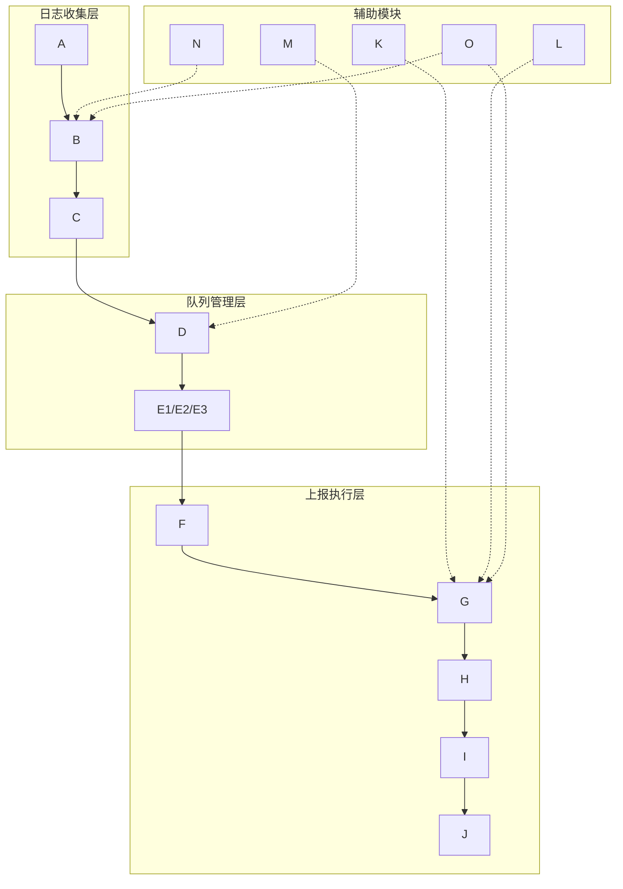

# 架构图文档模板规范

## 使用场景

当用户需要：
- 创建架构图文档时
- 绘制技术架构图时
- 生成流程图时

## 触发条件

以下情况自动应用此规范：
- 用户要求创建架构图时
- 检测到需要架构图时

## 与其他规则的配合

- 与 `document-format` 配合：确保文档格式正确
- 与核心规则配合使用

---

## 强制要求
- **核心原则**：架构图文档必须结构清晰、图表模块化、说明可折叠、便于导航
- **适用范围**：所有技术架构图文档，包括系统架构、模块架构、流程图等

## 文档结构要求

### 基本结构

架构图文档必须遵循以下结构：

```markdown
# [项目/系统名称] 技术架构图

## 📑 目录导航

- [一、整体架构图](#一整体架构图)
  - [1.1 章节名称](#11-章节名称)
  - [1.2 章节名称](#12-章节名称)
- [二、模块说明](#二模块说明)
- [三、配置说明](#三配置说明)
- [四、其他章节](#四其他章节)

---

## 一、整体架构图

### 1.1 章节名称

#### 1.1.1 子模块1架构图
[图表]

#### 1.1.2 子模块2架构图
[图表]

#### 1.1.3 整体架构关系图
[简化版关系图]

## 二、模块说明

<details>
<summary><strong>📖 点击展开模块说明</strong></summary>

[详细说明内容]

</details>
```

### 目录导航要求

- **必须包含目录导航**：文档开头必须提供完整的目录导航
- **目录格式**：使用 Markdown 的锚点链接，支持多级目录
- **目录更新**：文档结构变更时，及时更新目录
- **目录位置**：紧跟在文档标题后，使用 `## 📑 目录导航` 作为标题

### 章节组织要求

- **一级标题（H1）**：文档主标题，每个文档只有一个
- **二级标题（H2）**：主要章节，用于划分文档的主要部分（如：一、整体架构图）
- **三级标题（H3）**：小节标题，用于细分章节内容（如：1.1 三层架构与核心模块）
- **四级标题（H4）**：子小节标题，用于进一步细分（如：1.1.1 日志收集层架构图）
- **层级限制**：建议不超过 4 级标题，保持结构简洁

## 图表组织要求

### 大图表拆分原则

**核心原则**：大图表必须拆分成多个小模块，提高可读性和加载性能

#### 拆分标准

- **参与者数量**：如果图表包含 8 个以上参与者，应拆分
- **嵌套层级**：如果图表包含 3 层以上嵌套，应拆分
- **子图数量**：如果图表包含 3 个以上独立子图，应拆分
- **复杂度**：如果图表信息密度过高，难以理解，应拆分

#### 拆分方式

1. **按功能模块拆分**：
   - 将大图拆分成多个功能模块的独立图表
   - 每个模块图表聚焦单一功能
   - 最后提供一个简化版的关系图，展示模块间关系

2. **按业务流程拆分**：
   - 将复杂流程拆分成多个子流程
   - 每个子流程图表聚焦单一流程
   - 最后提供一个完整流程关系图

3. **拆分后的组织方式**：
   ```markdown
   ### 1.1 章节名称
   
   #### 1.1.1 子模块1架构图
   [独立的图表]
   
   #### 1.1.2 子模块2架构图
   [独立的图表]
   
   #### 1.1.3 整体架构关系图
   [简化版，展示模块间关系]
   ```

#### 拆分示例

**拆分前**（不推荐）：
```markdown
### 1.1 三层架构与核心模块


```

**拆分后**（推荐）：
```markdown
### 1.1 三层架构与核心模块

#### 1.1.1 日志收集层架构图
[独立的图表]

#### 1.1.2 队列管理层架构图
[独立的图表]

#### 1.1.3 上报执行层架构图
[独立的图表]

#### 1.1.4 辅助模块架构图
[独立的图表]

#### 1.1.5 整体架构关系图
[简化版，展示模块间关系]
```

### 图表类型组织

#### 架构图（graph TB/LR）
- **用途**：展示系统架构、模块关系
- **组织方式**：按模块拆分，每个模块独立图表
- **样式要求**：使用统一的颜色方案，核心模块使用强调色

#### 流程图（flowchart TD）
- **用途**：展示业务流程、决策流程
- **组织方式**：按流程阶段拆分，每个阶段独立图表
- **样式要求**：使用统一的颜色方案，关键节点使用强调色

#### 时序图（sequenceDiagram）
- **用途**：展示模块间交互、数据流转
- **组织方式**：按交互阶段拆分，每个阶段独立图表
- **样式要求**：参与者数量控制在 6 个以内，超过应拆分

#### 关系图（简化版）
- **用途**：展示整体关系、模块间关联
- **组织方式**：在拆分后提供简化版关系图
- **样式要求**：简化节点和连接，突出主要关系

## 说明部分组织要求

### 说明部分默认折叠

**核心原则**：架构图下方的详细说明必须默认折叠，使用 HTML `<details>` 标签

#### 折叠范围

以下说明部分必须默认折叠：

1. **模块说明**：模块功能、特性说明
2. **配置说明**：默认配置、配置说明、使用说明
3. **技术要点**：技术细节、实现原理
4. **代码示例**：完整的代码示例（超过 20 行）
5. **详细说明**：任何超过 5 行的详细说明

#### 折叠格式

```markdown
### 2.1 模块说明

<details>
<summary><strong>📖 点击展开模块说明</strong></summary>

[详细说明内容]

</details>
```

#### 折叠标题格式

- **模块说明**：`📖 点击展开模块说明`
- **配置说明**：`📖 点击展开默认配置和说明`
- **技术要点**：`📖 点击展开技术要点说明`
- **代码示例**：`📖 点击展开完整配置示例`
- **其他说明**：`📖 点击展开说明`

### 说明部分组织原则

1. **图表优先**：图表直接展示，说明默认折叠
2. **按需展开**：用户需要查看说明时，点击展开
3. **结构清晰**：说明部分使用清晰的标题和列表
4. **内容完整**：折叠的说明内容必须完整，包含所有必要信息

## 内容格式要求

### 图表格式

#### Mermaid 图表

- **必须指定图表类型**：graph、flowchart、sequenceDiagram 等
- **图表标题**：每个图表前必须有清晰的标题
- **图表说明**：复杂图表应在图表后添加简要说明（可折叠）
- **样式统一**：使用统一的颜色方案和样式

#### 图表颜色方案

建议使用以下颜色方案：

- **核心模块**：`#fff4e1`（浅黄色）
- **重要节点**：`#e8f5e9`（浅绿色）
- **辅助模块**：`#fce4ec`（浅粉色）
- **错误/警告**：`#ffebee`（浅红色）
- **信息提示**：`#e3f2fd`（浅蓝色）
- **普通节点**：`#e1f5ff`（浅青色）

### 文本格式

- **强调**：使用 `**粗体**` 强调重要信息
- **代码引用**：行内代码使用反引号 `` `code` ``
- **列表**：使用有序列表表示步骤，使用无序列表表示并列项
- **引用**：使用 `>` 表示引用内容

### 表格格式

- **必须使用表格形式展示结构化数据**
- **表格对齐**：左对齐文本，右对齐数字
- **表格标题**：复杂表格应添加标题或说明

## 文档组织最佳实践

### 章节组织

1. **整体架构图**：展示系统整体架构，按模块拆分
2. **模块说明**：详细说明各个模块的功能和特性（默认折叠）
3. **配置说明**：说明配置项和配置方式（默认折叠）
4. **流程图**：展示业务流程、数据流转（按流程拆分）
5. **技术要点**：技术细节和实现原理（默认折叠）

### 图表组织

1. **先拆分后整合**：先提供拆分的模块图表，再提供整体关系图
2. **从简单到复杂**：先展示简单图表，再展示复杂图表
3. **渐进式理解**：支持用户从简单到复杂逐步理解

### 说明组织

1. **图表优先**：图表直接展示，说明默认折叠
2. **按需展开**：用户需要查看说明时，点击展开
3. **结构清晰**：说明部分使用清晰的标题和列表

## 适用场景

**以下类型的架构图文档应遵循此规范：**

- ✅ **系统架构图**：系统整体架构、模块架构
- ✅ **技术架构图**：技术栈架构、框架架构
- ✅ **流程图**：业务流程、数据流转、决策流程
- ✅ **模块架构图**：功能模块架构、组件架构
- ✅ **其他架构图**：任何需要展示架构和流程的文档

## 重要原则

1. **图表模块化**：大图表必须拆分成多个小模块
2. **说明可折叠**：详细说明必须默认折叠
3. **结构清晰**：文档结构层次分明，易于导航
4. **内容完整**：提供充分的信息，避免信息缺失
5. **格式统一**：遵循统一的格式规范，保持文档风格一致
6. **易于维护**：文档应易于更新和维护，避免冗余内容
7. **用户友好**：从读者角度组织内容，提供清晰的导航

## 注意事项

1. **强制要求**：所有架构图文档必须遵循此规范
2. **拆分要求**：大图表必须拆分，提高可读性
3. **折叠要求**：详细说明必须默认折叠
4. **目录要求**：文档必须包含目录导航
5. **一致性要求**：同一项目的架构图文档应保持格式一致
6. **更新要求**：文档更新时，同步更新目录和结构

## 模板确认机制

**重要**：当用户输入架构图相关内容时，必须：

1. **提示用户确认**：询问用户是否使用此模板格式
2. **展示模板结构**：向用户展示模板的基本结构
3. **等待用户确认**：只有用户明确确认后，才使用此模板
4. **灵活调整**：根据用户需求，灵活调整模板结构

**确认流程**：
```
用户输入架构图相关内容
  ↓
AI 提示：检测到架构图相关内容，是否使用架构图文档模板？
  ↓
展示模板结构预览
  ↓
等待用户确认
  ↓
用户确认后，使用模板格式生成文档
```